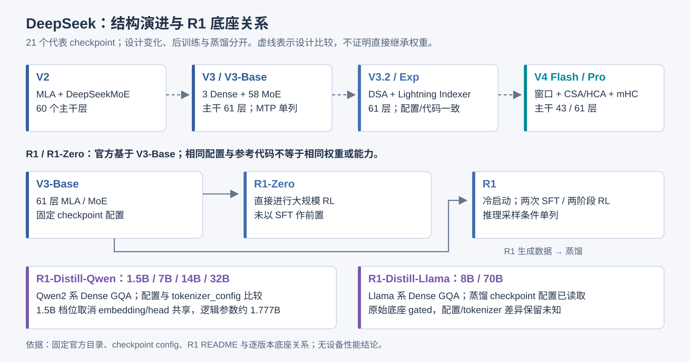
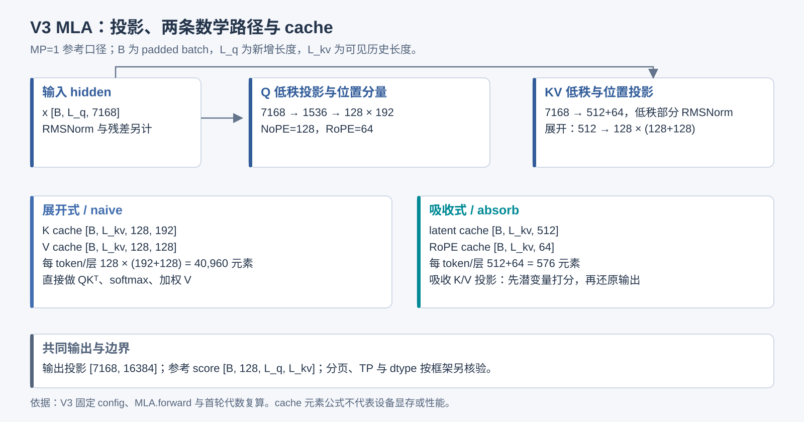
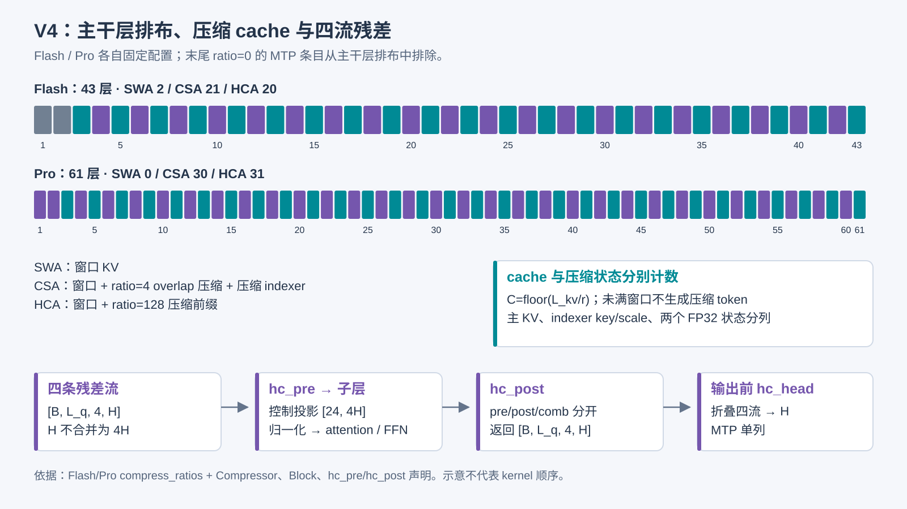
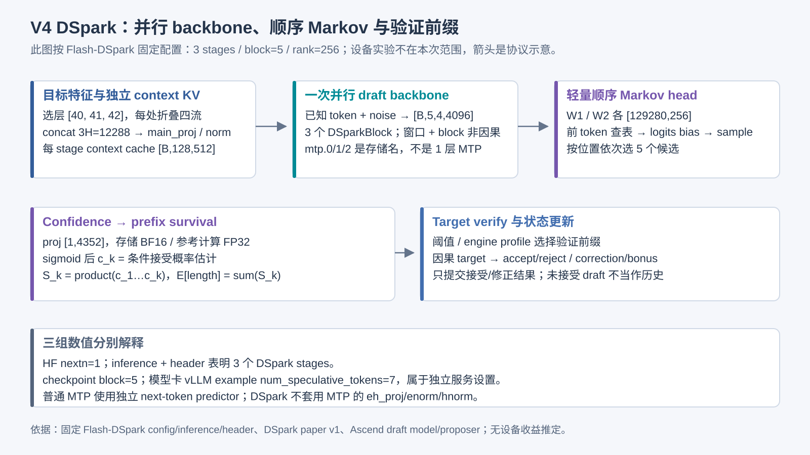

# DeepSeek 模型研究图谱

研究快照：2026-10-01。P0–P5 静态研究与交付，设备验证不纳入本次验收。

<table><thead><tr><th>模型</th><th>主干层</th><th>结构</th><th>主干逻辑参数</th></tr></thead><tbody><tr><td>DeepSeek-V2</td><td>60</td><td>MLA 60 层</td><td>235,741,434,880</td></tr><tr><td>DeepSeek-V3-Base</td><td>61</td><td>MLA 61 层</td><td>671,026,419,200</td></tr><tr><td>DeepSeek-V3</td><td>61</td><td>MLA 61 层</td><td>671,026,419,200</td></tr><tr><td>DeepSeek-R1-Zero</td><td>61</td><td>MLA 61 层</td><td>671,026,419,200</td></tr><tr><td>DeepSeek-R1</td><td>61</td><td>MLA 61 层</td><td>671,026,419,200</td></tr><tr><td>DeepSeek-R1-Distill-Qwen-1.5B</td><td>28</td><td>GQA 28 层</td><td>1,777,088,000</td></tr><tr><td>DeepSeek-R1-Distill-Qwen-7B</td><td>28</td><td>GQA 28 层</td><td>7,615,616,512</td></tr><tr><td>DeepSeek-R1-Distill-Qwen-14B</td><td>48</td><td>GQA 48 层</td><td>14,770,033,664</td></tr><tr><td>DeepSeek-R1-Distill-Qwen-32B</td><td>64</td><td>GQA 64 层</td><td>32,763,876,352</td></tr><tr><td>DeepSeek-R1-Distill-Llama-8B</td><td>32</td><td>GQA 32 层</td><td>8,030,261,248</td></tr><tr><td>DeepSeek-R1-Distill-Llama-70B</td><td>80</td><td>GQA 80 层</td><td>70,553,706,496</td></tr><tr><td>DeepSeek-V3.2-Exp</td><td>61</td><td>DSA 61 层</td><td>671,877,944,064</td></tr><tr><td>DeepSeek-V3.2</td><td>61</td><td>DSA 61 层</td><td>671,877,944,064</td></tr><tr><td>DeepSeek-V4-Flash-Base</td><td>43</td><td>SWA 2 层 / CSA 21 层 / HCA 20 层</td><td>284,332,240,471</td></tr><tr><td>DeepSeek-V4-Flash</td><td>43</td><td>SWA 2 层 / CSA 21 层 / HCA 20 层</td><td>284,332,240,471</td></tr><tr><td>DeepSeek-V4-Pro-Base</td><td>61</td><td>HCA 31 层 / CSA 30 层</td><td>1,572,997,201,763</td></tr><tr><td>DeepSeek-V4-Pro</td><td>61</td><td>HCA 31 层 / CSA 30 层</td><td>1,572,997,201,763</td></tr><tr><td>DeepSeek-V4-Flash-DSpark</td><td>43</td><td>SWA 2 层 / CSA 21 层 / HCA 20 层</td><td>284,332,240,471</td></tr><tr><td>DeepSeek-V4-Pro-DSpark</td><td>61</td><td>HCA 31 层 / CSA 30 层</td><td>1,572,997,201,763</td></tr><tr><td>DeepSeek-V4-Flash-0731</td><td>43</td><td>SWA 2 层 / CSA 21 层 / HCA 20 层</td><td>284,332,240,471</td></tr><tr><td>DeepSeek-V4-Pro-0813</td><td>61</td><td>HCA 31 层 / CSA 30 层</td><td>1,572,997,201,763</td></tr></tbody></table>

## 1. 代表版本与底座关系

当前覆盖 21 个选定 checkpoint，名称与 revision 来自官方目录。V2 是设计演进入口；V3 Base/后训练分列；R1/Zero 官方基于 V3-Base；Distill 保留各自 Qwen/Llama 底座。Max 推理档位没有新增为 checkpoint，另补 DSpark 挂接版与 Flash-0731/Pro-0813；V4.1 等仍属后续范围。

<table><thead><tr><th>模型</th><th>主干层</th><th>结构</th><th>hidden</th><th>主干逻辑参数</th><th>底座</th></tr></thead><tbody><tr><td>DeepSeek-V2</td><td>60</td><td>MLA 60 层</td><td>5120</td><td>235,741,434,880</td><td>不预设权重底座</td></tr><tr><td>DeepSeek-V3-Base</td><td>61</td><td>MLA 61 层</td><td>7168</td><td>671,026,419,200</td><td>不预设权重底座</td></tr><tr><td>DeepSeek-V3</td><td>61</td><td>MLA 61 层</td><td>7168</td><td>671,026,419,200</td><td>deepseek-ai/DeepSeek-V3-Base</td></tr><tr><td>DeepSeek-R1-Zero</td><td>61</td><td>MLA 61 层</td><td>7168</td><td>671,026,419,200</td><td>deepseek-ai/DeepSeek-V3-Base</td></tr><tr><td>DeepSeek-R1</td><td>61</td><td>MLA 61 层</td><td>7168</td><td>671,026,419,200</td><td>deepseek-ai/DeepSeek-V3-Base</td></tr><tr><td>DeepSeek-R1-Distill-Qwen-1.5B</td><td>28</td><td>GQA 28 层</td><td>1536</td><td>1,777,088,000</td><td>Qwen/Qwen2.5-Math-1.5B</td></tr><tr><td>DeepSeek-R1-Distill-Qwen-7B</td><td>28</td><td>GQA 28 层</td><td>3584</td><td>7,615,616,512</td><td>Qwen/Qwen2.5-Math-7B</td></tr><tr><td>DeepSeek-R1-Distill-Qwen-14B</td><td>48</td><td>GQA 48 层</td><td>5120</td><td>14,770,033,664</td><td>Qwen/Qwen2.5-14B</td></tr><tr><td>DeepSeek-R1-Distill-Qwen-32B</td><td>64</td><td>GQA 64 层</td><td>5120</td><td>32,763,876,352</td><td>Qwen/Qwen2.5-32B</td></tr><tr><td>DeepSeek-R1-Distill-Llama-8B</td><td>32</td><td>GQA 32 层</td><td>4096</td><td>8,030,261,248</td><td>meta-llama/Llama-3.1-8B</td></tr><tr><td>DeepSeek-R1-Distill-Llama-70B</td><td>80</td><td>GQA 80 层</td><td>8192</td><td>70,553,706,496</td><td>meta-llama/Llama-3.3-70B-Instruct</td></tr><tr><td>DeepSeek-V3.2-Exp</td><td>61</td><td>DSA 61 层</td><td>7168</td><td>671,877,944,064</td><td>deepseek-ai/DeepSeek-V3.2-Exp-Base</td></tr><tr><td>DeepSeek-V3.2</td><td>61</td><td>DSA 61 层</td><td>7168</td><td>671,877,944,064</td><td>deepseek-ai/DeepSeek-V3.2-Exp-Base</td></tr><tr><td>DeepSeek-V4-Flash-Base</td><td>43</td><td>SWA 2 层 / CSA 21 层 / HCA 20 层</td><td>4096</td><td>284,332,240,471</td><td>不预设权重底座</td></tr><tr><td>DeepSeek-V4-Flash</td><td>43</td><td>SWA 2 层 / CSA 21 层 / HCA 20 层</td><td>4096</td><td>284,332,240,471</td><td>deepseek-ai/DeepSeek-V4-Flash-Base</td></tr><tr><td>DeepSeek-V4-Pro-Base</td><td>61</td><td>HCA 31 层 / CSA 30 层</td><td>7168</td><td>1,572,997,201,763</td><td>不预设权重底座</td></tr><tr><td>DeepSeek-V4-Pro</td><td>61</td><td>HCA 31 层 / CSA 30 层</td><td>7168</td><td>1,572,997,201,763</td><td>deepseek-ai/DeepSeek-V4-Pro-Base</td></tr><tr><td>DeepSeek-V4-Flash-DSpark</td><td>43</td><td>SWA 2 层 / CSA 21 层 / HCA 20 层</td><td>4096</td><td>284,332,240,471</td><td>deepseek-ai/DeepSeek-V4-Flash</td></tr><tr><td>DeepSeek-V4-Pro-DSpark</td><td>61</td><td>HCA 31 层 / CSA 30 层</td><td>7168</td><td>1,572,997,201,763</td><td>deepseek-ai/DeepSeek-V4-Pro</td></tr><tr><td>DeepSeek-V4-Flash-0731</td><td>43</td><td>SWA 2 层 / CSA 21 层 / HCA 20 层</td><td>4096</td><td>284,332,240,471</td><td>不预设权重底座</td></tr><tr><td>DeepSeek-V4-Pro-0813</td><td>61</td><td>HCA 31 层 / CSA 30 层</td><td>7168</td><td>1,572,997,201,763</td><td>不预设权重底座</td></tr></tbody></table>
<figure><figcaption>固定版本关系、官方 R1 README 与 21 份配置；虚线只表示设计比较。</figcaption></figure>

## 2. 结构、参数与缓存口径

层从 1 开始展示，源码层号从 0 开始。MoE 用一个代表专家模板与完整专家数/top-k，不展开成数万个浏览器对象。逻辑参数由固定配置加参考源码的声明形状推导，排除量化 scale 与非训练 hash 地址表；MTP/DSpark 单列。激活线性参数代理不是 FLOPs 或性能。

当前 21 版实际存储全部来自各自全分片 header；逻辑形状、I8/FP4 容器、F8_E8M0/F32 scale 与非训练 I64 地址表分别核对。结构页按 MLA、DSA、CSA、HCA、SWA、GQA 各自的缓存说明显示，mHC 的 4 流轴不合并进 hidden。

本轮展开 21 版主干、实际发布的 MTP 与 DSpark。V3-Base、R1/Zero、V3.2/Exp 的 MTP 均有自己的文件头，并以固定 vLLM 独立 forward/loader 对应；共享 embedding/head 副本排除。SharedHead.norm 在所选参考后端独立构造/加载，上游训练别名和值是否相同仍不由 header 证明。

## 3. V3 基线与文件头审计

主干参数 671,026,419,200，61 层 = 3 Dense + 58 MoE。文件头覆盖 163 个分片与 91,991 个张量，实际全部发布载荷 688,574,839,360 字节；索引声明 total_size=1,369,062,772,000，不作为实测载荷。此次 HTTP Range 只读取 11,888,393 字节元数据，没有读取权重载荷。

<table><thead><tr><th>存储类型</th><th>张量数量</th></tr></thead><tbody><tr><td>BF16</td><td>316</td></tr><tr><td>F8_E4M3</td><td>45808</td></tr><tr><td>F32</td><td>45867</td></tr></tbody></table>

主 attention 的 Q/低秩 KV/NoPE/RoPE 与 naive/absorb 路径分别说明。MP=1 时吸收式 cache 为每 token/层 512+64 元素，展开式为 128×(192+128)。BF16 假设的字节公式不等于框架显存实测。

MTP 文件层号 61 与主干 0–60 分开；存储参数元素数 13,463,426,304 包含共享 embedding/head 的存储副本。官方 11.5B unique、14B/685B 发布口径和文件头统计分别保留；无法只由 header 证明所有加载别名或相同数值。V3 demo 转换显式跳过 MTP，不能宣称支持该路径。
<figure><figcaption>V3 config + 固定官方 MLA.forward；两条数学路径由首轮 FP64 合成矩阵复算。</figcaption></figure>

## 4. V3.2 / V4 增量

V3.2 与 Exp 的所选配置和 inference/model.py 字节一致。DSA 新增 Indexer 的低秩 Q 投影、K 投影、LayerNorm、每头权重投影、Hadamard 旋转、FP8 index score 与 top-k。每层新增逻辑参数 13,959,424，61 层主干共 671,877,944,064。参考 prefill 使用展开 attention 加 index mask；decode 使用吸收式路径，不能把 V3 的两个自由实现分支直接当作 V3.2 分派。

V4-Flash 主干为 2 SWA + 21 CSA + 20 HCA；V4-Pro 为 30 CSA + 31 HCA。普通 V4 的 compress_ratios 含一个 MTP 条目，DSpark 版含三个 draft stage 条目；末尾 ratio=0 不计入主干。ratio=4 的 learned compressor 使用 overlap/coff=2，并有独立的压缩 indexer；ratio=128 使用全压缩前缀，无 learned indexer。窗口、压缩 KV、indexer cache 和两个 FP32 compressor 状态分别计数。

V4 的 query head dim=512，末尾 64 为位置分量；共享 KV dim=512，输出采用分组低秩 wo_a/wo_b。mHC 每子层有 [24,4H] 的控制投影、[24] base、[3] scale，维护 [B,L_q,4,H]；hc_pre 经 Sinkhorn 构造 pre/post/comb，hc_post 还原四流。前三层 hash 路由仍计算 gating scores，token→expert 表是非训练地址表，参考构造声明 I32，本轮实际 header 为 I64，不据此认定 Engram 集成。

Base 的 expert_dtype=FP8，后训练版 routed experts=FP4；FP4 每容器两元素、group32 UE8M0 scale 是参考 Linear 的条件格式，实际 header 已核对：routed FP4 存在 I8 容器，scale 为 F8_E8M0；Base/shared 与 routed 的 dtype/shape 分开，不以 I8 单独推断 FP4。V4 参考 MTP 共享 embedding/head，独立拥有投影、norm 与流折叠，普通 Transformer.forward 不自动执行 MTP。
<figure><figcaption>Flash/Pro 固定配置与参考模型；压缩率、MTP 边界、四流轴按 canonical 数据生成。</figcaption></figure>

## 5. MTP、DSpark 与推测解码协议

DSpark 采用并行 draft backbone 加轻量顺序模块，并由 confidence 估计条件接受概率。V4-Flash/Pro-DSpark 官方声明是原 preview checkpoint 挂接 draft 模块；Flash-0731/Pro-0813 属于另外的正式发布，不由配置相同推定权重相同。全部固定目录、配置、native 代码和 header 独立保存。

<table><thead><tr><th>checkpoint</th><th>HF nextn 声明</th><th>实际 draft stages</th><th>目标层号(0-based)</th><th>block size</th><th>Markov rank</th><th>独立 draft 逻辑参数</th></tr></thead><tbody><tr><td>DeepSeek-V4-Flash-DSpark</td><td>1</td><td>3</td><td>[40, 41, 42]</td><td>5</td><td>256</td><td>19,845,850,983</td></tr><tr><td>DeepSeek-V4-Pro-DSpark</td><td>1</td><td>3</td><td>[58, 59, 60]</td><td>5</td><td>512</td><td>77,498,408,103</td></tr><tr><td>DeepSeek-V4-Flash-0731</td><td>1</td><td>3</td><td>[40, 41, 42]</td><td>5</td><td>256</td><td>19,845,850,983</td></tr><tr><td>DeepSeek-V4-Pro-0813</td><td>1</td><td>3</td><td>[58, 59, 60]</td><td>5</td><td>512</td><td>77,498,408,103</td></tr></tbody></table>

存储仍使用 mtp.0/1/2 namespace，但模块是 DSparkBlock：首层 main_proj/main_norm 融合三处目标 hc_head 特征，三层都使用独立 context SWA cache，末层有 norm、流折叠、两个 [V,R] Markov 矩阵和 [1,H+R] confidence 投影；共享主干 embedding/head。MTP 的 eh_proj/enorm/hnorm 不套给 DSpark。HF num_nextn_predict_layers=1、compress_ratios 的 3 个尾零、inference n_mtp_layers=3 与真实 namespace 分别保留。

native prefill 只初始化 context KV；draft 时一个 noisy block 在 backbone 内非因果并行处理。随后按前一已选 token 做 Markov embedding→logits bias→sample，形成块内顺序依赖。confidence proj 在 header 为 BF16，native 构造/计算 FP32；原生 forward_head 返回 logits，服务侧 sigmoid 后才是条件置信度。checkpoint block=5 与模型卡 vLLM 示例 num_speculative_tokens=7 是不同设置，原样保留。

<table><thead><tr><th>阶段</th><th>静态协议</th></tr></thead><tbody><tr><td>context-prefill</td><td>目标主干正常 prefill/验证并取指定层特征；融合后初始化独立 context KV</td></tr><tr><td>draft</td><td>noisy block → 多 stage 并行 backbone → 顺序 Markov logits 修正/sample → confidence</td></tr><tr><td>select-prefix</td><td>conditional confidence → prefix survival；阈值或 engine-specific throughput profile 分配验证长度，不能任意 peek 后续位置再回退</td></tr><tr><td>verify</td><td>target 对选中 prefix 做因果 forward；按所选 sampler 接受/拒绝，含首个拒绝位置或全部接受后的 bonus token</td></tr><tr><td>update</td><td>只提交已接受/修正 token 的状态；丢弃或覆盖未接受 draft cache，下一轮输入由 target hidden 驱动</td></tr></tbody></table>

论文的条件概率 c_k 给出前缀生存概率 S_k=∏_{j≤k}c_j，期望接受长度为 Σ_k S_k。作者的负载感知前缀 scheduler 结合 engine-specific throughput profile；公开 demo 的固定阈值、框架自适应配置和生产 scheduler 分开。前缀选择需保持 stopping-time/early-stopping 条件，任意看后续 token 再回退可能造成选择偏差。训练侧含 vanilla Markov/RNN 变体和 confidence 校准，本 V4 权重与代码采用 vanilla Markov，不推定包含 RNN。

<table><thead><tr><th>方法</th><th>草稿</th><th>target</th><th>参数/缓存</th></tr></thead><tbody><tr><td>AR</td><td>无附加 draft</td><td>每步一个 target token</td><td>只有主干；主干 cache</td></tr><tr><td>MTP</td><td>独立 next-token predictor 可循环重用；训练深度与服务 draft 次数不同</td><td>验证候选 causal prefix</td><td>共享 embedding/head，独立投影、block、norm；MTP 和主干各自按后端管理</td></tr><tr><td>DSpark</td><td>并行 backbone + 轻量顺序 Markov/RNN；本 V4 checkpoint 是 vanilla Markov</td><td>可变验证 prefix，confidence/负载配置独立</td><td>3 stage，首层 main_proj，末层 Markov/confidence，共享 embed/head；独立 SWA context + block 内非因果 draft；不沿用主干 CSA/HCA</td></tr></tbody></table>

MTP 训练层数与服务循环生成次数不同，MTP-1 不等于只能配置 1 个 draft token。固定 vLLM 参考的 MTP 会 mask position=0 embedding，两次 norm/concat→eh_proj→独立 DecoderLayer；logits hidden 与回收 hidden 分别只执行一次 final norm。V3 native demo 跳过 MTP，不据此抹掉 checkpoint 已发布的 MTP。

DSpark 作者在 V4 在线服务、匹配总吞吐条件下自述 Flash 单用户生成速度提高 60%–85%、Pro 57%–78%；这些数值属于作者环境，未作为本站或 Ascend 实测。静态小概率向量验证仅检查 rejection distribution 恒等式及条件概率乘积，不验证训练置信度、校准、设备或部署收益。Muon optimizer、SFT/RL/GRPO 和 on-policy distillation 是训练侧机制，独立于推测解码执行图。

主要来源：<a href="https://arxiv.org/abs/2607.05147v1">DSpark 论文 v1</a>；<a href="https://github.com/deepseek-ai/DeepSpec/tree/005e03b81cec38b7da6399833d609ee89a2587f2">DeepSpec 固定源码</a>；每个 checkpoint 的 config/inference/header 与框架 proof 链见 speculation.json / site-proofs.json。
<figure><figcaption>按 Flash-DSpark 固定配置与公开参考绘制；服务配置、checkpoint 字段和实际 stage 不混用。</figcaption></figure>

## 6. R1 与 Distill

原始 R1、R1-Zero、V3-Base 的所选配置与原始 V3 字节相同，固定 HF modeling_deepseek.py 的 SHA-256 也相同。这里只复用主干形状与参考计算；后训练、权重内容、能力与服务条件不据此推定相同。

<table><thead><tr><th>checkpoint</th><th>配置字节相同</th><th>参考代码字节相同</th></tr></thead><tbody><tr><td>DeepSeek-V3-Base</td><td>True</td><td>True</td></tr><tr><td>DeepSeek-R1-Zero</td><td>False</td><td>True</td></tr><tr><td>DeepSeek-R1</td><td>False</td><td>True</td></tr></tbody></table>

R1-Zero 在 V3-Base 上直接进行大规模 RL，未以 SFT 作前置；R1 使用冷启动数据并采用两次 SFT/两阶段 RL。官方评测使用最大生成 32,768 token、temperature=0.6、top_p=0.95，并对采样任务生成 64 条响应估计 pass@1；这些是评测/采样条件，不是架构或服务容量。

Distill 六版都是 Dense GQA 底座，不使用 V3 MLA/MoE。Qwen2 固定参考类的 Q/K/V bias 与 Llama 的 attention_bias/mlp_bias 分别核对；词表、EOS/BOS、位置上限、tie_word_embeddings 来自实际蒸馏配置。名称 1.5B 等沿用底座档位，不强行把推导参数配平到名称。

<table><thead><tr><th>蒸馏模型</th><th>底座</th><th>配置变化字段</th><th>tokenizer_config 变化字段</th></tr></thead><tbody><tr><td>DeepSeek-R1-Distill-Qwen-1.5B</td><td>Qwen/Qwen2.5-Math-1.5B</td><td>max_position_embeddings, tie_word_embeddings</td><td>add_bos_token, add_eos_token, add_prefix_space, added_tokens_decoder, additional_special_tokens, bos_token, chat_template, eos_token, errors, legacy, model_max_length, pad_token, sp_model_kwargs, split_special_tokens, tokenizer_class</td></tr><tr><td>DeepSeek-R1-Distill-Qwen-7B</td><td>Qwen/Qwen2.5-Math-7B</td><td>max_position_embeddings</td><td>add_bos_token, add_eos_token, add_prefix_space, added_tokens_decoder, additional_special_tokens, bos_token, chat_template, eos_token, errors, legacy, model_max_length, pad_token, sp_model_kwargs, split_special_tokens, tokenizer_class</td></tr><tr><td>DeepSeek-R1-Distill-Qwen-14B</td><td>Qwen/Qwen2.5-14B</td><td></td><td>add_bos_token, add_eos_token, add_prefix_space, added_tokens_decoder, additional_special_tokens, bos_token, chat_template, eos_token, errors, legacy, model_max_length, pad_token, sp_model_kwargs, split_special_tokens, tokenizer_class</td></tr><tr><td>DeepSeek-R1-Distill-Qwen-32B</td><td>Qwen/Qwen2.5-32B</td><td></td><td>add_bos_token, add_eos_token, add_prefix_space, added_tokens_decoder, additional_special_tokens, bos_token, chat_template, eos_token, errors, legacy, model_max_length, pad_token, sp_model_kwargs, split_special_tokens, tokenizer_class</td></tr><tr><td>DeepSeek-R1-Distill-Llama-8B</td><td>meta-llama/Llama-3.1-8B</td><td>底座 gated，未获取配置</td><td>底座 gated，未获取 tokenizer 配置</td></tr><tr><td>DeepSeek-R1-Distill-Llama-70B</td><td>meta-llama/Llama-3.3-70B-Instruct</td><td>底座 gated，未获取配置</td><td>底座 gated，未获取 tokenizer 配置</td></tr></tbody></table>

Qwen 四版完成固定底座配置与 tokenizer_config 比较；Llama 原底座 resolve 请求返回 gated/401，蒸馏配置与 tokenizer_config 已读取，原底座差异保留未知。没有借第三方镜像替代。现已逐条比较四个 Qwen 底座与蒸馏完整 tokenizer.json：151,643 个 vocab token 的 ID、151,387 个 merge 完全一致，added_tokens 不同；normalizer/pre_tokenizer/post_processor/decoder 一致。六个 Distill 的完整词表与特殊 ID/embedding 上限都核对，Llama 原底座的完整 tokenizer 同样 gated。

## 7. 参考实现与 Ascend 路径

固定 vLLM、vLLM-Ascend 与 TileKernels 各自提交；这些快照未被组成或测试为兼容栈。模型 forward、框架模块、torch.ops 分派和设备实现分层记录，数学步骤与 kernel 不是一对一。实现、硬件、优化页按当前模型过滤专题。

原始 FP8、转换 MXFP8/MXFP4、BF16 fallback 分开说明。TileKernels 的 Ascend 后端要求 Ascend 950、CANN≥9.2、Python≥3.12、PyTorch≥2.13、TileLang≥0.1.15；不能推广为 A2/A3 或任意已安装环境。V3.2/V4 的 Indexer、压缩、mHC 与 MoE 通信分别记录条件和缺口。

<table><thead><tr><th>开放后端路径</th><th>调用/注册链</th><th>约束</th></tr></thead><tbody><tr><td>compressor</td><td>Python Compressor.forward → torch.ops._C_ascend.compressor → PrivateUse1 注册 → vllm_ascend::compressor → EXEC_NPU_CMD(aclnnCompressor) → Compressor host/tiling 与 arch35 kernel 入口</td><td>ratio/coff、FP32 state、norm/rope shapes、量化 scale、slot mapping 与 token update 在 wrapper/host 层分别检查；arch35 源存在不推定设备编译成功。</td></tr><tr><td>hc-pre</td><td>DeepseekV4DecoderLayer.hc_pre → torch.ops._C_ascend.npu_hc_pre_v2 → PrivateUse1 注册/shape 检查 → hc_pre host/tiling → 公开 AscendC hc_pre 入口</td><td>wrapper 显式限 hc_mult=4、mix=24；fn/base/scale、dtype、pre_mix 与 Sinkhorn 迭代等分开。TileKernels *_asc 是另一独立实现，没有看到该框架调用 TileKernels 的接线。</td></tr><tr><td>gmm-swiglu</td><td>MoE/量化路径按条件选择融合算子 → _C_ascend grouped_matmul_swiglu_quant 注册 → host dtype/scale/group-list 条件 → aclnn wrapper/workspace/launch</td><td>这条 custom-op 与 torch_npu 分步 grouped_matmul + swiglu_group_quant 是不同候选分支；不串成一个执行链。FP4 容器、NZ/ND、group size 和量化 loader 要独立对应。</td></tr></tbody></table>

注册和 host/kernel 入口范围有独立 source/range 哈希，C++ 范围不冒充 Python AST 函数证明。CANN 相关算子已在匹配版本开源仓继续核查，具体来源见第 10 节；实际分派、ABI 与设备数值仍待验证。未看到 TileKernels 与该框架的调用接线，保留两套独立实现。

## 8. 证据与验收

每项已知事实使用 official、derived 或 interpretation，未知为 null/unknown。已读取范围、配置 revision、源码 commit、函数位置与文件/函数体 SHA-256 随下载保留。参数、shape、cache 与来源引用由 DeepSeek 专用验证器检查，普通 build 按 family 分派；Kimi 专用验证器不冒充覆盖 DeepSeek。

网页、报告与 CSV 使用相同研究数据。全层映射由代表模板展开，下载说明注明静态展开范围；它不等于权重加载、设备数值正确性或性能验证。检查窄屏、二维回退、版本比较、阶段/分支筛选与所有下载链接。

## 9. 本次验收范围与可选后续研究

当前没有硬件，用户已将设备运行与性能验证移出本次范围。本次交付按模型结构、文件头、shape/参数公式、固定来源与 CANN 源码、导出一致性及网站功能验收；设备实验不作为未完成项或验收前置条件。

源码与 package 的只读核查仍是本次静态研究。实际运行分支、ABI、数值与性能标为未实测；duration、利用率、mte、scalar 与吞吐保持空值或未知。未来有硬件并另行发起时，可使用可选研究卡片与实验记录模板，不自动恢复实验。

## 10. CANN 开源算子与本地 SDK

此前将 CANN 相关缺口笼统写为闭源是不准确的，现按匹配版本开源仓和本地 package 继续核查。本地只读检查确认 CANN 9.2.0-beta.2、aarch64；固定 ops-transformer/ops-nn/ops-math 的 v9.2.0-beta.2 tag，并另固定 op-plugin bridge。

<table><thead><tr><th>来源</th><th>固定 revision</th></tr></thead><tbody><tr><td>ops-transformer</td><td>5f33f1e23d41fe0a047d01b7c7ae278777cac1f5</td></tr><tr><td>ops-nn</td><td>30ef7dd563c8a4b74c3161835c8e47d1d96f87b6</td></tr><tr><td>ops-math</td><td>0a2ce5b57caec6068d9e5658b740c2d41482aa15</td></tr><tr><td>Ascend/op-plugin</td><td>d83570a35dfe0d8e9869c3ecfca6647cfccdd9c8</td></tr></tbody></table>

<table><thead><tr><th>算子源码目录</th><th>API 符号示例</th><th>框架上下文</th><th>接线证据范围</th><th>固定源码链接</th></tr></thead><tbody><tr><td>attention/fused_infer_attention_score</td><td>aclnnFusedInferAttentionScore, aclnnFusedInferAttentionScoreGetWorkspaceSize, aclnnFusedInferAttentionScoreV2, aclnnFusedInferAttentionScoreV2GetMaxWorkspaceSize, aclnnFusedInferAttentionScoreV2GetWorkspaceSize</td><td>npu_fused_infer_attention_score / v2 / workspace / out</td><td>公开来源定位；具体 Python/框架调用须与下面 bridge 及已固定 vLLM-Ascend 上下文对应</td><td><a href="https://atomgit.com/cann/ops-transformer/blob/5f33f1e23d41fe0a047d01b7c7ae278777cac1f5/attention/fused_infer_attention_score/op_api/aclnn_fused_infer_attention_score.cpp#L25-L41">api</a> <a href="https://atomgit.com/cann/ops-transformer/blob/5f33f1e23d41fe0a047d01b7c7ae278777cac1f5/attention/fused_infer_attention_score/op_api/aclnn_fused_infer_attention_score.h#L24-L40">api</a> <a href="https://atomgit.com/cann/ops-transformer/blob/5f33f1e23d41fe0a047d01b7c7ae278777cac1f5/attention/fused_infer_attention_score/op_api/aclnn_fused_infer_attention_score_inner.cpp#L1-L15">api</a> <a href="https://atomgit.com/cann/ops-transformer/blob/5f33f1e23d41fe0a047d01b7c7ae278777cac1f5/attention/fused_infer_attention_score/op_api/aclnn_fused_infer_attention_score_v2.cpp#L26-L42">api</a> <a href="https://atomgit.com/cann/ops-transformer/blob/5f33f1e23d41fe0a047d01b7c7ae278777cac1f5/attention/fused_infer_attention_score/op_api/aclnn_fused_infer_attention_score_v2.h#L24-L40">api</a> <a href="https://atomgit.com/cann/ops-transformer/blob/5f33f1e23d41fe0a047d01b7c7ae278777cac1f5/attention/fused_infer_attention_score/op_api/aclnn_fused_infer_attention_score_v3.cpp#L31-L47">api</a> <a href="https://atomgit.com/cann/ops-transformer/blob/5f33f1e23d41fe0a047d01b7c7ae278777cac1f5/attention/fused_infer_attention_score/op_api/aclnn_fused_infer_attention_score_v3.h#L24-L40">api</a> <a href="https://atomgit.com/cann/ops-transformer/blob/5f33f1e23d41fe0a047d01b7c7ae278777cac1f5/attention/fused_infer_attention_score/op_api/aclnn_fused_infer_attention_score_v4.cpp#L31-L47">api</a> <a href="https://atomgit.com/cann/ops-transformer/blob/5f33f1e23d41fe0a047d01b7c7ae278777cac1f5/attention/fused_infer_attention_score/op_api/aclnn_fused_infer_attention_score_v4.h#L21-L37">api</a> <a href="https://atomgit.com/cann/ops-transformer/blob/5f33f1e23d41fe0a047d01b7c7ae278777cac1f5/attention/fused_infer_attention_score/op_api/aclnn_fused_infer_attention_score_v5.cpp#L31-L47">api</a> <a href="https://atomgit.com/cann/ops-transformer/blob/5f33f1e23d41fe0a047d01b7c7ae278777cac1f5/attention/fused_infer_attention_score/op_api/aclnn_fused_infer_attention_score_v5.h#L21-L37">api</a> <a href="https://atomgit.com/cann/ops-transformer/blob/5f33f1e23d41fe0a047d01b7c7ae278777cac1f5/attention/fused_infer_attention_score/op_host/fused_infer_attention_score_def.cpp#L20-L36">definition</a> <a href="https://atomgit.com/cann/ops-transformer/blob/5f33f1e23d41fe0a047d01b7c7ae278777cac1f5/attention/fused_infer_attention_score/op_host/arch35/fia_tiling_fullquant_gqa.cpp#L27-L43">tiling</a> <a href="https://atomgit.com/cann/ops-transformer/blob/5f33f1e23d41fe0a047d01b7c7ae278777cac1f5/attention/fused_infer_attention_score/op_host/arch35/fia_tiling_fullquant_mx.cpp#L27-L43">tiling</a> <a href="https://atomgit.com/cann/ops-transformer/blob/5f33f1e23d41fe0a047d01b7c7ae278777cac1f5/attention/fused_infer_attention_score/op_kernel/fused_infer_attention_score.cpp#L53-L69">kernel_entry</a> <a href="https://atomgit.com/cann/ops-transformer/blob/5f33f1e23d41fe0a047d01b7c7ae278777cac1f5/attention/fused_infer_attention_score/op_kernel/fused_infer_attention_score_apt.cpp#L30-L46">kernel_entry</a></td></tr><tr><td>attention/sparse_flash_attention</td><td>aclnnSparseFlashAttention, aclnnSparseFlashAttentionGetWorkspaceSize, aclnnSparseFlashAttentionV2, aclnnSparseFlashAttentionV2GetWorkspaceSize</td><td>sparse attention dispatcher</td><td>公开来源定位；具体 Python/框架调用须与下面 bridge 及已固定 vLLM-Ascend 上下文对应</td><td><a href="https://atomgit.com/cann/ops-transformer/blob/5f33f1e23d41fe0a047d01b7c7ae278777cac1f5/attention/sparse_flash_attention/op_host/op_api/aclnn_sparse_flash_attention.cpp#L32-L48">api</a> <a href="https://atomgit.com/cann/ops-transformer/blob/5f33f1e23d41fe0a047d01b7c7ae278777cac1f5/attention/sparse_flash_attention/op_host/op_api/aclnn_sparse_flash_attention.h#L24-L40">api</a> <a href="https://atomgit.com/cann/ops-transformer/blob/5f33f1e23d41fe0a047d01b7c7ae278777cac1f5/attention/sparse_flash_attention/op_host/op_api/aclnn_sparse_flash_attention_v2.cpp#L33-L49">api</a> <a href="https://atomgit.com/cann/ops-transformer/blob/5f33f1e23d41fe0a047d01b7c7ae278777cac1f5/attention/sparse_flash_attention/op_host/op_api/aclnn_sparse_flash_attention_v2.h#L24-L40">api</a> <a href="https://atomgit.com/cann/ops-transformer/blob/5f33f1e23d41fe0a047d01b7c7ae278777cac1f5/attention/sparse_flash_attention/op_host/sparse_flash_attention_def.cpp#L17-L33">definition</a> <a href="https://atomgit.com/cann/ops-transformer/blob/5f33f1e23d41fe0a047d01b7c7ae278777cac1f5/attention/sparse_flash_attention/op_host/sparse_flash_attention_tiling.cpp#L28-L44">tiling</a> <a href="https://atomgit.com/cann/ops-transformer/blob/5f33f1e23d41fe0a047d01b7c7ae278777cac1f5/attention/sparse_flash_attention/op_kernel/sparse_flash_attention.cpp#L26-L42">kernel_entry</a></td></tr><tr><td>attention/sparse_flash_mla</td><td>aclnnSparseFlashMla, aclnnSparseFlashMlaGetWorkspaceSize</td><td>V4 sparse MLA</td><td>公开来源定位；具体 Python/框架调用须与下面 bridge 及已固定 vLLM-Ascend 上下文对应</td><td><a href="https://atomgit.com/cann/ops-transformer/blob/5f33f1e23d41fe0a047d01b7c7ae278777cac1f5/attention/sparse_flash_mla/op_host/sparse_flash_mla_def.cpp#L17-L33">definition</a> <a href="https://atomgit.com/cann/ops-transformer/blob/5f33f1e23d41fe0a047d01b7c7ae278777cac1f5/attention/sparse_flash_mla/op_host/sparse_flash_mla_tiling.cpp#L19-L35">tiling</a> <a href="https://atomgit.com/cann/ops-transformer/blob/5f33f1e23d41fe0a047d01b7c7ae278777cac1f5/attention/sparse_flash_mla/op_kernel/sparse_flash_mla.cpp#L30-L46">kernel_entry</a></td></tr><tr><td>attention/mixed_quant_sparse_flash_mla</td><td>aclnnMixedQuantSparseFlashMla, aclnnMixedQuantSparseFlashMlaGetWorkspaceSize</td><td>V4 mixed-quant sparse MLA</td><td>公开来源定位；具体 Python/框架调用须与下面 bridge 及已固定 vLLM-Ascend 上下文对应</td><td><a href="https://atomgit.com/cann/ops-transformer/blob/5f33f1e23d41fe0a047d01b7c7ae278777cac1f5/attention/mixed_quant_sparse_flash_mla/op_host/mixed_quant_sparse_flash_mla_def.cpp#L17-L33">definition</a> <a href="https://atomgit.com/cann/ops-transformer/blob/5f33f1e23d41fe0a047d01b7c7ae278777cac1f5/attention/mixed_quant_sparse_flash_mla/op_host/mixed_quant_sparse_flash_mla_tiling.cpp#L21-L37">tiling</a> <a href="https://atomgit.com/cann/ops-transformer/blob/5f33f1e23d41fe0a047d01b7c7ae278777cac1f5/attention/mixed_quant_sparse_flash_mla/op_kernel/mixed_quant_sparse_flash_mla.cpp#L25-L41">kernel_entry</a></td></tr><tr><td>attention/sparse_flash_mla_metadata</td><td>aclnnSparseFlashMlaMetadata, aclnnSparseFlashMlaMetadataGetWorkspaceSize</td><td>metadata preparation</td><td>公开来源定位；具体 Python/框架调用须与下面 bridge 及已固定 vLLM-Ascend 上下文对应</td><td><a href="https://atomgit.com/cann/ops-transformer/blob/5f33f1e23d41fe0a047d01b7c7ae278777cac1f5/attention/sparse_flash_mla_metadata/op_host/op_api/aclnn_sparse_flash_mla_metadata.cpp#L37-L53">api</a> <a href="https://atomgit.com/cann/ops-transformer/blob/5f33f1e23d41fe0a047d01b7c7ae278777cac1f5/attention/sparse_flash_mla_metadata/op_host/op_api/aclnn_sparse_flash_mla_metadata.h#L18-L34">api</a></td></tr><tr><td>attention/lightning_indexer</td><td>aclnnLightningIndexer, aclnnLightningIndexerGetWorkspaceSize</td><td>indexer</td><td>公开来源定位；具体 Python/框架调用须与下面 bridge 及已固定 vLLM-Ascend 上下文对应</td><td><a href="https://atomgit.com/cann/ops-transformer/blob/5f33f1e23d41fe0a047d01b7c7ae278777cac1f5/attention/lightning_indexer/op_host/op_api/aclnn_lightning_indexer.cpp#L32-L48">api</a> <a href="https://atomgit.com/cann/ops-transformer/blob/5f33f1e23d41fe0a047d01b7c7ae278777cac1f5/attention/lightning_indexer/op_host/op_api/aclnn_lightning_indexer.h#L24-L40">api</a> <a href="https://atomgit.com/cann/ops-transformer/blob/5f33f1e23d41fe0a047d01b7c7ae278777cac1f5/attention/lightning_indexer/op_host/lightning_indexer_def.cpp#L17-L33">definition</a> <a href="https://atomgit.com/cann/ops-transformer/blob/5f33f1e23d41fe0a047d01b7c7ae278777cac1f5/attention/lightning_indexer/op_host/lightning_indexer_tiling.cpp#L17-L33">tiling</a> <a href="https://atomgit.com/cann/ops-transformer/blob/5f33f1e23d41fe0a047d01b7c7ae278777cac1f5/attention/lightning_indexer/op_kernel/lightning_indexer.cpp#L25-L41">kernel_entry</a></td></tr><tr><td>attention/lightning_indexer_v2</td><td>aclnnLightningIndexerV2, aclnnLightningIndexerV2GetWorkspaceSize</td><td>V4 indexer</td><td>公开来源定位；具体 Python/框架调用须与下面 bridge 及已固定 vLLM-Ascend 上下文对应</td><td><a href="https://atomgit.com/cann/ops-transformer/blob/5f33f1e23d41fe0a047d01b7c7ae278777cac1f5/attention/lightning_indexer_v2/op_host/lightning_indexer_v2_def.cpp#L17-L33">definition</a> <a href="https://atomgit.com/cann/ops-transformer/blob/5f33f1e23d41fe0a047d01b7c7ae278777cac1f5/attention/lightning_indexer_v2/op_host/lightning_indexer_v2_tiling.cpp#L17-L33">tiling</a> <a href="https://atomgit.com/cann/ops-transformer/blob/5f33f1e23d41fe0a047d01b7c7ae278777cac1f5/attention/lightning_indexer_v2/op_kernel/lightning_indexer_v2.cpp#L22-L38">kernel_entry</a></td></tr><tr><td>attention/quant_lightning_indexer</td><td>aclnnQuantLightningIndexer, aclnnQuantLightningIndexerGetWorkspaceSize</td><td>quant indexer</td><td>公开来源定位；具体 Python/框架调用须与下面 bridge 及已固定 vLLM-Ascend 上下文对应</td><td><a href="https://atomgit.com/cann/ops-transformer/blob/5f33f1e23d41fe0a047d01b7c7ae278777cac1f5/attention/quant_lightning_indexer/op_host/op_api/aclnn_quant_lightning_indexer.cpp#L33-L49">api</a> <a href="https://atomgit.com/cann/ops-transformer/blob/5f33f1e23d41fe0a047d01b7c7ae278777cac1f5/attention/quant_lightning_indexer/op_host/op_api/aclnn_quant_lightning_indexer.h#L25-L41">api</a> <a href="https://atomgit.com/cann/ops-transformer/blob/5f33f1e23d41fe0a047d01b7c7ae278777cac1f5/attention/quant_lightning_indexer/op_host/quant_lightning_indexer_def.cpp#L16-L32">definition</a> <a href="https://atomgit.com/cann/ops-transformer/blob/5f33f1e23d41fe0a047d01b7c7ae278777cac1f5/attention/quant_lightning_indexer/op_host/quant_lightning_indexer_tiling.cpp#L18-L34">tiling</a> <a href="https://atomgit.com/cann/ops-transformer/blob/5f33f1e23d41fe0a047d01b7c7ae278777cac1f5/attention/quant_lightning_indexer/op_kernel/quant_lightning_indexer.cpp#L25-L41">kernel_entry</a></td></tr><tr><td>attention/quant_lightning_indexer_v2</td><td>aclnnQuantLightningIndexerV2, aclnnQuantLightningIndexerV2GetWorkspaceSize</td><td>_C_ascend.npu_quant_lightning_indexer_v2</td><td>公开来源定位；具体 Python/框架调用须与下面 bridge 及已固定 vLLM-Ascend 上下文对应</td><td><a href="https://atomgit.com/cann/ops-transformer/blob/5f33f1e23d41fe0a047d01b7c7ae278777cac1f5/attention/quant_lightning_indexer_v2/op_host/quant_lightning_indexer_v2_def.cpp#L17-L33">definition</a> <a href="https://atomgit.com/cann/ops-transformer/blob/5f33f1e23d41fe0a047d01b7c7ae278777cac1f5/attention/quant_lightning_indexer_v2/op_host/quant_lightning_indexer_v2_tiling.cpp#L18-L34">tiling</a> <a href="https://atomgit.com/cann/ops-transformer/blob/5f33f1e23d41fe0a047d01b7c7ae278777cac1f5/attention/quant_lightning_indexer_v2/op_kernel/quant_lightning_indexer_v2.cpp#L22-L38">kernel_entry</a></td></tr><tr><td>attention/compressor</td><td>aclnnCompressor, aclnnCompressorGetWorkspaceSize</td><td>_C_ascend.compressor / aclnnCompressor</td><td>公开来源定位；具体 Python/框架调用须与下面 bridge 及已固定 vLLM-Ascend 上下文对应</td><td><a href="https://atomgit.com/cann/ops-transformer/blob/5f33f1e23d41fe0a047d01b7c7ae278777cac1f5/attention/compressor/op_host/compressor_def.cpp#L12-L28">definition</a> <a href="https://atomgit.com/cann/ops-transformer/blob/5f33f1e23d41fe0a047d01b7c7ae278777cac1f5/attention/compressor/op_host/arch35/compressor_tiling.cpp#L23-L39">tiling</a> <a href="https://atomgit.com/cann/ops-transformer/blob/5f33f1e23d41fe0a047d01b7c7ae278777cac1f5/attention/compressor/op_host/compressor_tiling_register.cpp#L19-L35">tiling</a> <a href="https://atomgit.com/cann/ops-transformer/blob/5f33f1e23d41fe0a047d01b7c7ae278777cac1f5/attention/compressor/op_kernel/compressor.cpp#L23-L39">kernel_entry</a></td></tr><tr><td>mhc/mhc_pre</td><td>aclnnMhcPre, aclnnMhcPreGetWorkspaceSize, aclnnMhcPreV2, aclnnMhcPreV2GetWorkspaceSize</td><td>official MhcPre; framework custom HcPreV2 kept separate</td><td>公开官方实现与框架 custom-op 独立列出；相似算子名/数学定义不证明框架直接调用该 CANN 实现</td><td><a href="https://atomgit.com/cann/ops-transformer/blob/5f33f1e23d41fe0a047d01b7c7ae278777cac1f5/mhc/mhc_pre/op_host/op_api/aclnn_mhc_pre.cpp#L663-L679">api</a> <a href="https://atomgit.com/cann/ops-transformer/blob/5f33f1e23d41fe0a047d01b7c7ae278777cac1f5/mhc/mhc_pre/op_host/op_api/aclnn_mhc_pre.h#L40-L56">api</a> <a href="https://atomgit.com/cann/ops-transformer/blob/5f33f1e23d41fe0a047d01b7c7ae278777cac1f5/mhc/mhc_pre/op_host/op_api/aclnn_mhc_pre_v2.h#L40-L56">api</a> <a href="https://atomgit.com/cann/ops-transformer/blob/5f33f1e23d41fe0a047d01b7c7ae278777cac1f5/mhc/mhc_pre/op_host/mhc_pre_def.cpp#L16-L32">definition</a> <a href="https://atomgit.com/cann/ops-transformer/blob/5f33f1e23d41fe0a047d01b7c7ae278777cac1f5/mhc/mhc_pre/op_host/op_tiling/arch35/mhc_pre_tiling.cpp#L24-L40">tiling</a> <a href="https://atomgit.com/cann/ops-transformer/blob/5f33f1e23d41fe0a047d01b7c7ae278777cac1f5/mhc/mhc_pre/op_kernel/mhc_pre_apt.cpp#L20-L36">kernel_entry</a></td></tr><tr><td>mhc/mhc_post</td><td>aclnnMhcPost, aclnnMhcPostGetWorkspaceSize</td><td>official MhcPost; framework custom HcPost kept separate</td><td>公开官方实现与框架 custom-op 独立列出；相似算子名/数学定义不证明框架直接调用该 CANN 实现</td><td><a href="https://atomgit.com/cann/ops-transformer/blob/5f33f1e23d41fe0a047d01b7c7ae278777cac1f5/mhc/mhc_post/op_host/op_api/aclnn_mhc_post.cpp#L274-L290">api</a> <a href="https://atomgit.com/cann/ops-transformer/blob/5f33f1e23d41fe0a047d01b7c7ae278777cac1f5/mhc/mhc_post/op_host/op_api/aclnn_mhc_post.h#L31-L46">api</a> <a href="https://atomgit.com/cann/ops-transformer/blob/5f33f1e23d41fe0a047d01b7c7ae278777cac1f5/mhc/mhc_post/op_host/mhc_post_def.cpp#L16-L32">definition</a> <a href="https://atomgit.com/cann/ops-transformer/blob/5f33f1e23d41fe0a047d01b7c7ae278777cac1f5/mhc/mhc_post/op_host/op_tiling/arch35/mhc_post_tiling_base_arch35.cpp#L28-L44">tiling</a> <a href="https://atomgit.com/cann/ops-transformer/blob/5f33f1e23d41fe0a047d01b7c7ae278777cac1f5/mhc/mhc_post/op_host/op_tiling/arch35/mhc_post_tiling_nohres_arch35.cpp#L28-L44">tiling</a> <a href="https://atomgit.com/cann/ops-transformer/blob/5f33f1e23d41fe0a047d01b7c7ae278777cac1f5/mhc/mhc_post/op_kernel/mhc_post.cpp#L19-L35">kernel_entry</a> <a href="https://atomgit.com/cann/ops-transformer/blob/5f33f1e23d41fe0a047d01b7c7ae278777cac1f5/mhc/mhc_post/op_kernel/mhc_post_apt.cpp#L22-L38">kernel_entry</a></td></tr><tr><td>gmm/grouped_matmul</td><td>aclnnGroupedMatmul, aclnnGroupedMatmulGetWorkspaceSize, aclnnGroupedMatmulV2, aclnnGroupedMatmulV2GetWorkspaceSize, aclnnGroupedMatmulV3</td><td>npu_grouped_matmul</td><td>公开来源定位；具体 Python/框架调用须与下面 bridge 及已固定 vLLM-Ascend 上下文对应</td><td><a href="https://atomgit.com/cann/ops-transformer/blob/5f33f1e23d41fe0a047d01b7c7ae278777cac1f5/gmm/grouped_matmul/op_api/aclnn_grouped_matmul.cpp#L3070-L3086">api</a> <a href="https://atomgit.com/cann/ops-transformer/blob/5f33f1e23d41fe0a047d01b7c7ae278777cac1f5/gmm/grouped_matmul/op_api/aclnn_grouped_matmul.h#L41-L57">api</a> <a href="https://atomgit.com/cann/ops-transformer/blob/5f33f1e23d41fe0a047d01b7c7ae278777cac1f5/gmm/grouped_matmul/op_api/aclnn_grouped_matmul_v2.h#L43-L59">api</a> <a href="https://atomgit.com/cann/ops-transformer/blob/5f33f1e23d41fe0a047d01b7c7ae278777cac1f5/gmm/grouped_matmul/op_api/aclnn_grouped_matmul_v3.h#L43-L59">api</a> <a href="https://atomgit.com/cann/ops-transformer/blob/5f33f1e23d41fe0a047d01b7c7ae278777cac1f5/gmm/grouped_matmul/op_api/aclnn_grouped_matmul_v4.h#L66-L82">api</a> <a href="https://atomgit.com/cann/ops-transformer/blob/5f33f1e23d41fe0a047d01b7c7ae278777cac1f5/gmm/grouped_matmul/op_api/aclnn_grouped_matmul_v5.h#L58-L74">api</a> <a href="https://atomgit.com/cann/ops-transformer/blob/5f33f1e23d41fe0a047d01b7c7ae278777cac1f5/gmm/grouped_matmul/op_api/aclnn_grouped_matmul_weight_nz.h#L60-L76">api</a> <a href="https://atomgit.com/cann/ops-transformer/blob/5f33f1e23d41fe0a047d01b7c7ae278777cac1f5/gmm/grouped_matmul/op_host/grouped_matmul_def.cpp#L16-L32">definition</a> <a href="https://atomgit.com/cann/ops-transformer/blob/5f33f1e23d41fe0a047d01b7c7ae278777cac1f5/gmm/grouped_matmul/op_host/op_tiling/arch35/grouped_no_quant_matmul_tiling.cpp#L23-L39">tiling</a> <a href="https://atomgit.com/cann/ops-transformer/blob/5f33f1e23d41fe0a047d01b7c7ae278777cac1f5/gmm/grouped_matmul/op_host/op_tiling/arch35/grouped_quant_basic_api_matmul_tiling.cpp#L18-L34">tiling</a> <a href="https://atomgit.com/cann/ops-transformer/blob/5f33f1e23d41fe0a047d01b7c7ae278777cac1f5/gmm/grouped_matmul/op_kernel/grouped_matmul.cpp#L40-L56">kernel_entry</a> <a href="https://atomgit.com/cann/ops-transformer/blob/5f33f1e23d41fe0a047d01b7c7ae278777cac1f5/gmm/grouped_matmul/op_kernel/grouped_matmul_a4w4_interface.cpp#L16-L32">kernel_entry</a></td></tr><tr><td>gmm/grouped_matmul_swiglu_quant</td><td>aclnnGroupedMatmulSwigluQuant, aclnnGroupedMatmulSwigluQuantGetWorkspaceSize, aclnnGroupedMatmulSwigluQuantWeightNZ, aclnnGroupedMatmulSwigluQuantWeightNZGetWorkspaceSize</td><td>grouped_matmul_swiglu_quant</td><td>公开来源定位；具体 Python/框架调用须与下面 bridge 及已固定 vLLM-Ascend 上下文对应</td><td><a href="https://atomgit.com/cann/ops-transformer/blob/5f33f1e23d41fe0a047d01b7c7ae278777cac1f5/gmm/grouped_matmul_swiglu_quant/op_api/aclnn_grouped_matmul_swiglu_quant.cpp#L427-L443">api</a> <a href="https://atomgit.com/cann/ops-transformer/blob/5f33f1e23d41fe0a047d01b7c7ae278777cac1f5/gmm/grouped_matmul_swiglu_quant/op_api/aclnn_grouped_matmul_swiglu_quant.h#L35-L51">api</a> <a href="https://atomgit.com/cann/ops-transformer/blob/5f33f1e23d41fe0a047d01b7c7ae278777cac1f5/gmm/grouped_matmul_swiglu_quant/op_api/aclnn_grouped_matmul_swiglu_quant_weight_nz.h#L35-L51">api</a> <a href="https://atomgit.com/cann/ops-transformer/blob/5f33f1e23d41fe0a047d01b7c7ae278777cac1f5/gmm/grouped_matmul_swiglu_quant/op_host/grouped_matmul_swiglu_quant_def.cpp#L16-L32">definition</a> <a href="https://atomgit.com/cann/ops-transformer/blob/5f33f1e23d41fe0a047d01b7c7ae278777cac1f5/gmm/grouped_matmul_swiglu_quant/op_host/grouped_matmul_swiglu_quant_tiling.cpp#L20-L36">tiling</a> <a href="https://atomgit.com/cann/ops-transformer/blob/5f33f1e23d41fe0a047d01b7c7ae278777cac1f5/gmm/grouped_matmul_swiglu_quant/op_kernel/grouped_matmul_swiglu_quant.cpp#L18-L34">kernel_entry</a></td></tr><tr><td>gmm/grouped_matmul_swiglu_quant_v2</td><td>aclnnGroupedMatmulSwigluQuantV2, aclnnGroupedMatmulSwigluQuantV2GetWorkspaceSize, aclnnGroupedMatmulSwigluQuantWeightNzV2, aclnnGroupedMatmulSwigluQuantWeightNzV2GetWorkspaceSize</td><td>V2 API alternative</td><td>公开来源定位；具体 Python/框架调用须与下面 bridge 及已固定 vLLM-Ascend 上下文对应</td><td><a href="https://atomgit.com/cann/ops-transformer/blob/5f33f1e23d41fe0a047d01b7c7ae278777cac1f5/gmm/grouped_matmul_swiglu_quant_v2/op_api/aclnn_grouped_matmul_swiglu_quant_v2.cpp#L49-L65">api</a> <a href="https://atomgit.com/cann/ops-transformer/blob/5f33f1e23d41fe0a047d01b7c7ae278777cac1f5/gmm/grouped_matmul_swiglu_quant_v2/op_api/aclnn_grouped_matmul_swiglu_quant_v2.h#L45-L61">api</a> <a href="https://atomgit.com/cann/ops-transformer/blob/5f33f1e23d41fe0a047d01b7c7ae278777cac1f5/gmm/grouped_matmul_swiglu_quant_v2/op_api/aclnn_grouped_matmul_swiglu_quant_weight_nz_v2.h#L45-L61">api</a> <a href="https://atomgit.com/cann/ops-transformer/blob/5f33f1e23d41fe0a047d01b7c7ae278777cac1f5/gmm/grouped_matmul_swiglu_quant_v2/op_host/grouped_matmul_swiglu_quant_v2_def.cpp#L17-L33">definition</a> <a href="https://atomgit.com/cann/ops-transformer/blob/5f33f1e23d41fe0a047d01b7c7ae278777cac1f5/gmm/grouped_matmul_swiglu_quant_v2/op_host/op_tiling/arch35/grouped_matmul_swiglu_quant_v2_basic_api_tiling.cpp#L21-L37">tiling</a> <a href="https://atomgit.com/cann/ops-transformer/blob/5f33f1e23d41fe0a047d01b7c7ae278777cac1f5/gmm/grouped_matmul_swiglu_quant_v2/op_host/op_tiling/arch35/grouped_matmul_swiglu_quant_v2_basic_tiling.cpp#L22-L38">tiling</a> <a href="https://atomgit.com/cann/ops-transformer/blob/5f33f1e23d41fe0a047d01b7c7ae278777cac1f5/gmm/grouped_matmul_swiglu_quant_v2/op_kernel/grouped_matmul_swiglu_quant_v2.cpp#L21-L37">kernel_entry</a> <a href="https://atomgit.com/cann/ops-transformer/blob/5f33f1e23d41fe0a047d01b7c7ae278777cac1f5/gmm/grouped_matmul_swiglu_quant_v2/op_kernel/grouped_matmul_swiglu_quant_v2_apt.cpp#L45-L61">kernel_entry</a></td></tr><tr><td>mc2/moe_distribute_dispatch_v2</td><td>aclnnMoeDistributeDispatchV2, aclnnMoeDistributeDispatchV2GetWorkspaceSize, aclnnMoeDistributeDispatchV3, aclnnMoeDistributeDispatchV3GetWorkspaceSize, aclnnMoeDistributeDispatchV4</td><td>npu_moe_distribute_dispatch_v2</td><td>公开来源定位；具体 Python/框架调用须与下面 bridge 及已固定 vLLM-Ascend 上下文对应</td><td><a href="https://atomgit.com/cann/ops-transformer/blob/5f33f1e23d41fe0a047d01b7c7ae278777cac1f5/mc2/moe_distribute_dispatch_v2/op_api/aclnn_moe_distribute_dispatch_v2.cpp#L26-L42">api</a> <a href="https://atomgit.com/cann/ops-transformer/blob/5f33f1e23d41fe0a047d01b7c7ae278777cac1f5/mc2/moe_distribute_dispatch_v2/op_api/aclnn_moe_distribute_dispatch_v2.h#L61-L77">api</a> <a href="https://atomgit.com/cann/ops-transformer/blob/5f33f1e23d41fe0a047d01b7c7ae278777cac1f5/mc2/moe_distribute_dispatch_v2/op_api/aclnn_moe_distribute_dispatch_v3.cpp#L26-L42">api</a> <a href="https://atomgit.com/cann/ops-transformer/blob/5f33f1e23d41fe0a047d01b7c7ae278777cac1f5/mc2/moe_distribute_dispatch_v2/op_api/aclnn_moe_distribute_dispatch_v3.h#L65-L81">api</a> <a href="https://atomgit.com/cann/ops-transformer/blob/5f33f1e23d41fe0a047d01b7c7ae278777cac1f5/mc2/moe_distribute_dispatch_v2/op_api/aclnn_moe_distribute_dispatch_v4.cpp#L27-L43">api</a> <a href="https://atomgit.com/cann/ops-transformer/blob/5f33f1e23d41fe0a047d01b7c7ae278777cac1f5/mc2/moe_distribute_dispatch_v2/op_api/aclnn_moe_distribute_dispatch_v4.h#L66-L82">api</a> <a href="https://atomgit.com/cann/ops-transformer/blob/5f33f1e23d41fe0a047d01b7c7ae278777cac1f5/mc2/moe_distribute_dispatch_v2/op_host/moe_distribute_dispatch_v2_def.cpp#L17-L33">definition</a> <a href="https://atomgit.com/cann/ops-transformer/blob/5f33f1e23d41fe0a047d01b7c7ae278777cac1f5/mc2/moe_distribute_dispatch_v2/op_host/op_tiling/arch35/moe_distribute_dispatch_v2_tiling_arch35.cpp#L35-L51">tiling</a> <a href="https://atomgit.com/cann/ops-transformer/blob/5f33f1e23d41fe0a047d01b7c7ae278777cac1f5/mc2/moe_distribute_dispatch_v2/op_host/op_tiling/moe_distribute_dispatch_tiling_helper.cpp#L18-L34">tiling</a> <a href="https://atomgit.com/cann/ops-transformer/blob/5f33f1e23d41fe0a047d01b7c7ae278777cac1f5/mc2/moe_distribute_dispatch_v2/op_kernel/arch35/moe_distribute_dispatch_v2_apt.cpp#L22-L38">kernel_entry</a> <a href="https://atomgit.com/cann/ops-transformer/blob/5f33f1e23d41fe0a047d01b7c7ae278777cac1f5/mc2/moe_distribute_dispatch_v2/op_kernel/arch22/moe_distribute_dispatch_v2_a2.cpp#L20-L36">kernel_entry</a></td></tr><tr><td>mc2/moe_distribute_dispatch_v3</td><td>aclnnMoeDistributeDispatchV5, aclnnMoeDistributeDispatchV5GetWorkspaceSize</td><td>plugin V3/V4 alternatives</td><td>公开来源定位；具体 Python/框架调用须与下面 bridge 及已固定 vLLM-Ascend 上下文对应</td><td><a href="https://atomgit.com/cann/ops-transformer/blob/5f33f1e23d41fe0a047d01b7c7ae278777cac1f5/mc2/moe_distribute_dispatch_v3/op_api/aclnn_moe_distribute_dispatch_v5.cpp#L27-L43">api</a> <a href="https://atomgit.com/cann/ops-transformer/blob/5f33f1e23d41fe0a047d01b7c7ae278777cac1f5/mc2/moe_distribute_dispatch_v3/op_host/moe_distribute_dispatch_v3_def.cpp#L17-L33">definition</a> <a href="https://atomgit.com/cann/ops-transformer/blob/5f33f1e23d41fe0a047d01b7c7ae278777cac1f5/mc2/moe_distribute_dispatch_v3/op_host/op_tiling/arch35/moe_distribute_dispatch_v3_tiling_a5.cpp#L17-L33">tiling</a> <a href="https://atomgit.com/cann/ops-transformer/blob/5f33f1e23d41fe0a047d01b7c7ae278777cac1f5/mc2/moe_distribute_dispatch_v3/op_host/op_tiling/moe_distribute_dispatch_v3_tiling.cpp#L29-L45">tiling</a> <a href="https://atomgit.com/cann/ops-transformer/blob/5f33f1e23d41fe0a047d01b7c7ae278777cac1f5/mc2/moe_distribute_dispatch_v3/op_kernel/arch35/moe_distribute_dispatch_v3_apt.cpp#L26-L42">kernel_entry</a> <a href="https://atomgit.com/cann/ops-transformer/blob/5f33f1e23d41fe0a047d01b7c7ae278777cac1f5/mc2/moe_distribute_dispatch_v3/op_kernel/arch22/moe_distribute_dispatch_v3_a3.cpp#L28-L44">kernel_entry</a></td></tr><tr><td>mc2/moe_distribute_combine_v2</td><td>aclnnMoeDistributeCombineV2, aclnnMoeDistributeCombineV2GetWorkspaceSize, aclnnMoeDistributeCombineV3, aclnnMoeDistributeCombineV3GetWorkspaceSize, aclnnMoeDistributeCombineV4</td><td>npu_moe_distribute_combine_v2</td><td>公开来源定位；具体 Python/框架调用须与下面 bridge 及已固定 vLLM-Ascend 上下文对应</td><td><a href="https://atomgit.com/cann/ops-transformer/blob/5f33f1e23d41fe0a047d01b7c7ae278777cac1f5/mc2/moe_distribute_combine_v2/op_api/aclnn_moe_distribute_combine_v2.cpp#L27-L43">api</a> <a href="https://atomgit.com/cann/ops-transformer/blob/5f33f1e23d41fe0a047d01b7c7ae278777cac1f5/mc2/moe_distribute_combine_v2/op_api/aclnn_moe_distribute_combine_v2.h#L61-L77">api</a> <a href="https://atomgit.com/cann/ops-transformer/blob/5f33f1e23d41fe0a047d01b7c7ae278777cac1f5/mc2/moe_distribute_combine_v2/op_api/aclnn_moe_distribute_combine_v3.cpp#L27-L43">api</a> <a href="https://atomgit.com/cann/ops-transformer/blob/5f33f1e23d41fe0a047d01b7c7ae278777cac1f5/mc2/moe_distribute_combine_v2/op_api/aclnn_moe_distribute_combine_v3.h#L71-L87">api</a> <a href="https://atomgit.com/cann/ops-transformer/blob/5f33f1e23d41fe0a047d01b7c7ae278777cac1f5/mc2/moe_distribute_combine_v2/op_api/aclnn_moe_distribute_combine_v4.cpp#L27-L43">api</a> <a href="https://atomgit.com/cann/ops-transformer/blob/5f33f1e23d41fe0a047d01b7c7ae278777cac1f5/mc2/moe_distribute_combine_v2/op_api/aclnn_moe_distribute_combine_v4.h#L72-L88">api</a> <a href="https://atomgit.com/cann/ops-transformer/blob/5f33f1e23d41fe0a047d01b7c7ae278777cac1f5/mc2/moe_distribute_combine_v2/op_host/moe_distribute_combine_v2_def.cpp#L17-L33">definition</a> <a href="https://atomgit.com/cann/ops-transformer/blob/5f33f1e23d41fe0a047d01b7c7ae278777cac1f5/mc2/moe_distribute_combine_v2/op_host/op_tiling/arch35/moe_distribute_combine_tiling_arch35.cpp#L35-L51">tiling</a> <a href="https://atomgit.com/cann/ops-transformer/blob/5f33f1e23d41fe0a047d01b7c7ae278777cac1f5/mc2/moe_distribute_combine_v2/op_host/op_tiling/moe_distribute_combine_tiling_helper.cpp#L17-L33">tiling</a> <a href="https://atomgit.com/cann/ops-transformer/blob/5f33f1e23d41fe0a047d01b7c7ae278777cac1f5/mc2/moe_distribute_combine_v2/op_kernel/arch35/moe_distribute_combine_v2_apt.cpp#L19-L35">kernel_entry</a> <a href="https://atomgit.com/cann/ops-transformer/blob/5f33f1e23d41fe0a047d01b7c7ae278777cac1f5/mc2/moe_distribute_combine_v2/op_kernel/arch22/moe_distribute_combine_v2_a2.cpp#L24-L40">kernel_entry</a></td></tr><tr><td>mc2/moe_distribute_combine_v3</td><td>aclnnMoeDistributeCombineV5, aclnnMoeDistributeCombineV5GetWorkspaceSize</td><td>plugin V3/V4 alternatives</td><td>公开来源定位；具体 Python/框架调用须与下面 bridge 及已固定 vLLM-Ascend 上下文对应</td><td><a href="https://atomgit.com/cann/ops-transformer/blob/5f33f1e23d41fe0a047d01b7c7ae278777cac1f5/mc2/moe_distribute_combine_v3/op_api/aclnn_moe_distribute_combine_v5.cpp#L25-L41">api</a> <a href="https://atomgit.com/cann/ops-transformer/blob/5f33f1e23d41fe0a047d01b7c7ae278777cac1f5/mc2/moe_distribute_combine_v3/op_host/moe_distribute_combine_v3_def.cpp#L17-L33">definition</a> <a href="https://atomgit.com/cann/ops-transformer/blob/5f33f1e23d41fe0a047d01b7c7ae278777cac1f5/mc2/moe_distribute_combine_v3/op_host/op_tiling/arch35/moe_distribute_combine_v3_tiling_a5.cpp#L25-L41">tiling</a> <a href="https://atomgit.com/cann/ops-transformer/blob/5f33f1e23d41fe0a047d01b7c7ae278777cac1f5/mc2/moe_distribute_combine_v3/op_host/op_tiling/moe_distribute_combine_v3_tiling.cpp#L41-L57">tiling</a> <a href="https://atomgit.com/cann/ops-transformer/blob/5f33f1e23d41fe0a047d01b7c7ae278777cac1f5/mc2/moe_distribute_combine_v3/op_kernel/arch35/moe_distribute_combine_v3_apt.cpp#L27-L43">kernel_entry</a> <a href="https://atomgit.com/cann/ops-transformer/blob/5f33f1e23d41fe0a047d01b7c7ae278777cac1f5/mc2/moe_distribute_combine_v3/op_kernel/arch22/moe_distribute_combine_v3_a3.cpp#L29-L45">kernel_entry</a></td></tr><tr><td>posembedding/rotary_position_embedding</td><td>aclnnRotaryPositionEmbedding, aclnnRotaryPositionEmbeddingGetWorkspaceSize, aclnnRotaryPositionEmbeddingV2, aclnnRotaryPositionEmbeddingV2GetWorkspaceSize</td><td>official rotary operator; custom inplace partial rotary is distinct</td><td>公开官方实现与框架 custom-op 独立列出；相似算子名/数学定义不证明框架直接调用该 CANN 实现</td><td><a href="https://atomgit.com/cann/ops-transformer/blob/5f33f1e23d41fe0a047d01b7c7ae278777cac1f5/posembedding/rotary_position_embedding/op_host/op_api/aclnn_rotary_position_embedding.cpp#L77-L93">api</a> <a href="https://atomgit.com/cann/ops-transformer/blob/5f33f1e23d41fe0a047d01b7c7ae278777cac1f5/posembedding/rotary_position_embedding/op_host/op_api/aclnn_rotary_position_embedding.h#L39-L55">api</a> <a href="https://atomgit.com/cann/ops-transformer/blob/5f33f1e23d41fe0a047d01b7c7ae278777cac1f5/posembedding/rotary_position_embedding/op_host/op_api/aclnn_rotary_position_embedding_v2.h#L41-L57">api</a> <a href="https://atomgit.com/cann/ops-transformer/blob/5f33f1e23d41fe0a047d01b7c7ae278777cac1f5/posembedding/rotary_position_embedding/op_host/rotary_position_embedding_def.cpp#L16-L32">definition</a> <a href="https://atomgit.com/cann/ops-transformer/blob/5f33f1e23d41fe0a047d01b7c7ae278777cac1f5/posembedding/rotary_position_embedding/op_host/rope_interleaved_tiling.cpp#L19-L35">tiling</a> <a href="https://atomgit.com/cann/ops-transformer/blob/5f33f1e23d41fe0a047d01b7c7ae278777cac1f5/posembedding/rotary_position_embedding/op_host/rope_regbase_tiling_a_and_b.cpp#L16-L32">tiling</a> <a href="https://atomgit.com/cann/ops-transformer/blob/5f33f1e23d41fe0a047d01b7c7ae278777cac1f5/posembedding/rotary_position_embedding/op_kernel/rotary_position_embedding.cpp#L24-L40">kernel_entry</a> <a href="https://atomgit.com/cann/ops-transformer/blob/5f33f1e23d41fe0a047d01b7c7ae278777cac1f5/posembedding/rotary_position_embedding/op_kernel/rotary_position_embedding_apt.cpp#L26-L42">kernel_entry</a></td></tr><tr><td>norm/rms_norm</td><td>aclnnRmsNorm, aclnnRmsNormGetWorkspaceSize</td><td>npu_rms_norm</td><td>公开来源定位；具体 Python/框架调用须与下面 bridge 及已固定 vLLM-Ascend 上下文对应</td><td><a href="https://atomgit.com/cann/ops-nn/blob/30ef7dd563c8a4b74c3161835c8e47d1d96f87b6/norm/rms_norm/op_host/rms_norm_def.cpp#L17-L33">definition</a> <a href="https://atomgit.com/cann/ops-nn/blob/30ef7dd563c8a4b74c3161835c8e47d1d96f87b6/norm/rms_norm/op_host/rms_norm_tiling_arch35.cpp#L16-L32">tiling</a> <a href="https://atomgit.com/cann/ops-nn/blob/30ef7dd563c8a4b74c3161835c8e47d1d96f87b6/norm/rms_norm/op_host/rms_norm_tiling.cpp#L17-L33">tiling</a> <a href="https://atomgit.com/cann/ops-nn/blob/30ef7dd563c8a4b74c3161835c8e47d1d96f87b6/norm/rms_norm/op_kernel/rms_norm.cpp#L29-L45">kernel_entry</a> <a href="https://atomgit.com/cann/ops-nn/blob/30ef7dd563c8a4b74c3161835c8e47d1d96f87b6/norm/rms_norm/op_kernel/rms_norm_apt.cpp#L15-L31">kernel_entry</a></td></tr><tr><td>norm/add_rms_norm</td><td>aclnnAddRmsNorm, aclnnAddRmsNormGetWorkspaceSize</td><td>npu_add_rms_norm; custom bias path is distinct</td><td>公开官方实现与框架 custom-op 独立列出；相似算子名/数学定义不证明框架直接调用该 CANN 实现</td><td><a href="https://atomgit.com/cann/ops-nn/blob/30ef7dd563c8a4b74c3161835c8e47d1d96f87b6/norm/add_rms_norm/op_host/op_api/aclnn_add_rms_norm.cpp#L208-L224">api</a> <a href="https://atomgit.com/cann/ops-nn/blob/30ef7dd563c8a4b74c3161835c8e47d1d96f87b6/norm/add_rms_norm/op_host/op_api/aclnn_add_rms_norm.h#L52-L68">api</a> <a href="https://atomgit.com/cann/ops-nn/blob/30ef7dd563c8a4b74c3161835c8e47d1d96f87b6/norm/add_rms_norm/op_host/add_rms_norm_def.cpp#L17-L33">definition</a> <a href="https://atomgit.com/cann/ops-nn/blob/30ef7dd563c8a4b74c3161835c8e47d1d96f87b6/norm/add_rms_norm/op_host/add_rms_norm_tiling_arch35.cpp#L21-L37">tiling</a> <a href="https://atomgit.com/cann/ops-nn/blob/30ef7dd563c8a4b74c3161835c8e47d1d96f87b6/norm/add_rms_norm/op_host/add_rms_norm_tiling.cpp#L17-L33">tiling</a> <a href="https://atomgit.com/cann/ops-nn/blob/30ef7dd563c8a4b74c3161835c8e47d1d96f87b6/norm/add_rms_norm/op_kernel/add_rms_norm.cpp#L19-L35">kernel_entry</a> <a href="https://atomgit.com/cann/ops-nn/blob/30ef7dd563c8a4b74c3161835c8e47d1d96f87b6/norm/add_rms_norm/op_kernel/add_rms_norm_apt.cpp#L17-L33">kernel_entry</a></td></tr><tr><td>activation/swi_glu</td><td>aclnnSwiGlu, aclnnSwiGluGetWorkspaceSize</td><td>npu_swiglu generated op_api</td><td>公开来源定位；具体 Python/框架调用须与下面 bridge 及已固定 vLLM-Ascend 上下文对应</td><td><a href="https://atomgit.com/cann/ops-nn/blob/30ef7dd563c8a4b74c3161835c8e47d1d96f87b6/activation/swi_glu/op_host/swi_glu_def.cpp#L17-L33">definition</a> <a href="https://atomgit.com/cann/ops-nn/blob/30ef7dd563c8a4b74c3161835c8e47d1d96f87b6/activation/swi_glu/op_host/swi_glu_tiling.cpp#L20-L36">tiling</a> <a href="https://atomgit.com/cann/ops-nn/blob/30ef7dd563c8a4b74c3161835c8e47d1d96f87b6/activation/swi_glu/op_kernel/swi_glu.cpp#L17-L33">kernel_entry</a> <a href="https://atomgit.com/cann/ops-nn/blob/30ef7dd563c8a4b74c3161835c8e47d1d96f87b6/activation/swi_glu/op_kernel/swi_glu_apt.cpp#L17-L33">kernel_entry</a></td></tr><tr><td>activation/swiglu_group_quant</td><td>aclnnSwigluGroupQuant, aclnnSwigluGroupQuantGetWorkspaceSize</td><td>npu_swiglu_group_quant</td><td>公开来源定位；具体 Python/框架调用须与下面 bridge 及已固定 vLLM-Ascend 上下文对应</td><td><a href="https://atomgit.com/cann/ops-nn/blob/30ef7dd563c8a4b74c3161835c8e47d1d96f87b6/activation/swiglu_group_quant/op_host/swiglu_group_quant_def.cpp#L21-L37">definition</a> <a href="https://atomgit.com/cann/ops-nn/blob/30ef7dd563c8a4b74c3161835c8e47d1d96f87b6/activation/swiglu_group_quant/op_host/arch35/swiglu_group_quant_hifp8_tiling.cpp#L19-L35">tiling</a> <a href="https://atomgit.com/cann/ops-nn/blob/30ef7dd563c8a4b74c3161835c8e47d1d96f87b6/activation/swiglu_group_quant/op_host/arch35/swiglu_group_quant_tiling.cpp#L19-L35">tiling</a> <a href="https://atomgit.com/cann/ops-nn/blob/30ef7dd563c8a4b74c3161835c8e47d1d96f87b6/activation/swiglu_group_quant/op_kernel/swiglu_group_quant.cpp#L26-L42">kernel_entry</a></td></tr><tr><td>matmul/mat_mul_v3</td><td>aclnnAddmm, aclnnAddmmGetWorkspaceSize, aclnnAddmmWeightNz, aclnnAddmmWeightNzGetWorkspaceSize, aclnnInplaceAddmm</td><td>Mm/Matmul API candidates; not an unconditional GEMM dispatch</td><td>公开来源定位；具体 Python/框架调用须与下面 bridge 及已固定 vLLM-Ascend 上下文对应</td><td><a href="https://atomgit.com/cann/ops-nn/blob/30ef7dd563c8a4b74c3161835c8e47d1d96f87b6/matmul/mat_mul_v3/op_host/op_api/aclnn_addmm.cpp#L775-L791">api</a> <a href="https://atomgit.com/cann/ops-nn/blob/30ef7dd563c8a4b74c3161835c8e47d1d96f87b6/matmul/mat_mul_v3/op_host/op_api/aclnn_addmm.h#L22-L38">api</a> <a href="https://atomgit.com/cann/ops-nn/blob/30ef7dd563c8a4b74c3161835c8e47d1d96f87b6/matmul/mat_mul_v3/op_host/op_api/aclnn_matmul.cpp#L780-L796">api</a> <a href="https://atomgit.com/cann/ops-nn/blob/30ef7dd563c8a4b74c3161835c8e47d1d96f87b6/matmul/mat_mul_v3/op_host/op_api/aclnn_matmul.h#L23-L39">api</a> <a href="https://atomgit.com/cann/ops-nn/blob/30ef7dd563c8a4b74c3161835c8e47d1d96f87b6/matmul/mat_mul_v3/op_host/op_api/aclnn_mm.cpp#L114-L130">api</a> <a href="https://atomgit.com/cann/ops-nn/blob/30ef7dd563c8a4b74c3161835c8e47d1d96f87b6/matmul/mat_mul_v3/op_host/op_api/aclnn_mm.h#L23-L38">api</a> <a href="https://atomgit.com/cann/ops-nn/blob/30ef7dd563c8a4b74c3161835c8e47d1d96f87b6/matmul/mat_mul_v3/op_host/mat_mul_v3_def.cpp#L16-L32">definition</a> <a href="https://atomgit.com/cann/ops-nn/blob/30ef7dd563c8a4b74c3161835c8e47d1d96f87b6/matmul/mat_mul_v3/op_host/op_tiling/arch35/matmul_v3_asw_tiling.cpp#L20-L36">tiling</a> <a href="https://atomgit.com/cann/ops-nn/blob/30ef7dd563c8a4b74c3161835c8e47d1d96f87b6/matmul/mat_mul_v3/op_host/op_tiling/arch35/matmul_v3_basic_aswt_tiling.cpp#L20-L36">tiling</a> <a href="https://atomgit.com/cann/ops-nn/blob/30ef7dd563c8a4b74c3161835c8e47d1d96f87b6/matmul/mat_mul_v3/op_kernel/arch35/mat_mul_v3.cpp#L49-L65">kernel_entry</a> <a href="https://atomgit.com/cann/ops-nn/blob/30ef7dd563c8a4b74c3161835c8e47d1d96f87b6/matmul/mat_mul_v3/op_kernel/mat_mul_v3.cpp#L39-L55">kernel_entry</a></td></tr><tr><td>matmul/quant_batch_matmul_v4</td><td>aclnnQuantMatmulV5, aclnnQuantMatmulV5GetWorkspaceSize</td><td>quantized GEMM candidate</td><td>公开来源定位；具体 Python/框架调用须与下面 bridge 及已固定 vLLM-Ascend 上下文对应</td><td><a href="https://atomgit.com/cann/ops-nn/blob/30ef7dd563c8a4b74c3161835c8e47d1d96f87b6/matmul/quant_batch_matmul_v4/op_host/op_api/aclnn_quant_matmul_v5.cpp#L1061-L1077">api</a> <a href="https://atomgit.com/cann/ops-nn/blob/30ef7dd563c8a4b74c3161835c8e47d1d96f87b6/matmul/quant_batch_matmul_v4/op_host/op_api/aclnn_quant_matmul_v5.h#L41-L57">api</a> <a href="https://atomgit.com/cann/ops-nn/blob/30ef7dd563c8a4b74c3161835c8e47d1d96f87b6/matmul/quant_batch_matmul_v4/op_host/quant_batch_matmul_v4_def.cpp#L17-L33">definition</a> <a href="https://atomgit.com/cann/ops-nn/blob/30ef7dd563c8a4b74c3161835c8e47d1d96f87b6/matmul/quant_batch_matmul_v4/op_host/op_tiling/arch35/adaptive_sliding_window_basic_api_v4_tiling.cpp#L29-L45">tiling</a> <a href="https://atomgit.com/cann/ops-nn/blob/30ef7dd563c8a4b74c3161835c8e47d1d96f87b6/matmul/quant_batch_matmul_v4/op_host/op_tiling/arch35/quant_batch_matmul_v4_asw_tiling.cpp#L29-L45">tiling</a> <a href="https://atomgit.com/cann/ops-nn/blob/30ef7dd563c8a4b74c3161835c8e47d1d96f87b6/matmul/quant_batch_matmul_v4/op_kernel/arch35/quant_batch_matmul_v4.cpp#L81-L97">kernel_entry</a> <a href="https://atomgit.com/cann/ops-nn/blob/30ef7dd563c8a4b74c3161835c8e47d1d96f87b6/matmul/quant_batch_matmul_v4/op_kernel/quant_batch_matmul_v4.cpp#L44-L60">kernel_entry</a></td></tr><tr><td>quant/dynamic_mx_quant</td><td>aclnnDynamicMxQuant, aclnnDynamicMxQuantGetWorkspaceSize, aclnnDynamicMxQuantV2, aclnnDynamicMxQuantV2GetWorkspaceSize, aclnnDynamicMxQuantV3</td><td>MX quantization</td><td>公开来源定位；具体 Python/框架调用须与下面 bridge 及已固定 vLLM-Ascend 上下文对应</td><td><a href="https://atomgit.com/cann/ops-nn/blob/30ef7dd563c8a4b74c3161835c8e47d1d96f87b6/quant/dynamic_mx_quant/op_host/dynamic_mx_quant_def.cpp#L25-L41">definition</a> <a href="https://atomgit.com/cann/ops-nn/blob/30ef7dd563c8a4b74c3161835c8e47d1d96f87b6/quant/dynamic_mx_quant/op_host/arch35/dynamic_mx_quant_optimize_tiling_arch35.cpp#L18-L34">tiling</a> <a href="https://atomgit.com/cann/ops-nn/blob/30ef7dd563c8a4b74c3161835c8e47d1d96f87b6/quant/dynamic_mx_quant/op_host/arch35/dynamic_mx_quant_tail_axis_tiling_arch35.cpp#L19-L35">tiling</a> <a href="https://atomgit.com/cann/ops-nn/blob/30ef7dd563c8a4b74c3161835c8e47d1d96f87b6/quant/dynamic_mx_quant/op_kernel/dynamic_mx_quant.cpp#L27-L43">kernel_entry</a></td></tr><tr><td>math/add</td><td>aclnnAdd, aclnnAddGetWorkspaceSize, aclnnAddV3, aclnnAddV3GetWorkspaceSize, aclnnAdds</td><td>mathematical building block; not a per-step kernel assignment</td><td>公开来源定位；具体 Python/框架调用须与下面 bridge 及已固定 vLLM-Ascend 上下文对应</td><td><a href="https://atomgit.com/cann/ops-math/blob/0a2ce5b57caec6068d9e5658b740c2d41482aa15/math/add/op_api/aclnn_add.cpp#L316-L332">api</a> <a href="https://atomgit.com/cann/ops-math/blob/0a2ce5b57caec6068d9e5658b740c2d41482aa15/math/add/op_api/aclnn_add.h#L41-L57">api</a> <a href="https://atomgit.com/cann/ops-math/blob/0a2ce5b57caec6068d9e5658b740c2d41482aa15/math/add/op_api/aclnn_add_v3.cpp#L160-L176">api</a> <a href="https://atomgit.com/cann/ops-math/blob/0a2ce5b57caec6068d9e5658b740c2d41482aa15/math/add/op_api/aclnn_add_v3.h#L23-L39">api</a> <a href="https://atomgit.com/cann/ops-math/blob/0a2ce5b57caec6068d9e5658b740c2d41482aa15/math/add/op_host/add_def.cpp#L16-L32">definition</a> <a href="https://atomgit.com/cann/ops-math/blob/0a2ce5b57caec6068d9e5658b740c2d41482aa15/math/add/op_host/arch35/add_tiling_arch35.cpp#L21-L37">tiling</a> <a href="https://atomgit.com/cann/ops-math/blob/0a2ce5b57caec6068d9e5658b740c2d41482aa15/math/add/op_kernel/arch35/add.cpp#L19-L35">kernel_entry</a></td></tr><tr><td>math/mul</td><td>aclnnInplaceMul, aclnnInplaceMulGetWorkspaceSize, aclnnInplaceMuls, aclnnInplaceMulsGetWorkspaceSize, aclnnMul</td><td>mathematical building block; not a per-step kernel assignment</td><td>公开来源定位；具体 Python/框架调用须与下面 bridge 及已固定 vLLM-Ascend 上下文对应</td><td><a href="https://atomgit.com/cann/ops-math/blob/0a2ce5b57caec6068d9e5658b740c2d41482aa15/math/mul/op_api/aclnn_mul.cpp#L368-L384">api</a> <a href="https://atomgit.com/cann/ops-math/blob/0a2ce5b57caec6068d9e5658b740c2d41482aa15/math/mul/op_api/aclnn_mul.h#L33-L49">api</a> <a href="https://atomgit.com/cann/ops-math/blob/0a2ce5b57caec6068d9e5658b740c2d41482aa15/math/mul/op_host/mul_def.cpp#L17-L33">definition</a> <a href="https://atomgit.com/cann/ops-math/blob/0a2ce5b57caec6068d9e5658b740c2d41482aa15/math/mul/op_host/arch35/mul_tiling_arch35.cpp#L23-L39">tiling</a> <a href="https://atomgit.com/cann/ops-math/blob/0a2ce5b57caec6068d9e5658b740c2d41482aa15/math/mul/op_kernel/mul_apt.cpp#L19-L35">kernel_entry</a></td></tr><tr><td>experimental/math/cast</td><td>aclnnCast, aclnnCastGetWorkspaceSize</td><td>experimental Cast; availability not production selection</td><td>公开来源定位；具体 Python/框架调用须与下面 bridge 及已固定 vLLM-Ascend 上下文对应</td><td><a href="https://atomgit.com/cann/ops-math/blob/0a2ce5b57caec6068d9e5658b740c2d41482aa15/experimental/math/cast/op_api/aclnn_cast.cpp#L127-L143">api</a> <a href="https://atomgit.com/cann/ops-math/blob/0a2ce5b57caec6068d9e5658b740c2d41482aa15/experimental/math/cast/op_api/aclnn_cast.h#L36-L52">api</a> <a href="https://atomgit.com/cann/ops-math/blob/0a2ce5b57caec6068d9e5658b740c2d41482aa15/experimental/math/cast/op_host/cast_def.cpp#L16-L32">definition</a> <a href="https://atomgit.com/cann/ops-math/blob/0a2ce5b57caec6068d9e5658b740c2d41482aa15/experimental/math/cast/op_host/cast_tiling.cpp#L21-L37">tiling</a> <a href="https://atomgit.com/cann/ops-math/blob/0a2ce5b57caec6068d9e5658b740c2d41482aa15/experimental/math/cast/op_kernel/cast.cpp#L16-L32">kernel_entry</a></td></tr></tbody></table>

Python API 后缀不能用来猜测 CANN API 版本：所选 op-plugin 的 npu_fused_infer_attention_score_v2 按条件调用 aclnnFusedInferAttentionScoreV4/V5；MoE dispatch/combine 与 grouped_matmul 也存在版本/格式条件分支。源码候选集合不是执行时序。官方 MhcPre/Post 与框架 custom HcPre/Post 保留为独立实现。

安装目录提供编译器/AscendC SDK 和可读取的 SwiGLU、RMSNorm、Matmul 高级 API 源码；所检查路径没有三个独立算子库的 libopapi 与算子头文件。SDK 高级 API 不等同完整 aclnn 算子库，缺少包内文件时使用对应 tag 的源文件继续追踪。未安装/更新虚拟机软件或执行算子，设备实验不在本次范围。

本轮 CANN 数据包含 30 个源码家族、333 个固定源文件和 350 个源码范围，原始字节同时核对 SHA-256 与 Git blob SHA-1。完整逐项链接与本地包证据见 <a href="DeepSeek-CANN-operators.json">CANN 算子核对 JSON</a>。源码存在、实际库/分派、ABI、设备数值与性能分别验收。

## 11. 静态成本、算子契约与系统分析

静态分析扩展覆盖 21 个 checkpoint 的主干成本、30 个 CANN 契约家族、固定版本的并行/通信与五个机制教学演示。成本只统计声明矩阵收缩和逻辑容量，支持与数值边界保持。

网站新增成本计算器、CANN 约束手册、并行/通信计算和机制步进页；主页另有跨家族比较，保留 DeepSeek、Kimi、GLM 的不同读取深度与统计口径。

完整公式、条件、示例与来源见 <a href="DeepSeek-静态分析.md">静态分析说明</a>、<a href="DeepSeek-静态分析.xlsx">分析工作簿</a> 和 <a href="DeepSeek-静态分析.json">分析 JSON</a>。设备实验仍不在本次范围。

