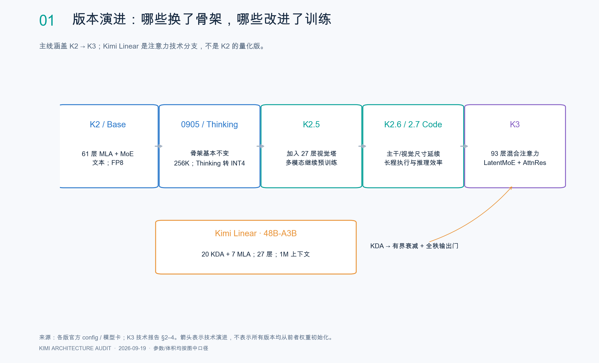
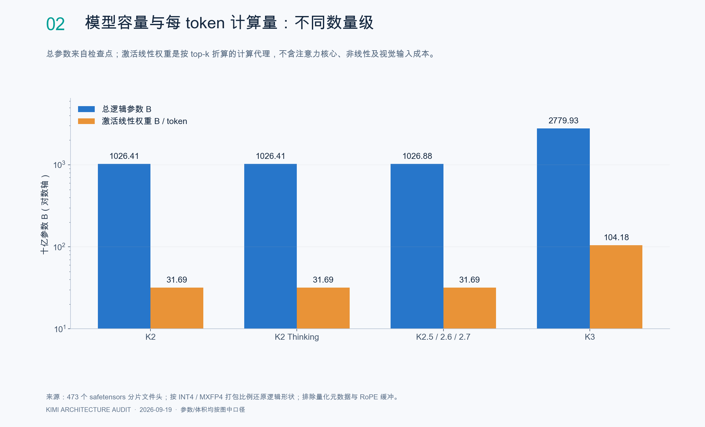
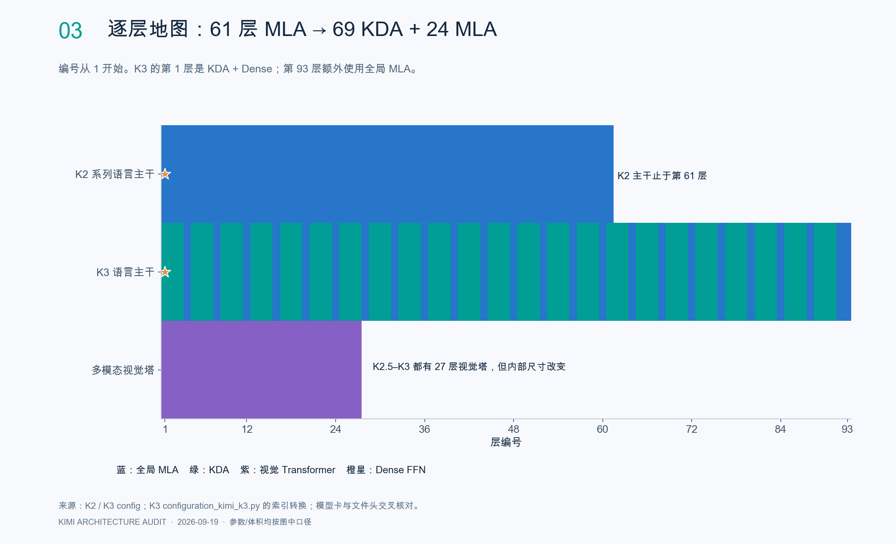
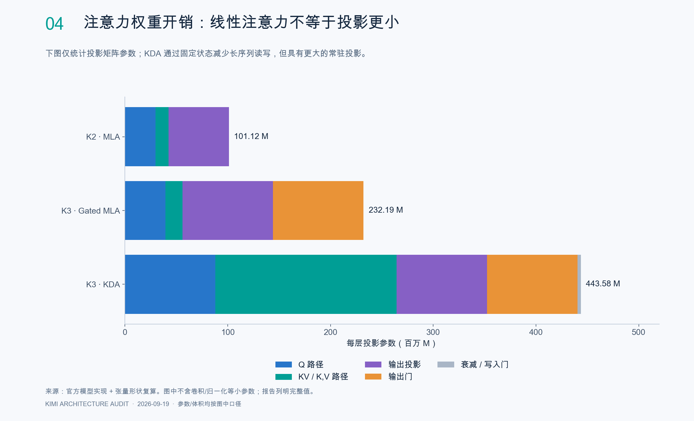
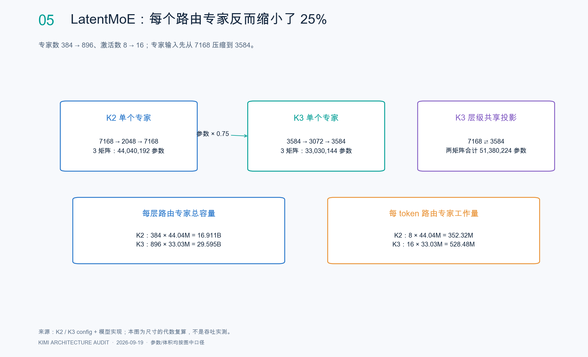
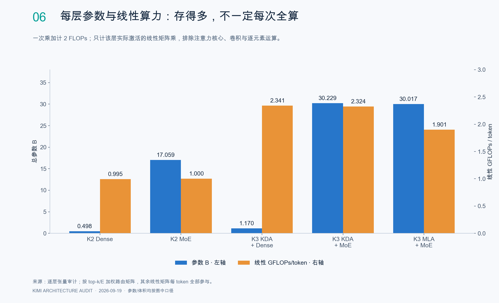
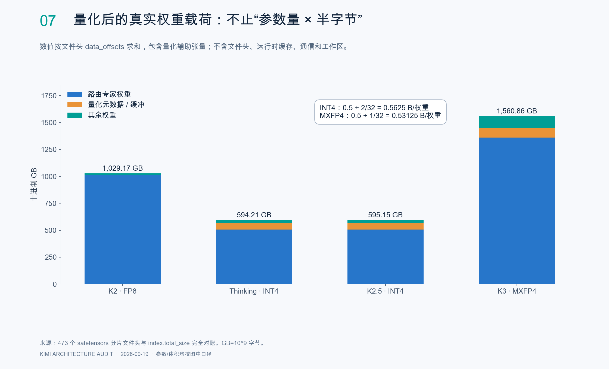
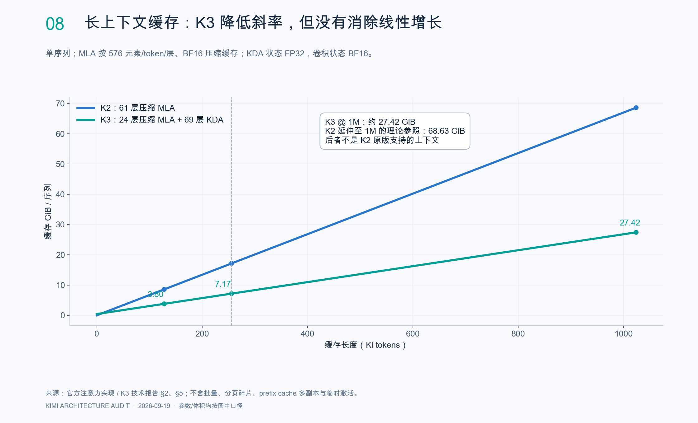
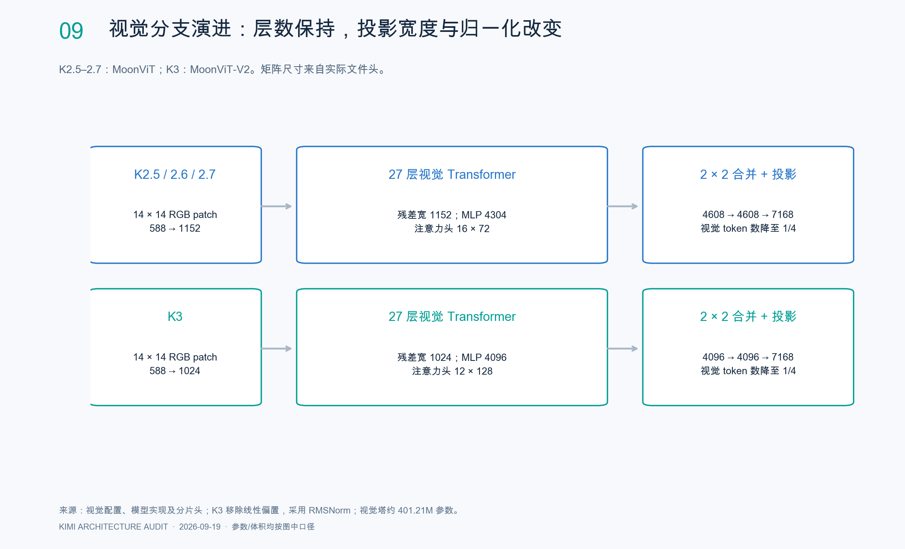
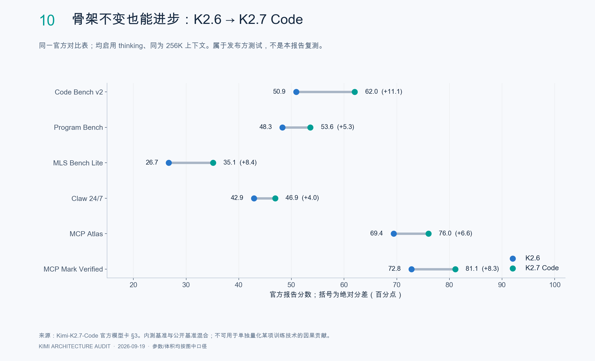

# Kimi K2 → Kimi K3：架构演进、逐层张量、计算与量化审计

**研究日期：2026 年 9 月 19 日｜中文研究报告｜含 10 张分析图与可复算数据附件**

本报告的核心结论：**K2 到 K2.7 的主要语言骨架持续复用；K2.5 加入视觉通路；K3 才发生主干级重构。** K3 同时改变序列混合、深度信息流、专家计算空间、优化稳定性和部署精度。单用“从一万亿变成二点八万亿”不能解释这些变化。

这里的“全部层”指选定公开检查点中所有语言层、视觉层、嵌入、输出头、连接器、归一化和辅助张量。主线覆盖 K2-Instruct、0905、Thinking、K2.5、K2.6、K2.7 Code、K3；K2-Base 的配置与首发 Instruct 对照，Kimi Linear、VL、Audio 则作为相关技术分支单列，避免把不同产品误串成一条权重继承链。未公开的训练内部张量、优化器状态和线上私有版本不能由公开权重完整还原。

## 1. 研究口径与证据强度

- **直接观测**：官方 config、实现代码、技术论文、模型卡；固定版本的 safetensors 分片头与索引。
- **复算**：由张量形状、元素格式、分片偏移和 top-k 推导参数量、存储与线性乘法成本。
- **官方解释**：发布方在论文中给出的设计动机与实验结论；不等于本报告独立复现实验。
- **分析推断**：由结构推导的工程影响；不能反向证明未披露的训练配方。

共核对 **7 个主线检查点、473 个分片、1,610,434 个张量条目**。仅通过 HTTP Range 读取文件头，没有下载数 TB 的完整权重，也没有加载模型做推理或性能测试。每个模型的张量集合与 weight_map 对账，并将 data_offsets 计算出的有效载荷与 index.total_size 对账，全部一致。

矩阵尺寸统一使用 **[输出维度, 输入维度]**。B=10⁹ 参数，M=10⁶ 参数；GB=10⁹ 字节，GiB=2³⁰ 字节。报告的“逻辑参数”将打包权重解读回低位元素数量，排除量化 scale、shape 元数据及 RoPE 的 inv_freq 缓冲，保留路由校正向量等模型状态。此计数不等于所有张量都需要梯度。

附件：`逐层参数与体积.csv` 覆盖每个主线版本的每一层；`全部张量清单.csv.gz` 覆盖全部张量及存储/逻辑形状；各版本 `tensor-templates.csv` 折叠重复的层与专家，适合快速核对。来源固定版本见文末。

## 2. 主线演进：改变在哪里，为什么改变

| 阶段 | 结构与精度变化 | 能力/训练变化与动机 | 不能据此声称 |
| --- | --- | --- | --- |
| K2-Base → K2-Instruct | 61 层、64 头 MLA；首层 Dense、60 层 MoE；384 选 8 + 1 共享专家；公开 FP8 | Base 提供预训练基础，Instruct 通过 SFT/RL 学习工具使用与任务执行；容量由稀疏专家提供 | Instruct 是不同深度的模型 |
| K2 → 0905 | 主要矩阵尺寸不变；上下文 131072 → 262144；YaRN factor 32 → 64；RMSNorm eps 1e-6 → 1e-5 | 改善 agentic coding 和前端任务，扩大长程任务可见上下文 | 上下文翻倍等于参数翻倍 |
| 0905 / K2 主线 → Thinking | 仍是同一类 61 层骨架；路由专家转原生 INT4，group size 32 | 扩展思考与工具交替；后训练 QAT 降低长推理服务成本 | Thinking 只是加了一条提示词，或全模型 INT4 |
| K2-Base → K2.5 | 语言主干维度延续；新增 27 层 MoonViT 和连接器；路由专家 INT4 | 官方称在 K2-Base 上继续进行约 15T 混合视觉/文本 token 预训练；联合视觉与 agent 能力、并行 Agent Swarm | 仅外挂 OCR；或 MoE 专家数等于 agent 数 |
| K2.5 → K2.6 | 语言和视觉主要张量尺寸一致 | 面向更长 coding 任务与持续任务执行；官方展示更大规模 agent 编排 | 因加层或加专家而进步 |
| K2.6 → K2.7 Code | 主要尺寸延续；同为 INT4；强制 thinking / 保留思考历史的使用方式 | 编码专门化；官方称思考 token 使用约减少 30%；同表评测提升 | 计算速度必定提高 30%，或每项任务都少用 30% token |
| K2 家族 → K3 | 93 层；69 KDA + 24 Gated MLA；896 选 16；LatentMoE；Block AttnRes；SiTU；MoonViT-V2；MXFP4 专家权重 | 同时扩大基础容量和长程推理；把百万上下文、稀疏通信、训练稳定性及低位部署一起设计 | K3 完全取消 KV cache；或纯粹把 K2 等比例放大 |

本次配置逐字段对比中，K2.6 相对 K2.5 的差别主要是结束 token 设置；K2.7 Code 还调整了量化排除规则的正则表达式。**尺寸相同不表示权重相同、数据相同或训练算法相同。** 后训练配方未公开到可复现的地方，不补写虚构细节。

来源：[K2 官方仓库](https://github.com/MoonshotAI/Kimi-K2)、[0905 模型卡](https://huggingface.co/moonshotai/Kimi-K2-Instruct-0905)、[Thinking 模型卡](https://huggingface.co/moonshotai/Kimi-K2-Thinking)、[K2.5 论文](https://arxiv.org/abs/2602.02276)、[K2.6 模型卡](https://huggingface.co/moonshotai/Kimi-K2.6)、[K2.7 Code 模型卡](https://huggingface.co/moonshotai/Kimi-K2.7-Code)、[K3 技术报告](https://github.com/MoonshotAI/Kimi-K3/blob/main/k3_tech_report.pdf)。

**图 1。** 架构改变与训练改变应分开评价。

## 3. 总体规格与参数审计

| 项目 | K2 / 0905 / Thinking | K2.5 / K2.6 / K2.7 Code | K3 |
| --- | --- | --- | --- |
| 语言层数 | 61 | 61 | 93 |
| Dense FFN 层数 | 1 | 1 | 1 |
| MoE 层数 | 60 | 60 | 92 |
| 残差宽度 | 7168 | 7168 | 7168 |
| 注意力 | 61 MLA | 61 MLA | 69 KDA + 24 Gated MLA |
| 注意力头数 | 64 | 64 | 96 |
| Dense 中间宽度 | 18432 | 18432 | 33792 |
| 路由专家数 / top-k | 384 / 8 | 384 / 8 | 896 / 16 |
| 路由专家输入宽度 | 7168 | 7168 | 3584 |
| 路由专家中间宽度 | 2048 | 2048 | 3072 |
| 共享专家等价数量 | 1 | 1 | 2（实现合并为中间宽 6144 的 FFN） |
| 词表 | 163840 | 163840 | 163840 |
| 输入/输出嵌入共享 | 否 | 否 | 否 |
| 视觉层数 | 无 | 27 | 27 |
| 视觉残差宽 | — | 1152 | 1024 |
| 最大上下文配置 | 首发 131072；后两版 262144 | 262144 | 1048576 |
| 主干位置机制 | RoPE + YaRN | RoPE + YaRN | MLA NoPE；KDA 隐式顺序信息 |
| 公开主干 MTP 层数 | 0 | 0 | 0 |

以下精确值来自检查点审计；它们与论文圆整口径分开列示。

| 检查点 | 复算逻辑参数 | 载荷 GB | 载荷 GiB | 分片 |
| --- | --- | --- | --- | --- |
| K2-Instruct | 1,026,408,232,448 | 1,029.173257 | 958.492 | 61 |
| K2-Instruct-0905 | 1,026,408,232,448 | 1,029.173266 | 958.492 | 62 |
| K2-Thinking | 1,026,408,232,448 | 594.205921 | 553.397 | 62 |
| K2.5 | 1,026,879,376,368 | 595.148193 | 554.275 | 64 |
| K2.6 | 1,026,879,376,368 | 595.148193 | 554.275 | 64 |
| K2.7-Code | 1,026,879,376,368 | 595.148193 | 554.275 | 64 |
| K3 | 2,779,931,837,184 | 1,560.860325 | 1,453.664 | 96 |

**官方标称与检查点口径。** K2 文献常列 1.04T / 32B 或 32.6B，公开主干复算为约 1.026408T；K3 论文列 2.78T / 104.2B，公开检查点约 2.779932T。K3 技术报告表 1 同时列 K2、K3 训练时均有 1 个 MTP 层，但公开主干配置的 nextn 层数均为 0。增加一个 K2 大小的 MoE 块会把约 1.026T 推近 1.043T，**这可解释差异量级，但不能仅凭这一步算术断言论文精确计数必然采用了该口径**。部署估算应以实际检查点为准。

特别注意：Hugging Face 自动参数摘要中的 I32 / U8 可能对应压缩容器及逻辑权重识别，不能把摘要数字直接乘该 dtype 字节数。本报告使用真实 shape 与 data_offsets。

**图 2。** 公开权重约 1.026T → 2.780T；文本线性算子代理约 31.69B → 104.18B。

**图 3。** 层级编号覆盖全部语言层和视觉层；完整数值清单见逐层 CSV。

## 4. K2 全部语言层：从输入到输出

设批量 B、序列长度 T。输入 token ID 为 [B,T]，嵌入后为 [B,T,7168]。第 1 层为 MLA + Dense，之后第 2–61 层为 MLA + MoE；每个子层前 RMSNorm，外部残差相加。最终 RMSNorm 后，经独立词表头产生 [B,T,163840] logits。生成阶段通常只投影必要位置，不能把整段全词表 logits 当成必需常驻张量。

### 4.1 每一层都具有的 MLA

| 张量/模块 | 权重逻辑形状 [out,in] | 参数 | 输出特征 |
| --- | --- | ---: | --- |
| q_a_proj | [1536,7168] | 11,010,048 | 1536 维查询潜变量 |
| q_a_layernorm | [1536] | 1,536 | RMSNorm |
| q_b_proj | [12288,1536] | 18,874,368 | 64 × (128+64) |
| kv_a_proj_with_mqa | [576,7168] | 4,128,768 | 512 压缩 KV + 64 共享位置分量 |
| kv_a_layernorm | [512] | 512 | 压缩内容归一化 |
| kv_b_proj | [16384,512] | 8,388,608 | 64 × (128 内容 K + 128 V) |
| o_proj | [7168,8192] | 58,720,256 | 64 × 128 → 7168 |
| MLA 合计 | — | **101,124,096** | 不含两处块级 RMSNorm |

Q/K 的每头维度是 192，V 每头是 128。**7168/64=112 不是该模型的注意力 head dimension**；残差宽度与注意力投影输出宽度不同。MLA 的低秩压缩也不能读成普通 MHA/GQA：尽管配置给出 64 个 KV heads，优化部署可缓存共享压缩潜变量。

### 4.2 首层 Dense 与其余 60 层 MoE

Dense 的 gate、up 为 [18432,7168]，down 为 [7168,18432]。SwiGLU 形式是 SiLU(gate(x))⊙up(x)，再 down 投影：

`P_dense = 3 × 7168 × 18432 = 396,361,728`。

单个路由专家 gate/up 为 [2048,7168]，down 为 [7168,2048]：

`P_expert = 3 × 7168 × 2048 = 44,040,192`。

每个 MoE 层储存 384 个这样的路由专家和 1 个同尺寸共享专家；每 token 仅使用 8 个路由专家，但共享专家始终使用。路由权重 [384,7168]，另有 [384] 校正向量；评分使用 sigmoid，top-k 权重归一化，输出缩放因子 2.827。校正偏置用于选择专家，不能误当作 FFN 线性层的普通 bias。

| 单层组成 | 精确参数数 |
| --- | ---: |
| 384 个路由专家 | 16,911,433,728 |
| 1 个共享专家 | 44,040,192 |
| Router + 校正向量 | 2,752,896 |
| MLA | 101,124,096 |
| 两处块级 RMSNorm | 14,336 |
| 第 2–61 层每层合计 | **17,059,365,248** |
| 第 1 层 MLA + Dense + 两处 RMSNorm | **497,500,160** |

嵌入与输出头各为 [163840,7168]，各有 1,174,405,120 个参数；末端 RMSNorm 为 7168。总计：

`2×1,174,405,120 + 497,500,160 + 60×17,059,365,248 + 7168 = 1,026,408,232,448`。

K2.5–K2.7 语言部分沿用这些尺寸；视觉部分另加。K2/0905/Thinking 保存的 RoPE inv_freq 缓冲数量并不一致，已计入文件载荷，但不计入上述模型参数。

来源：[K2 配置](https://huggingface.co/moonshotai/Kimi-K2-Instruct/blob/main/config.json)、[K2.5 配置](https://huggingface.co/moonshotai/Kimi-K2.5/blob/main/config.json)、相应固定版本权重头。上表数值为本报告独立算术复算。

## 5. K3 的结构重构：逐模块、逐层拆解

### 5.1 93 层的排列

从 1 开始：第 4、8、12……92 层，以及第 93 层为 Gated MLA，共 24 层。其余 69 层为 KDA。第 1 层使用 Dense FFN，之后 92 层都使用 LatentMoE。代码中的层索引从 0 开始，配置列表从 1 开始，审计已处理这一差异。

K3 的残差宽仍为 7168；深度从 61 增到 93（约 +52.5%），并非把残差宽等比例扩大。以下保留官方实现和权重布局之间可观察到的细微差别，不用四舍五入掩盖。

### 5.2 Gated MLA：96 头 + NoPE + 输出门

| 张量 | 形状 | 参数 |
| --- | --- | ---: |
| q_a_proj | [1536,7168] | 11,010,048 |
| q_b_proj | [18432,1536] | 28,311,552 |
| kv_a_proj | [576,7168] | 4,128,768 |
| kv_b_proj | [24576,512] | 12,582,912 |
| o_proj | [7168,12288] | 88,080,384 |
| g_proj | [12288,7168] | 88,080,384 |
| Q/KV 两处小 RMSNorm | [1536]、[512] | 2,048 |
| 合计 | — | **232,196,096** |

与 K2 相比，新增全秩输出门 sigmoid(Wg x)，用于逐 token 控制注意力输出通道。保留的字段 qk_rope_head_dim=64 表示分量尺寸，**不意味着 K3 仍实际应用 RoPE**：实现没有旋转嵌入，论文明确采用 NoPE。这 64 维仍存在于 Q/K 投影和 576 维压缩表示中。

### 5.3 KDA：固定矩阵状态，通道级遗忘，内容写入

每头状态约为 [128,128]，96 头为 [96,128,128]。不同于保存所有历史 token 的 K/V，KDA 将历史压入状态，使用通道级遗忘和 delta-rule 更新。用列向量 k、q、v 和状态 S∈R^(d_k×d_v) 表示，一步更新可写为：

`S_t = (I − β_t k_t k_tᵀ) diag(α_t) S_(t−1) + β_t k_t v_tᵀ`，`o_t = S_tᵀ q_t`。

α 控制逐通道遗忘，β 控制写入强度；减去旧状态对当前 key 的预测，再写入新的 value，是 delta-rule 与简单累加式线性注意力的重要区别。实际实现采用分块/融合算子，公式不是执行调度。其主要矩阵如下：

| 模块 | 权重形状 | 数量/参数 |
| --- | --- | ---: |
| Q、K、V 投影 | 各 [12288,7168] | 各 88,080,384 |
| 全秩输出门 g_proj | [12288,7168] | 88,080,384 |
| 输出投影 o_proj | [7168,12288] | 88,080,384 |
| 衰减低秩投影 f_a / f_b | [128,7168] / [12288,128] | 917,504 / 1,572,864 |
| 写入门 b_proj | [96,7168] | 688,128 |
| Q/K/V depthwise 短卷积 | 各 [12288,1,4] | 合计 147,456 |
| dt_bias | [12288] | 12,288 |
| 头内输出 RMSNorm | [128] | 128 |
| A_log | 配置/代码语义为 96 头；本次文件头为 [128] | 文件布局计 128 |

**布局差异需要保留。** 公开实现按 96 头声明 A_log，但审计到分片头保存 [128]。可能涉及导出布局或填充，本报告未加载完整权重验证其原因。因此，逻辑架构按代码计算的单层 KDA 为 443,740,384，按已发布头部布局计为 **443,740,416**，差 32。69 层总差只有 2208 个元素，参数量影响极小，但这阻止我们把“文件头计数”冒充“完全通过加载验证的训练参数数”。

KDA 相对 Kimi Linear 的关键改进是将 log-decay 限制在 (-5,0)，让 16-token tile 的累计范围可控，便于使用 Tensor Core 矩阵乘路径；输出门从低秩改成全秩。**线性的是序列长度方向的复杂度，不是投影参数量更小。**

**图 4。** KDA 的注意力模块约 443.74M 参数，Gated MLA 约 232.20M，K2 MLA 约 101.12M。

### 5.4 Stable LatentMoE：把路由专家搬到 3584 维空间

路径为：7168 维输入 → [3584,7168] 压缩 → 896 选 16 的专家计算 → 3584 维聚合 → RMSNorm → [7168,3584] 恢复；共享专家则直接在原始 7168 维输入上计算，并与路由输出相加。路由器也读取原始 7168 维输入。

| 组成 | 形状 / 数量 | 参数 |
| --- | --- | ---: |
| 单个路由专家 w1 / w3 | 各 [3072,3584] | 各 11,010,048 |
| 单个路由专家 w2 | [3584,3072] | 11,010,048 |
| 单个路由专家合计 | 三矩阵 | **33,030,144** |
| 全部路由专家 | ×896 | **29,595,009,024** |
| 压缩+恢复投影 | [3584,7168] + [7168,3584] | 51,380,224 |
| 潜空间 RMSNorm | [3584] | 3,584 |
| 共享 FFN | gate/up [6144,7168]，down [7168,6144] | 132,120,576 |
| Router | [896,7168] + [896] 校正向量 | 6,423,424 |

单个专家虽然中间维度从 2048 增至 3072，但输入维度减半，故参数变成 K2 单专家的 **75%**。每层路由容量为 K2 的 1.75 倍；激活专家线性权重为 K2 的 1.5 倍。压缩/恢复投影是每层共享，**不应该给每个专家重复加一份**。

SiTU-GLU 对 gate 和 up 支路施加平滑 tanh 限幅，参数 β₁=4、β₂=25；归一化控制专家聚合后幅值。Quantile Balancing 用路由分数的分位数估计更新负载平衡偏置。前两者解决激活稳定性，后者解决极稀疏专家负载不均；它们不是减少专家数量的技术。

**图 5。** 总路由容量增加 75%，而单层激活路由专家矩阵工作量增加 50%；另需计算共享分支与压缩/恢复投影。

### 5.5 Attention Residuals：改的是深度信息流

普通残差把前面信息持续加进单一路径。Block AttnRes 将前层输出按块累计，并让当前子层按内容加权读取前面的块表示。K3 block size=12，93 层形成 8 个块（最后一个不满），连同嵌入来源共 9 个来源块。

每个语言层额外有两套长度 7168 的归一化权重与两套 [1,7168] 的打分向量：`4×7168=28,672` 个附加参数；全模型还增加末端的同类归一化和打分。相比数十亿参数的 MoE 层，这点参数几乎可忽略，但需要保留/传递块级激活；其价值和代价主要在信息流、内存和算子调度。

### 5.6 三类语言层的精确大小

| 层类型 | 出现位置 / 次数 | 本次检查点参数 | 权重载荷 GB |
| --- | --- | ---: | ---: |
| KDA + Dense | 第 1 层；1 次 | 1,170,446,592 | 2.341213184 |
| KDA + LatentMoE | 其余 KDA；68 次 | 30,228,720,256 | 16.990092800 |
| Gated MLA + LatentMoE | 第 4n 层及第 93 层；24 次 | 30,017,175,936 | 16.566684160 |

Dense 的三矩阵为 [33792,7168]、[33792,7168]、[7168,33792]，合计 726,663,168。各类层的总数包含块级两处 RMSNorm 和 AttnRes；上述文件布局统计包含 A_log 的已观察长度。嵌入与输出头各有 1,174,405,120 参数，末端 norm/AttnRes 共有 21,504。

来源：[K3 配置](https://huggingface.co/moonshotai/Kimi-K3/blob/main/config.json)、[语言实现](https://huggingface.co/moonshotai/Kimi-K3/blob/main/modeling_kimi_linear.py)、[K3 技术报告 §2](https://github.com/MoonshotAI/Kimi-K3/blob/main/k3_tech_report.pdf)，以及固定版本分片头。

**图 6。** K2 MoE 单层约 1.000 GFLOPs/token；K3 KDA+MoE 约 2.324，MLA+MoE 约 1.901。

## 6. 量化、数据类型与每层物理存储

| 版本 | 路由专家权重 | 元数据 | 非专家模块 | 训练/计算口径 |
| --- | --- | --- | --- | --- |
| K2 / 0905 | FP8 E4M3；大部分线性权重也 FP8 | 128×128 block，FP32 scale | 嵌入、norm 等 BF16；部分状态 F32 | 发布格式不能单独证明整个预训练都使用同一精度 |
| Thinking、K2.5–2.7 | INT4，8 个权重打包到 I32 | 每 32 权重一个 BF16 scale；shape 元数据 I32 | 注意力、Dense、共享专家、视觉等 BF16；路由校正 F32 | weight-only QAT；低位权重不代表激活全 INT4 |
| K3 | MXFP4，2 个权重打包到 U8 | 每 32 权重一个 U8 scale | 注意力/共享/潜空间投影等 BF16；KDA 的部分状态参数与短卷积 F32 | 官方说明路由专家 W4A8，MXFP8 激活；SFT 和 RL 均 QAT |

INT4 是整数数值网格，MXFP4 是微缩放浮点格式，**二者不能因为都写“4 bit”就互换权重字节**。K3 的配置将 scale_dtype 标为 uint8；这只是编码容器，不能把 scale 当作普通 unsigned 整数直接乘。

### 6.1 三种权重存储公式

- FP8 矩阵 [m,n]：`mn + 4×ceil(m/128)×ceil(n/128)` 字节。块边界需向上取整。
- INT4 矩阵 [m,n]：本次这些 n 均可整除 32，`mn/2 + 2mn/32 + 8` 字节；最后 8 字节为两个 I32 的原始 shape。等效主体 **4.5 bit/权重**，而非恰好 4。
- MXFP4 矩阵 [m,n]：`mn/2 + mn/32` 字节；本次专家头部没有逐矩阵 weight_shape，等效 **4.25 bit/权重**。

例如 K2 专家 gate：[2048,7168] 的逻辑 14,680,064 权重，INT4 容器是 I32 [2048,896]，scale 为 BF16 [2048,224]。K3 专家 w1：[3072,3584] 的逻辑 11,010,048 权重，U8 打包形状是 [3072,1792]，scale 为 U8 [3072,112]。

K2 单个专家三矩阵在 INT4 下约 **24,772,632 字节**；K3 单个专家在 MXFP4 下为 **17,547,264 字节**。量化改变物理存储，未改变专家的逻辑维度和个数。

### 6.2 哪些细节容易算错

1. “torch_dtype=bfloat16”不代表每个保存张量都是 BF16，量化配置和文件头优先。
2. F32 reduction、F32 router 计算、低位权重存储、BF16 残差流是不同层面的精度描述。
3. K3 配置中 input_activations=null 不能否定论文的专家 MXFP8 计算说明：序列化权重配置与运行时算子精度不是同一对象。实际引擎是否走 W4A8 内核，仍须验证。
4. 官方说“2×”加速有特定低延迟部署条件；本报告不把它画成所有硬件上固定的吞吐收益。
5. 缓存、工作区、CUDA graph、通信 buffer、额外复制和碎片都不在权重文件字节之内。

来源：[Thinking 原生 INT4 说明](https://huggingface.co/moonshotai/Kimi-K2-Thinking#4-native-int4-quantization)、各版 quantization_config 与本次分片头；[K3 报告 §4.1.4](https://github.com/MoonshotAI/Kimi-K3/blob/main/k3_tech_report.pdf)。

**图 7。** K2.5 权重约 595.15GB；K3 约 1560.86GB。MXFP4 的 U8 容器并不代表 8 位权重。

## 7. 计算复杂度、激活大小与 KV / recurrent cache

### 7.1 先给可复算的线性矩阵工作量

对矩阵 [out,in]，一个 token 的稠密线性乘法约为 `2×out×in` FLOPs。MoE 路由矩阵只按 top-k/E 折算，router、共享分支与注意力投影全算。由此得：

| 文本解码代理指标 | K2 主干 | K3 主干 |
| --- | ---: | ---: |
| 激活线性权重 + 输出头 | 31.686066B | 104.175433B |
| 对应线性计算量 / token | 63.372132 GFLOPs | 208.350865 GFLOPs |

这不是整模型 FLOPs 或吞吐基准：未含 QKᵀ/AV 注意力核心、KDA recurrence、softmax、norm、激活、卷积、路由分发、视觉输入与通信；输入 embedding 是查表，没有按整个词表矩阵乘计算。理论架构论文的 activated-parameters 数字还可能采用不同的嵌入/MTP计数。因此只在相同口径下比较。

### 7.2 序列维度的计算区别

常规展开注意力在 prefill 的因果 QKᵀ/AV 约需 `H×(d_qk+d_v)×T×(T+1)` FLOPs；decode 对长度 L 的历史，约需 `2×H×(d_qk+d_v)×L`。K2 为 H=64、d_qk=192、d_v=128；K3 的全局层 H=96。**这是展开表示的数学参照，优化 MLA 通过矩阵吸收改变实际执行形状和计算量，不能直接拿来预测 vLLM/SGLang 吞吐。**

KDA 的历史更新复杂度约为每 token `Θ(H×d_k×d_v)`，每层状态尺寸与 T 无关；chunkwise prefill 使用分块矩阵算法，不应等同于逐 token Python 循环。K3 总体还有 24 个全局层，整体 prefill 仍包含随 T² 增长的部分，decode 仍包含随历史长度增长的部分。

### 7.3 压缩缓存估算

按优化 MLA 缓存每层每 token `512+64=576` 个 BF16 元素：

`K2_cache(T) = 61 × T × 576 × 2 bytes`。

K3 按 24 层同尺寸压缩 MLA，69 层 KDA。若 recurrent state 为 FP32，短卷积缓存为 BF16：

`K3_cache(T) ≈ 24×T×576×2 + 69×(96×128×128×4 + 3×12288×4×2) bytes`。

固定 KDA 部分约 0.423 GiB/序列。K2 在 128Ki token 下约 8.578 GiB；K2 后续版本在 256Ki 下约 17.156 GiB；K3 在 256Ki 下约 7.173 GiB、1Mi 下约 27.423 GiB。相同 1Mi 长度，若把 K2 数学上外推，约需 68.625 GiB，但这是反事实结构比较，并不代表原版 K2 支持 1Mi。

公开 Transformers 参考实现存在将多头 K/V 展开后放入 cache 的路径：K3 每 token 每全局层为 `96×(192+128)` 个元素，而非 576。用这一参考路径推理会远大于图中的压缩估算。state 的实际 dtype、cache packing、分页、复制、前缀复用和并发请求都会改变最终显存。

### 7.4 激活与硬件瓶颈

一份 BF16 主干残差 [B,T,7168] 大小为 `2BT×7168` 字节。B=1、T=1Mi 时即 **14 GiB**。这是 prefill/训练中一份整段激活；decode 单 token 只有 14 KiB，不应混淆。训练需要更多保存激活，激活重计算和分片会改变峰值。AttnRes 的块级保留也应单独计入，而非藏进 KV 数字。

MoE 的稀疏激活减少 FLOPs，却没有免除全部专家权重的存储。低并发通常受权重带宽、专家跳转和通信影响；高并发还受专家负载、矩阵乘利用率及跨卡互联影响。K3 将路由载荷压到 3584 维，合理推断有利于控制专家分发的数据量，但实际通信收益取决于并行划分。官方 MoonEP 通过任务迁移实现设备级平衡；它与 Quantile Balancing 的专家选择平衡是不同层面的手段。

**图 8。** 实际引擎若缓存展开后的多头 K/V，结果会显著更大；这是压缩实现的结构估算。

## 8. 视觉通路：全部 27 层与连接器

K2.5–K2.7 的 MoonViT 残差宽 1152，16 头 ×72；K3 MoonViT-V2 残差宽 1024，但注意力 Q/K/V 输出各宽 1536，12 头 ×128。视觉层使用普通双线性 GELU MLP，不是语言部分的三矩阵 SwiGLU / SiTU-GLU。

| 视觉组件 | K2.5 / 2.6 / 2.7 | K3 |
| --- | --- | --- |
| Patch 卷积权重 | [1152,3,14,14] + bias [1152] | [1024,3,14,14]；无 bias |
| 空间位置表 | [64,64,1152] | [64,64,1024] |
| 每层 QKV | [3456,1152] + [3456] bias | [4608,1024]；无 bias |
| 每层输出投影 | [1152,1152] + bias | [1024,1536]；无 bias |
| 每层 MLP 上投影 | [4304,1152] + bias | [4096,1024]；无 bias |
| 每层 MLP 下投影 | [1152,4304] + bias | [1024,4096]；无 bias |
| 每层归一化 | 两个 LayerNorm，均有 weight/bias | 两个 RMSNorm，无 bias |
| 单视觉层参数 | 15,239,504 | 14,682,112 |
| 27 层 + patch/位置/末端 norm | **416,866,032** | **401,214,464** |
| 2×2 合并后的通道数 | 4608 | 4096 |
| Projector 两矩阵 | [4608,4608] → [7168,4608] | [4096,4096] → [7168,4096] |
| Projector 归一化/偏置 | 输入 LayerNorm + 线性 bias | 输出 RMSNorm；线性无 bias |
| Projector 参数 | **54,277,888** | **46,144,512** |
| 视觉通路总参数 | **471,143,920** | **447,358,976** |

模型卡“400M 视觉编码器”是近似数，本报告用已保存权重复算。时间位置特征若是无参数固定表，不应按 init_pos_emb_time 直接添一个可训练参数表。

2×2 patch 合并后，静态图像 token 数大体是 patch 网格的 1/4；具体数目还取决于动态分辨率、边界补齐、视频切块及时间池化。例如对可整除的 448×448 图像，14×14 patch 得到 32×32=1024 patches，空间合并后为 256 tokens。不能把任意视频长度都换成一个固定常数。

**为什么改视觉塔？** K3 论文给出的原因是联合训练稳定性：从 SigLIP 预初始化转向从头以 next-token prediction 联合训练；RMSNorm 和去 bias 配合这一方案。发布方报告从头训练的梯度更稳定，视觉评测匹配其对比初始化基线。这不意味着“去掉视觉预训练在任何模型上都更好”。

来源：[K2.5 视觉实现](https://huggingface.co/moonshotai/Kimi-K2.5/blob/main/modeling_kimi_k25.py)、[K3 视觉实现](https://huggingface.co/moonshotai/Kimi-K3/blob/main/modeling_kimi_k3.py)、[K3 技术报告 §2.4](https://github.com/MoonshotAI/Kimi-K3/blob/main/k3_tech_report.pdf)。

**图 9。** K3 视觉残差宽 1024，但 Q/K/V 各宽 1536；不能用 1024/12 推导 head dimension。

## 9. 为什么沿这些方向演进：问题、机制和代价

| 遇到的问题 | 技术方向 | 获益逻辑 | 新代价/边界 |
| --- | --- | --- | --- |
| 高质量训练 token 稀缺 | K2 MuonClip、数据重写 | 提升每 token 的学习收益，限制注意力 logit 爆炸 | 优化器/裁剪超参和系统实现更复杂 |
| 扩容但不想按总参数付 FLOPs | K2 稀疏 MoE；K3 更大专家池 | 每 token 只走少数专家 | 权重存储、专家通信、负载均衡不能省掉 |
| K2 长序列全局注意力昂贵 | 64 头而非更大头数；后续 KDA 混合 | 控制注意力计算/缓存斜率 | KDA 以固定状态压缩历史，仍需全局层补足交互 |
| 更深主干的信息叠加瓶颈 | K3 Block AttnRes | 选择性读取跨深度表示 | 需要块级激活存储与融合算子 |
| 更多专家/更大 top-k 带来成本 | K3 LatentMoE | 在半宽空间内做路由计算 | 新增压缩/恢复投影，可能引入表示瓶颈 |
| 高稀疏训练不稳定 | SiTU、潜空间 norm、Quantile Balancing | 控制幅值和专家负载 | 三项共同作用；不能从整模成绩拆出各自贡献 |
| 多头优化尺度不均 | K3 Per-Head Muon | 分头做正交化，避免大尺度头支配更新 | 需在优化器中理解头的形状与分组 |
| 视觉与语言目标不一致 | 从头联合训练 MoonViT-V2 | 表示直接适配语言建模与细粒度视觉任务 | 必须有足够的联合数据与训练能力 |
| 长程 agent 成本随思考/工具链增长 | Thinking、K2.7、K3 后训练 | 学会在预算内执行、验证、恢复、多轮推进 | 依赖环境、工具、历史保留及奖励设计 |
| TB 级部署成本 | INT4 → MXFP4/MXFP8 QAT | 把精度损失放入训练阶段适应 | 内核、打包布局、量化 scale、训练/rollout 一致性要求更高 |

K2 的技术报告明确讨论稀疏 scaling law 与注意力头数取舍：增加专家能以较低激活成本扩容量，而加注意力头在长上下文有明显代价。因此 K2 选择 384 选 8、64 头。K3 的新目标进一步要求同时处理序列、深度和专家三个方向。

K3 官方的“约 2.5× scaling efficiency”来自架构、数据和训练配方共同形成的 fitted scaling-law 对比；**不是部署吞吐提高 2.5×，也不是 KDA 单项贡献 2.5×**。其上下文按 8K→64K 预训练、256K→1M cooldown 逐步扩展；训练后再经 SFT、分领域/思考档位 RL、多教师 on-policy distillation 汇合能力。报告未从公开材料确认精确总训练 token 数与完整数据混合比例，不做猜填。

跨版本评测应尽量使用同一表、同一评测协议。下图选取 K2.7 官方对 K2.6 的同表对比，展示骨架不变时依然可能提高任务完成能力。它不能证明改进来自某一个训练步骤，更不能把 agent harness 效果全部归因于基础网络结构。

**图 10。** 不能把这组能力增益解释为加层或加专家；尺寸不变，权重与训练仍可显著改变。

## 10. 相关系列：技术支线不等于主线缩小版

| 支线 | 已核实结构 | 与主线的关系 | 尚不能推断的内容 |
| --- | --- | --- | --- |
| Kimi Linear 48B-A3B | 27 层：20 KDA + 7 MLA；隐藏宽 2304；首层 Dense 中间宽 9216；其余 MoE，256 选 8 +1 共享，中间宽 1024；KDA 32×128，MLA 32 头；1M 上下文配置；公开 BF16 | K3 混合注意力的技术先驱；K3 改进衰减门和输出门 | 不是将 K2 的 1T 权重量化成 48B；参数减少和量化是不同概念 |
| Kimi-VL-A3B | 27 层语言，宽 2048；首层 Dense 11264；64 选 6 +2 共享，专家中间宽 1408；MLA 16 头；27 层、宽 1152 视觉塔；BF16 | 较小的 MoE 视觉语言模型；MoonViT 路线相关 | 不能将其 A3B 与 K2 的 32B 激活或 K3 的 104B 当同一架构 |
| Kimi-Audio-7B-Instruct | 主干 28 层、宽 3584、FFN 18944、28 Q heads / 4 KV heads；另有 6 层 MIMO 设置、音频适配维 5120；BF16 | 音频理解/生成专用支线，不是 K2 MLA-MoE 的不同量化档 | 仅主 config 无法完整重建 Whisper/声学 tokenizer/vocoder 等外部音频部件 |
| Kimi K1.5 | 已公开强化学习技术报告 | 推理与长上下文 RL 的前序研究 | 本次没有可审计完整权重，不能填“精确每层矩阵尺寸” |

这些支线的表格属于**配置级对照**，不在 473 分片主线权重审计的覆盖范围内。其 Base / Instruct / Thinking 等变体也不应仅凭名字就宣称内部权重继承路径。

Kimi Linear 语言层可用下列尺寸模板展开：Dense 三矩阵 2304↔9216；每个专家三矩阵 2304↔1024；路由器 [256,2304]；共享专家 1 个。Kimi-VL：Dense 三矩阵 2048↔11264；路由专家三矩阵 2048↔1408；共享 FFN 等价中间宽 2816；路由器 [64,2048]。两者查询投影 q_lora_rank=null，不能强行套 K2 的 1536 查询压缩公式。

来源：[Kimi Linear 模型卡/配置](https://huggingface.co/moonshotai/Kimi-Linear-48B-A3B-Instruct)、[Kimi-VL 模型卡/配置](https://huggingface.co/moonshotai/Kimi-VL-A3B-Instruct)、[Kimi-Audio 模型卡/配置](https://huggingface.co/moonshotai/Kimi-Audio-7B-Instruct)、[K1.5 技术报告](https://arxiv.org/abs/2501.12599)。

## 11. 能确定什么，哪些还需要实测

- **已确定**：所审计公开分片的全部张量形状、存储 dtype、载荷字节；各语言/视觉层参数；七版本主要结构变化；量化元数据开销。
- **结构推导**：线性矩阵 FLOPs、给定 cache 布局下的理论容量、某些单模块计算/通信影响。公式假设已明示。
- **未独立复现**：准确率、tokens/s、训练效率、量化质量损失、极长上下文下的精度与生产显存峰值。
- **公开信息不足**：全量训练数据、各阶段 token 精确配比、所有 RL 超参、未发布线上私有模型、完整训练时 MTP 与 optimizer 状态。
- **已发现的口径差异**：K2 论文与公开主干参数数不同；K3 A_log 文件布局与参考代码声明长度不同；参考实现 cache 与优化压缩 cache 的体积不同。这些差异均未用猜测抹平。

部署前最有价值的补充实验是：固定硬件与引擎版本，确认实际缓存布局及 W4A8 内核，再测短/长 prefill、单流 decode、多并发、专家通信与峰值内存。仅凭报告中的权重 GB，不能给出可靠的最小卡数或每秒 token 承诺。

## 12. 固定版本来源与复核方式

所有主线分片头使用下列 Hugging Face revision 获取。配置与模型实现取自同日公开 main，七个主线配置另与固定 revision 逐字段核对一致；本次没有运行第三方仓库代码，仅读取文本与文件头。逐项结果可从附件复算。

| 模型 | 固定 revision | 官方配置 / 权重索引 |
| --- | --- | --- |
| Kimi-K2-Instruct | fd1984e2b7a3350dbf7305fe73a4ede25c14de50 | [config](https://huggingface.co/moonshotai/Kimi-K2-Instruct/blob/fd1984e2b7a3350dbf7305fe73a4ede25c14de50/config.json) · [index](https://huggingface.co/moonshotai/Kimi-K2-Instruct/blob/fd1984e2b7a3350dbf7305fe73a4ede25c14de50/model.safetensors.index.json) |
| Kimi-K2-Instruct-0905 | ac6c49f04883bd0a0598b790693a72061c676629 | [config](https://huggingface.co/moonshotai/Kimi-K2-Instruct-0905/blob/ac6c49f04883bd0a0598b790693a72061c676629/config.json) · [index](https://huggingface.co/moonshotai/Kimi-K2-Instruct-0905/blob/ac6c49f04883bd0a0598b790693a72061c676629/model.safetensors.index.json) |
| Kimi-K2-Thinking | a51ccc050d73dab088bf7b0e2dd9b30ae85a4e55 | [config](https://huggingface.co/moonshotai/Kimi-K2-Thinking/blob/a51ccc050d73dab088bf7b0e2dd9b30ae85a4e55/config.json) · [index](https://huggingface.co/moonshotai/Kimi-K2-Thinking/blob/a51ccc050d73dab088bf7b0e2dd9b30ae85a4e55/model.safetensors.index.json) |
| Kimi-K2.5 | 4d01dfe0332d63057c186e0b262165819efb6611 | [config](https://huggingface.co/moonshotai/Kimi-K2.5/blob/4d01dfe0332d63057c186e0b262165819efb6611/config.json) · [index](https://huggingface.co/moonshotai/Kimi-K2.5/blob/4d01dfe0332d63057c186e0b262165819efb6611/model.safetensors.index.json) |
| Kimi-K2.6 | 7eb5002f6aadc958aed6a9177b7ed26bb94011bb | [config](https://huggingface.co/moonshotai/Kimi-K2.6/blob/7eb5002f6aadc958aed6a9177b7ed26bb94011bb/config.json) · [index](https://huggingface.co/moonshotai/Kimi-K2.6/blob/7eb5002f6aadc958aed6a9177b7ed26bb94011bb/model.safetensors.index.json) |
| Kimi-K2.7-Code | 74797c9c62378b951a1f6fcf5c4631024e9b8bef | [config](https://huggingface.co/moonshotai/Kimi-K2.7-Code/blob/74797c9c62378b951a1f6fcf5c4631024e9b8bef/config.json) · [index](https://huggingface.co/moonshotai/Kimi-K2.7-Code/blob/74797c9c62378b951a1f6fcf5c4631024e9b8bef/model.safetensors.index.json) |
| Kimi-K3 | f831ab66814297da540d832a5235f8e904f29d06 | [config](https://huggingface.co/moonshotai/Kimi-K3/blob/f831ab66814297da540d832a5235f8e904f29d06/config.json) · [index](https://huggingface.co/moonshotai/Kimi-K3/blob/f831ab66814297da540d832a5235f8e904f29d06/model.safetensors.index.json) |

技术论证主要依据：[K2 论文](https://arxiv.org/abs/2507.20534)、[K2.5 论文](https://arxiv.org/abs/2602.02276)、[K3 技术报告](https://github.com/MoonshotAI/Kimi-K3/blob/main/k3_tech_report.pdf)、[K3 官方技术文章](https://www.kimi.com/blog/kimi-k3)。官方成绩、官方解释、独立算术复算和工程推断在正文中分别标注。

## 附录 A. 全部主线语言层、视觉层及全局组件

以下每个版本均单独列出，不省略中间层。参数数已排除量化元数据和 RoPE 缓冲；载荷包含这些字节。文字编号 1 对应权重名称 layers.0。完整矩阵与物理格式见张量清单及模板 CSV。

Kimi-K2-Instruct：展开全部层

| 组 | 层（1 起） | 结构 | 逻辑参数 | 载荷 GB |
| --- | --- | --- | --- | --- |
| decoder | 1 | MLA / Dense | 497,500,160 | 0.497638224 |
| decoder | 2 | MLA / MoE | 17,059,365,248 | 17.066299728 |
| decoder | 3 | MLA / MoE | 17,059,365,248 | 17.066299728 |
| decoder | 4 | MLA / MoE | 17,059,365,248 | 17.066299728 |
| decoder | 5 | MLA / MoE | 17,059,365,248 | 17.066299728 |
| decoder | 6 | MLA / MoE | 17,059,365,248 | 17.066299728 |
| decoder | 7 | MLA / MoE | 17,059,365,248 | 17.066299728 |
| decoder | 8 | MLA / MoE | 17,059,365,248 | 17.066299728 |
| decoder | 9 | MLA / MoE | 17,059,365,248 | 17.066299728 |
| decoder | 10 | MLA / MoE | 17,059,365,248 | 17.066299728 |
| decoder | 11 | MLA / MoE | 17,059,365,248 | 17.066299728 |
| decoder | 12 | MLA / MoE | 17,059,365,248 | 17.066299728 |
| decoder | 13 | MLA / MoE | 17,059,365,248 | 17.066299728 |
| decoder | 14 | MLA / MoE | 17,059,365,248 | 17.066299728 |
| decoder | 15 | MLA / MoE | 17,059,365,248 | 17.066299728 |
| decoder | 16 | MLA / MoE | 17,059,365,248 | 17.066299728 |
| decoder | 17 | MLA / MoE | 17,059,365,248 | 17.066299728 |
| decoder | 18 | MLA / MoE | 17,059,365,248 | 17.066299728 |
| decoder | 19 | MLA / MoE | 17,059,365,248 | 17.066299728 |
| decoder | 20 | MLA / MoE | 17,059,365,248 | 17.066299728 |
| decoder | 21 | MLA / MoE | 17,059,365,248 | 17.066299728 |
| decoder | 22 | MLA / MoE | 17,059,365,248 | 17.066299728 |
| decoder | 23 | MLA / MoE | 17,059,365,248 | 17.066299728 |
| decoder | 24 | MLA / MoE | 17,059,365,248 | 17.066299728 |
| decoder | 25 | MLA / MoE | 17,059,365,248 | 17.066299728 |
| decoder | 26 | MLA / MoE | 17,059,365,248 | 17.066299728 |
| decoder | 27 | MLA / MoE | 17,059,365,248 | 17.066299728 |
| decoder | 28 | MLA / MoE | 17,059,365,248 | 17.066299728 |
| decoder | 29 | MLA / MoE | 17,059,365,248 | 17.066299728 |
| decoder | 30 | MLA / MoE | 17,059,365,248 | 17.066299728 |
| decoder | 31 | MLA / MoE | 17,059,365,248 | 17.066299728 |
| decoder | 32 | MLA / MoE | 17,059,365,248 | 17.066299728 |
| decoder | 33 | MLA / MoE | 17,059,365,248 | 17.066299728 |
| decoder | 34 | MLA / MoE | 17,059,365,248 | 17.066299728 |
| decoder | 35 | MLA / MoE | 17,059,365,248 | 17.066299728 |
| decoder | 36 | MLA / MoE | 17,059,365,248 | 17.066299728 |
| decoder | 37 | MLA / MoE | 17,059,365,248 | 17.066299728 |
| decoder | 38 | MLA / MoE | 17,059,365,248 | 17.066299728 |
| decoder | 39 | MLA / MoE | 17,059,365,248 | 17.066299728 |
| decoder | 40 | MLA / MoE | 17,059,365,248 | 17.066299728 |
| decoder | 41 | MLA / MoE | 17,059,365,248 | 17.066299728 |
| decoder | 42 | MLA / MoE | 17,059,365,248 | 17.066299728 |
| decoder | 43 | MLA / MoE | 17,059,365,248 | 17.066299728 |
| decoder | 44 | MLA / MoE | 17,059,365,248 | 17.066299728 |
| decoder | 45 | MLA / MoE | 17,059,365,248 | 17.066299728 |
| decoder | 46 | MLA / MoE | 17,059,365,248 | 17.066299728 |
| decoder | 47 | MLA / MoE | 17,059,365,248 | 17.066299728 |
| decoder | 48 | MLA / MoE | 17,059,365,248 | 17.066299728 |
| decoder | 49 | MLA / MoE | 17,059,365,248 | 17.066299728 |
| decoder | 50 | MLA / MoE | 17,059,365,248 | 17.066299728 |
| decoder | 51 | MLA / MoE | 17,059,365,248 | 17.066299728 |
| decoder | 52 | MLA / MoE | 17,059,365,248 | 17.066299728 |
| decoder | 53 | MLA / MoE | 17,059,365,248 | 17.066299728 |
| decoder | 54 | MLA / MoE | 17,059,365,248 | 17.066299728 |
| decoder | 55 | MLA / MoE | 17,059,365,248 | 17.066299728 |
| decoder | 56 | MLA / MoE | 17,059,365,248 | 17.066299728 |
| decoder | 57 | MLA / MoE | 17,059,365,248 | 17.066299728 |
| decoder | 58 | MLA / MoE | 17,059,365,248 | 17.066299728 |
| decoder | 59 | MLA / MoE | 17,059,365,248 | 17.066299728 |
| decoder | 60 | MLA / MoE | 17,059,365,248 | 17.066299728 |
| decoder | 61 | MLA / MoE | 17,059,365,248 | 17.066299728 |
| embedding | — | — | 1,174,405,120 | 2.348810240 |
| final_norm_and_residual | — | — | 7,168 | 0.000014336 |
| output_head | — | — | 1,174,405,120 | 2.348810240 |

Kimi-K2-Instruct-0905：展开全部层

| 组 | 层（1 起） | 结构 | 逻辑参数 | 载荷 GB |
| --- | --- | --- | --- | --- |
| decoder | 1 | MLA / Dense | 497,500,160 | 0.497638368 |
| decoder | 2 | MLA / MoE | 17,059,365,248 | 17.066299872 |
| decoder | 3 | MLA / MoE | 17,059,365,248 | 17.066299872 |
| decoder | 4 | MLA / MoE | 17,059,365,248 | 17.066299872 |
| decoder | 5 | MLA / MoE | 17,059,365,248 | 17.066299872 |
| decoder | 6 | MLA / MoE | 17,059,365,248 | 17.066299872 |
| decoder | 7 | MLA / MoE | 17,059,365,248 | 17.066299872 |
| decoder | 8 | MLA / MoE | 17,059,365,248 | 17.066299872 |
| decoder | 9 | MLA / MoE | 17,059,365,248 | 17.066299872 |
| decoder | 10 | MLA / MoE | 17,059,365,248 | 17.066299872 |
| decoder | 11 | MLA / MoE | 17,059,365,248 | 17.066299872 |
| decoder | 12 | MLA / MoE | 17,059,365,248 | 17.066299872 |
| decoder | 13 | MLA / MoE | 17,059,365,248 | 17.066299872 |
| decoder | 14 | MLA / MoE | 17,059,365,248 | 17.066299872 |
| decoder | 15 | MLA / MoE | 17,059,365,248 | 17.066299872 |
| decoder | 16 | MLA / MoE | 17,059,365,248 | 17.066299872 |
| decoder | 17 | MLA / MoE | 17,059,365,248 | 17.066299872 |
| decoder | 18 | MLA / MoE | 17,059,365,248 | 17.066299872 |
| decoder | 19 | MLA / MoE | 17,059,365,248 | 17.066299872 |
| decoder | 20 | MLA / MoE | 17,059,365,248 | 17.066299872 |
| decoder | 21 | MLA / MoE | 17,059,365,248 | 17.066299872 |
| decoder | 22 | MLA / MoE | 17,059,365,248 | 17.066299872 |
| decoder | 23 | MLA / MoE | 17,059,365,248 | 17.066299872 |
| decoder | 24 | MLA / MoE | 17,059,365,248 | 17.066299872 |
| decoder | 25 | MLA / MoE | 17,059,365,248 | 17.066299872 |
| decoder | 26 | MLA / MoE | 17,059,365,248 | 17.066299872 |
| decoder | 27 | MLA / MoE | 17,059,365,248 | 17.066299872 |
| decoder | 28 | MLA / MoE | 17,059,365,248 | 17.066299872 |
| decoder | 29 | MLA / MoE | 17,059,365,248 | 17.066299872 |
| decoder | 30 | MLA / MoE | 17,059,365,248 | 17.066299872 |
| decoder | 31 | MLA / MoE | 17,059,365,248 | 17.066299872 |
| decoder | 32 | MLA / MoE | 17,059,365,248 | 17.066299872 |
| decoder | 33 | MLA / MoE | 17,059,365,248 | 17.066299872 |
| decoder | 34 | MLA / MoE | 17,059,365,248 | 17.066299872 |
| decoder | 35 | MLA / MoE | 17,059,365,248 | 17.066299872 |
| decoder | 36 | MLA / MoE | 17,059,365,248 | 17.066299872 |
| decoder | 37 | MLA / MoE | 17,059,365,248 | 17.066299872 |
| decoder | 38 | MLA / MoE | 17,059,365,248 | 17.066299872 |
| decoder | 39 | MLA / MoE | 17,059,365,248 | 17.066299872 |
| decoder | 40 | MLA / MoE | 17,059,365,248 | 17.066299872 |
| decoder | 41 | MLA / MoE | 17,059,365,248 | 17.066299872 |
| decoder | 42 | MLA / MoE | 17,059,365,248 | 17.066299872 |
| decoder | 43 | MLA / MoE | 17,059,365,248 | 17.066299872 |
| decoder | 44 | MLA / MoE | 17,059,365,248 | 17.066299872 |
| decoder | 45 | MLA / MoE | 17,059,365,248 | 17.066299872 |
| decoder | 46 | MLA / MoE | 17,059,365,248 | 17.066299872 |
| decoder | 47 | MLA / MoE | 17,059,365,248 | 17.066299872 |
| decoder | 48 | MLA / MoE | 17,059,365,248 | 17.066299872 |
| decoder | 49 | MLA / MoE | 17,059,365,248 | 17.066299872 |
| decoder | 50 | MLA / MoE | 17,059,365,248 | 17.066299872 |
| decoder | 51 | MLA / MoE | 17,059,365,248 | 17.066299872 |
| decoder | 52 | MLA / MoE | 17,059,365,248 | 17.066299872 |
| decoder | 53 | MLA / MoE | 17,059,365,248 | 17.066299872 |
| decoder | 54 | MLA / MoE | 17,059,365,248 | 17.066299872 |
| decoder | 55 | MLA / MoE | 17,059,365,248 | 17.066299872 |
| decoder | 56 | MLA / MoE | 17,059,365,248 | 17.066299872 |
| decoder | 57 | MLA / MoE | 17,059,365,248 | 17.066299872 |
| decoder | 58 | MLA / MoE | 17,059,365,248 | 17.066299872 |
| decoder | 59 | MLA / MoE | 17,059,365,248 | 17.066299872 |
| decoder | 60 | MLA / MoE | 17,059,365,248 | 17.066299872 |
| decoder | 61 | MLA / MoE | 17,059,365,248 | 17.066299872 |
| embedding | — | — | 1,174,405,120 | 2.348810240 |
| final_norm_and_residual | — | — | 7,168 | 0.000014336 |
| output_head | — | — | 1,174,405,120 | 2.348810240 |

Kimi-K2-Thinking：展开全部层

| 组 | 层（1 起） | 结构 | 逻辑参数 | 载荷 GB |
| --- | --- | --- | --- | --- |
| decoder | 1 | MLA / Dense | 497,500,160 | 0.995000576 |
| decoder | 2 | MLA / MoE | 17,059,365,248 | 9.808554752 |
| decoder | 3 | MLA / MoE | 17,059,365,248 | 9.808554752 |
| decoder | 4 | MLA / MoE | 17,059,365,248 | 9.808554752 |
| decoder | 5 | MLA / MoE | 17,059,365,248 | 9.808554752 |
| decoder | 6 | MLA / MoE | 17,059,365,248 | 9.808554752 |
| decoder | 7 | MLA / MoE | 17,059,365,248 | 9.808554752 |
| decoder | 8 | MLA / MoE | 17,059,365,248 | 9.808554752 |
| decoder | 9 | MLA / MoE | 17,059,365,248 | 9.808554752 |
| decoder | 10 | MLA / MoE | 17,059,365,248 | 9.808554752 |
| decoder | 11 | MLA / MoE | 17,059,365,248 | 9.808554752 |
| decoder | 12 | MLA / MoE | 17,059,365,248 | 9.808554752 |
| decoder | 13 | MLA / MoE | 17,059,365,248 | 9.808554752 |
| decoder | 14 | MLA / MoE | 17,059,365,248 | 9.808554752 |
| decoder | 15 | MLA / MoE | 17,059,365,248 | 9.808554752 |
| decoder | 16 | MLA / MoE | 17,059,365,248 | 9.808554752 |
| decoder | 17 | MLA / MoE | 17,059,365,248 | 9.808554752 |
| decoder | 18 | MLA / MoE | 17,059,365,248 | 9.808554752 |
| decoder | 19 | MLA / MoE | 17,059,365,248 | 9.808554752 |
| decoder | 20 | MLA / MoE | 17,059,365,248 | 9.808554752 |
| decoder | 21 | MLA / MoE | 17,059,365,248 | 9.808554752 |
| decoder | 22 | MLA / MoE | 17,059,365,248 | 9.808554752 |
| decoder | 23 | MLA / MoE | 17,059,365,248 | 9.808554752 |
| decoder | 24 | MLA / MoE | 17,059,365,248 | 9.808554752 |
| decoder | 25 | MLA / MoE | 17,059,365,248 | 9.808554752 |
| decoder | 26 | MLA / MoE | 17,059,365,248 | 9.808554752 |
| decoder | 27 | MLA / MoE | 17,059,365,248 | 9.808554752 |
| decoder | 28 | MLA / MoE | 17,059,365,248 | 9.808554752 |
| decoder | 29 | MLA / MoE | 17,059,365,248 | 9.808554752 |
| decoder | 30 | MLA / MoE | 17,059,365,248 | 9.808554752 |
| decoder | 31 | MLA / MoE | 17,059,365,248 | 9.808554752 |
| decoder | 32 | MLA / MoE | 17,059,365,248 | 9.808554752 |
| decoder | 33 | MLA / MoE | 17,059,365,248 | 9.808554752 |
| decoder | 34 | MLA / MoE | 17,059,365,248 | 9.808554752 |
| decoder | 35 | MLA / MoE | 17,059,365,248 | 9.808554752 |
| decoder | 36 | MLA / MoE | 17,059,365,248 | 9.808554752 |
| decoder | 37 | MLA / MoE | 17,059,365,248 | 9.808554752 |
| decoder | 38 | MLA / MoE | 17,059,365,248 | 9.808554752 |
| decoder | 39 | MLA / MoE | 17,059,365,248 | 9.808554752 |
| decoder | 40 | MLA / MoE | 17,059,365,248 | 9.808554752 |
| decoder | 41 | MLA / MoE | 17,059,365,248 | 9.808554752 |
| decoder | 42 | MLA / MoE | 17,059,365,248 | 9.808554752 |
| decoder | 43 | MLA / MoE | 17,059,365,248 | 9.808554752 |
| decoder | 44 | MLA / MoE | 17,059,365,248 | 9.808554752 |
| decoder | 45 | MLA / MoE | 17,059,365,248 | 9.808554752 |
| decoder | 46 | MLA / MoE | 17,059,365,248 | 9.808554752 |
| decoder | 47 | MLA / MoE | 17,059,365,248 | 9.808554752 |
| decoder | 48 | MLA / MoE | 17,059,365,248 | 9.808554752 |
| decoder | 49 | MLA / MoE | 17,059,365,248 | 9.808554752 |
| decoder | 50 | MLA / MoE | 17,059,365,248 | 9.808554752 |
| decoder | 51 | MLA / MoE | 17,059,365,248 | 9.808554752 |
| decoder | 52 | MLA / MoE | 17,059,365,248 | 9.808554752 |
| decoder | 53 | MLA / MoE | 17,059,365,248 | 9.808554752 |
| decoder | 54 | MLA / MoE | 17,059,365,248 | 9.808554752 |
| decoder | 55 | MLA / MoE | 17,059,365,248 | 9.808554752 |
| decoder | 56 | MLA / MoE | 17,059,365,248 | 9.808554752 |
| decoder | 57 | MLA / MoE | 17,059,365,248 | 9.808554752 |
| decoder | 58 | MLA / MoE | 17,059,365,248 | 9.808554752 |
| decoder | 59 | MLA / MoE | 17,059,365,248 | 9.808554752 |
| decoder | 60 | MLA / MoE | 17,059,365,248 | 9.808554752 |
| decoder | 61 | MLA / MoE | 17,059,365,248 | 9.808554752 |
| embedding | — | — | 1,174,405,120 | 2.348810240 |
| final_norm_and_residual | — | — | 7,168 | 0.000014336 |
| output_head | — | — | 1,174,405,120 | 2.348810240 |

Kimi-K2.5：展开全部层

| 组 | 层（1 起） | 结构 | 逻辑参数 | 载荷 GB |
| --- | --- | --- | --- | --- |
| decoder | 1 | MLA / Dense | 497,500,160 | 0.995000320 |
| decoder | 2 | MLA / MoE | 17,059,365,248 | 9.808554496 |
| decoder | 3 | MLA / MoE | 17,059,365,248 | 9.808554496 |
| decoder | 4 | MLA / MoE | 17,059,365,248 | 9.808554496 |
| decoder | 5 | MLA / MoE | 17,059,365,248 | 9.808554496 |
| decoder | 6 | MLA / MoE | 17,059,365,248 | 9.808554496 |
| decoder | 7 | MLA / MoE | 17,059,365,248 | 9.808554496 |
| decoder | 8 | MLA / MoE | 17,059,365,248 | 9.808554496 |
| decoder | 9 | MLA / MoE | 17,059,365,248 | 9.808554496 |
| decoder | 10 | MLA / MoE | 17,059,365,248 | 9.808554496 |
| decoder | 11 | MLA / MoE | 17,059,365,248 | 9.808554496 |
| decoder | 12 | MLA / MoE | 17,059,365,248 | 9.808554496 |
| decoder | 13 | MLA / MoE | 17,059,365,248 | 9.808554496 |
| decoder | 14 | MLA / MoE | 17,059,365,248 | 9.808554496 |
| decoder | 15 | MLA / MoE | 17,059,365,248 | 9.808554496 |
| decoder | 16 | MLA / MoE | 17,059,365,248 | 9.808554496 |
| decoder | 17 | MLA / MoE | 17,059,365,248 | 9.808554496 |
| decoder | 18 | MLA / MoE | 17,059,365,248 | 9.808554496 |
| decoder | 19 | MLA / MoE | 17,059,365,248 | 9.808554496 |
| decoder | 20 | MLA / MoE | 17,059,365,248 | 9.808554496 |
| decoder | 21 | MLA / MoE | 17,059,365,248 | 9.808554496 |
| decoder | 22 | MLA / MoE | 17,059,365,248 | 9.808554496 |
| decoder | 23 | MLA / MoE | 17,059,365,248 | 9.808554496 |
| decoder | 24 | MLA / MoE | 17,059,365,248 | 9.808554496 |
| decoder | 25 | MLA / MoE | 17,059,365,248 | 9.808554496 |
| decoder | 26 | MLA / MoE | 17,059,365,248 | 9.808554496 |
| decoder | 27 | MLA / MoE | 17,059,365,248 | 9.808554496 |
| decoder | 28 | MLA / MoE | 17,059,365,248 | 9.808554496 |
| decoder | 29 | MLA / MoE | 17,059,365,248 | 9.808554496 |
| decoder | 30 | MLA / MoE | 17,059,365,248 | 9.808554496 |
| decoder | 31 | MLA / MoE | 17,059,365,248 | 9.808554496 |
| decoder | 32 | MLA / MoE | 17,059,365,248 | 9.808554496 |
| decoder | 33 | MLA / MoE | 17,059,365,248 | 9.808554496 |
| decoder | 34 | MLA / MoE | 17,059,365,248 | 9.808554496 |
| decoder | 35 | MLA / MoE | 17,059,365,248 | 9.808554496 |
| decoder | 36 | MLA / MoE | 17,059,365,248 | 9.808554496 |
| decoder | 37 | MLA / MoE | 17,059,365,248 | 9.808554496 |
| decoder | 38 | MLA / MoE | 17,059,365,248 | 9.808554496 |
| decoder | 39 | MLA / MoE | 17,059,365,248 | 9.808554496 |
| decoder | 40 | MLA / MoE | 17,059,365,248 | 9.808554496 |
| decoder | 41 | MLA / MoE | 17,059,365,248 | 9.808554496 |
| decoder | 42 | MLA / MoE | 17,059,365,248 | 9.808554496 |
| decoder | 43 | MLA / MoE | 17,059,365,248 | 9.808554496 |
| decoder | 44 | MLA / MoE | 17,059,365,248 | 9.808554496 |
| decoder | 45 | MLA / MoE | 17,059,365,248 | 9.808554496 |
| decoder | 46 | MLA / MoE | 17,059,365,248 | 9.808554496 |
| decoder | 47 | MLA / MoE | 17,059,365,248 | 9.808554496 |
| decoder | 48 | MLA / MoE | 17,059,365,248 | 9.808554496 |
| decoder | 49 | MLA / MoE | 17,059,365,248 | 9.808554496 |
| decoder | 50 | MLA / MoE | 17,059,365,248 | 9.808554496 |
| decoder | 51 | MLA / MoE | 17,059,365,248 | 9.808554496 |
| decoder | 52 | MLA / MoE | 17,059,365,248 | 9.808554496 |
| decoder | 53 | MLA / MoE | 17,059,365,248 | 9.808554496 |
| decoder | 54 | MLA / MoE | 17,059,365,248 | 9.808554496 |
| decoder | 55 | MLA / MoE | 17,059,365,248 | 9.808554496 |
| decoder | 56 | MLA / MoE | 17,059,365,248 | 9.808554496 |
| decoder | 57 | MLA / MoE | 17,059,365,248 | 9.808554496 |
| decoder | 58 | MLA / MoE | 17,059,365,248 | 9.808554496 |
| decoder | 59 | MLA / MoE | 17,059,365,248 | 9.808554496 |
| decoder | 60 | MLA / MoE | 17,059,365,248 | 9.808554496 |
| decoder | 61 | MLA / MoE | 17,059,365,248 | 9.808554496 |
| embedding | — | — | 1,174,405,120 | 2.348810240 |
| final_norm_and_residual | — | — | 7,168 | 0.000014336 |
| output_head | — | — | 1,174,405,120 | 2.348810240 |
| projector | — | — | 54,277,888 | 0.108555776 |
| vision | 1 | — | 15,239,504 | 0.030479008 |
| vision | 2 | — | 15,239,504 | 0.030479008 |
| vision | 3 | — | 15,239,504 | 0.030479008 |
| vision | 4 | — | 15,239,504 | 0.030479008 |
| vision | 5 | — | 15,239,504 | 0.030479008 |
| vision | 6 | — | 15,239,504 | 0.030479008 |
| vision | 7 | — | 15,239,504 | 0.030479008 |
| vision | 8 | — | 15,239,504 | 0.030479008 |
| vision | 9 | — | 15,239,504 | 0.030479008 |
| vision | 10 | — | 15,239,504 | 0.030479008 |
| vision | 11 | — | 15,239,504 | 0.030479008 |
| vision | 12 | — | 15,239,504 | 0.030479008 |
| vision | 13 | — | 15,239,504 | 0.030479008 |
| vision | 14 | — | 15,239,504 | 0.030479008 |
| vision | 15 | — | 15,239,504 | 0.030479008 |
| vision | 16 | — | 15,239,504 | 0.030479008 |
| vision | 17 | — | 15,239,504 | 0.030479008 |
| vision | 18 | — | 15,239,504 | 0.030479008 |
| vision | 19 | — | 15,239,504 | 0.030479008 |
| vision | 20 | — | 15,239,504 | 0.030479008 |
| vision | 21 | — | 15,239,504 | 0.030479008 |
| vision | 22 | — | 15,239,504 | 0.030479008 |
| vision | 23 | — | 15,239,504 | 0.030479008 |
| vision | 24 | — | 15,239,504 | 0.030479008 |
| vision | 25 | — | 15,239,504 | 0.030479008 |
| vision | 26 | — | 15,239,504 | 0.030479008 |
| vision | 27 | — | 15,239,504 | 0.030479008 |
| vision_other | — | — | 5,399,424 | 0.010798848 |

Kimi-K2.6：展开全部层

| 组 | 层（1 起） | 结构 | 逻辑参数 | 载荷 GB |
| --- | --- | --- | --- | --- |
| decoder | 1 | MLA / Dense | 497,500,160 | 0.995000320 |
| decoder | 2 | MLA / MoE | 17,059,365,248 | 9.808554496 |
| decoder | 3 | MLA / MoE | 17,059,365,248 | 9.808554496 |
| decoder | 4 | MLA / MoE | 17,059,365,248 | 9.808554496 |
| decoder | 5 | MLA / MoE | 17,059,365,248 | 9.808554496 |
| decoder | 6 | MLA / MoE | 17,059,365,248 | 9.808554496 |
| decoder | 7 | MLA / MoE | 17,059,365,248 | 9.808554496 |
| decoder | 8 | MLA / MoE | 17,059,365,248 | 9.808554496 |
| decoder | 9 | MLA / MoE | 17,059,365,248 | 9.808554496 |
| decoder | 10 | MLA / MoE | 17,059,365,248 | 9.808554496 |
| decoder | 11 | MLA / MoE | 17,059,365,248 | 9.808554496 |
| decoder | 12 | MLA / MoE | 17,059,365,248 | 9.808554496 |
| decoder | 13 | MLA / MoE | 17,059,365,248 | 9.808554496 |
| decoder | 14 | MLA / MoE | 17,059,365,248 | 9.808554496 |
| decoder | 15 | MLA / MoE | 17,059,365,248 | 9.808554496 |
| decoder | 16 | MLA / MoE | 17,059,365,248 | 9.808554496 |
| decoder | 17 | MLA / MoE | 17,059,365,248 | 9.808554496 |
| decoder | 18 | MLA / MoE | 17,059,365,248 | 9.808554496 |
| decoder | 19 | MLA / MoE | 17,059,365,248 | 9.808554496 |
| decoder | 20 | MLA / MoE | 17,059,365,248 | 9.808554496 |
| decoder | 21 | MLA / MoE | 17,059,365,248 | 9.808554496 |
| decoder | 22 | MLA / MoE | 17,059,365,248 | 9.808554496 |
| decoder | 23 | MLA / MoE | 17,059,365,248 | 9.808554496 |
| decoder | 24 | MLA / MoE | 17,059,365,248 | 9.808554496 |
| decoder | 25 | MLA / MoE | 17,059,365,248 | 9.808554496 |
| decoder | 26 | MLA / MoE | 17,059,365,248 | 9.808554496 |
| decoder | 27 | MLA / MoE | 17,059,365,248 | 9.808554496 |
| decoder | 28 | MLA / MoE | 17,059,365,248 | 9.808554496 |
| decoder | 29 | MLA / MoE | 17,059,365,248 | 9.808554496 |
| decoder | 30 | MLA / MoE | 17,059,365,248 | 9.808554496 |
| decoder | 31 | MLA / MoE | 17,059,365,248 | 9.808554496 |
| decoder | 32 | MLA / MoE | 17,059,365,248 | 9.808554496 |
| decoder | 33 | MLA / MoE | 17,059,365,248 | 9.808554496 |
| decoder | 34 | MLA / MoE | 17,059,365,248 | 9.808554496 |
| decoder | 35 | MLA / MoE | 17,059,365,248 | 9.808554496 |
| decoder | 36 | MLA / MoE | 17,059,365,248 | 9.808554496 |
| decoder | 37 | MLA / MoE | 17,059,365,248 | 9.808554496 |
| decoder | 38 | MLA / MoE | 17,059,365,248 | 9.808554496 |
| decoder | 39 | MLA / MoE | 17,059,365,248 | 9.808554496 |
| decoder | 40 | MLA / MoE | 17,059,365,248 | 9.808554496 |
| decoder | 41 | MLA / MoE | 17,059,365,248 | 9.808554496 |
| decoder | 42 | MLA / MoE | 17,059,365,248 | 9.808554496 |
| decoder | 43 | MLA / MoE | 17,059,365,248 | 9.808554496 |
| decoder | 44 | MLA / MoE | 17,059,365,248 | 9.808554496 |
| decoder | 45 | MLA / MoE | 17,059,365,248 | 9.808554496 |
| decoder | 46 | MLA / MoE | 17,059,365,248 | 9.808554496 |
| decoder | 47 | MLA / MoE | 17,059,365,248 | 9.808554496 |
| decoder | 48 | MLA / MoE | 17,059,365,248 | 9.808554496 |
| decoder | 49 | MLA / MoE | 17,059,365,248 | 9.808554496 |
| decoder | 50 | MLA / MoE | 17,059,365,248 | 9.808554496 |
| decoder | 51 | MLA / MoE | 17,059,365,248 | 9.808554496 |
| decoder | 52 | MLA / MoE | 17,059,365,248 | 9.808554496 |
| decoder | 53 | MLA / MoE | 17,059,365,248 | 9.808554496 |
| decoder | 54 | MLA / MoE | 17,059,365,248 | 9.808554496 |
| decoder | 55 | MLA / MoE | 17,059,365,248 | 9.808554496 |
| decoder | 56 | MLA / MoE | 17,059,365,248 | 9.808554496 |
| decoder | 57 | MLA / MoE | 17,059,365,248 | 9.808554496 |
| decoder | 58 | MLA / MoE | 17,059,365,248 | 9.808554496 |
| decoder | 59 | MLA / MoE | 17,059,365,248 | 9.808554496 |
| decoder | 60 | MLA / MoE | 17,059,365,248 | 9.808554496 |
| decoder | 61 | MLA / MoE | 17,059,365,248 | 9.808554496 |
| embedding | — | — | 1,174,405,120 | 2.348810240 |
| final_norm_and_residual | — | — | 7,168 | 0.000014336 |
| output_head | — | — | 1,174,405,120 | 2.348810240 |
| projector | — | — | 54,277,888 | 0.108555776 |
| vision | 1 | — | 15,239,504 | 0.030479008 |
| vision | 2 | — | 15,239,504 | 0.030479008 |
| vision | 3 | — | 15,239,504 | 0.030479008 |
| vision | 4 | — | 15,239,504 | 0.030479008 |
| vision | 5 | — | 15,239,504 | 0.030479008 |
| vision | 6 | — | 15,239,504 | 0.030479008 |
| vision | 7 | — | 15,239,504 | 0.030479008 |
| vision | 8 | — | 15,239,504 | 0.030479008 |
| vision | 9 | — | 15,239,504 | 0.030479008 |
| vision | 10 | — | 15,239,504 | 0.030479008 |
| vision | 11 | — | 15,239,504 | 0.030479008 |
| vision | 12 | — | 15,239,504 | 0.030479008 |
| vision | 13 | — | 15,239,504 | 0.030479008 |
| vision | 14 | — | 15,239,504 | 0.030479008 |
| vision | 15 | — | 15,239,504 | 0.030479008 |
| vision | 16 | — | 15,239,504 | 0.030479008 |
| vision | 17 | — | 15,239,504 | 0.030479008 |
| vision | 18 | — | 15,239,504 | 0.030479008 |
| vision | 19 | — | 15,239,504 | 0.030479008 |
| vision | 20 | — | 15,239,504 | 0.030479008 |
| vision | 21 | — | 15,239,504 | 0.030479008 |
| vision | 22 | — | 15,239,504 | 0.030479008 |
| vision | 23 | — | 15,239,504 | 0.030479008 |
| vision | 24 | — | 15,239,504 | 0.030479008 |
| vision | 25 | — | 15,239,504 | 0.030479008 |
| vision | 26 | — | 15,239,504 | 0.030479008 |
| vision | 27 | — | 15,239,504 | 0.030479008 |
| vision_other | — | — | 5,399,424 | 0.010798848 |

Kimi-K2.7-Code：展开全部层

| 组 | 层（1 起） | 结构 | 逻辑参数 | 载荷 GB |
| --- | --- | --- | --- | --- |
| decoder | 1 | MLA / Dense | 497,500,160 | 0.995000320 |
| decoder | 2 | MLA / MoE | 17,059,365,248 | 9.808554496 |
| decoder | 3 | MLA / MoE | 17,059,365,248 | 9.808554496 |
| decoder | 4 | MLA / MoE | 17,059,365,248 | 9.808554496 |
| decoder | 5 | MLA / MoE | 17,059,365,248 | 9.808554496 |
| decoder | 6 | MLA / MoE | 17,059,365,248 | 9.808554496 |
| decoder | 7 | MLA / MoE | 17,059,365,248 | 9.808554496 |
| decoder | 8 | MLA / MoE | 17,059,365,248 | 9.808554496 |
| decoder | 9 | MLA / MoE | 17,059,365,248 | 9.808554496 |
| decoder | 10 | MLA / MoE | 17,059,365,248 | 9.808554496 |
| decoder | 11 | MLA / MoE | 17,059,365,248 | 9.808554496 |
| decoder | 12 | MLA / MoE | 17,059,365,248 | 9.808554496 |
| decoder | 13 | MLA / MoE | 17,059,365,248 | 9.808554496 |
| decoder | 14 | MLA / MoE | 17,059,365,248 | 9.808554496 |
| decoder | 15 | MLA / MoE | 17,059,365,248 | 9.808554496 |
| decoder | 16 | MLA / MoE | 17,059,365,248 | 9.808554496 |
| decoder | 17 | MLA / MoE | 17,059,365,248 | 9.808554496 |
| decoder | 18 | MLA / MoE | 17,059,365,248 | 9.808554496 |
| decoder | 19 | MLA / MoE | 17,059,365,248 | 9.808554496 |
| decoder | 20 | MLA / MoE | 17,059,365,248 | 9.808554496 |
| decoder | 21 | MLA / MoE | 17,059,365,248 | 9.808554496 |
| decoder | 22 | MLA / MoE | 17,059,365,248 | 9.808554496 |
| decoder | 23 | MLA / MoE | 17,059,365,248 | 9.808554496 |
| decoder | 24 | MLA / MoE | 17,059,365,248 | 9.808554496 |
| decoder | 25 | MLA / MoE | 17,059,365,248 | 9.808554496 |
| decoder | 26 | MLA / MoE | 17,059,365,248 | 9.808554496 |
| decoder | 27 | MLA / MoE | 17,059,365,248 | 9.808554496 |
| decoder | 28 | MLA / MoE | 17,059,365,248 | 9.808554496 |
| decoder | 29 | MLA / MoE | 17,059,365,248 | 9.808554496 |
| decoder | 30 | MLA / MoE | 17,059,365,248 | 9.808554496 |
| decoder | 31 | MLA / MoE | 17,059,365,248 | 9.808554496 |
| decoder | 32 | MLA / MoE | 17,059,365,248 | 9.808554496 |
| decoder | 33 | MLA / MoE | 17,059,365,248 | 9.808554496 |
| decoder | 34 | MLA / MoE | 17,059,365,248 | 9.808554496 |
| decoder | 35 | MLA / MoE | 17,059,365,248 | 9.808554496 |
| decoder | 36 | MLA / MoE | 17,059,365,248 | 9.808554496 |
| decoder | 37 | MLA / MoE | 17,059,365,248 | 9.808554496 |
| decoder | 38 | MLA / MoE | 17,059,365,248 | 9.808554496 |
| decoder | 39 | MLA / MoE | 17,059,365,248 | 9.808554496 |
| decoder | 40 | MLA / MoE | 17,059,365,248 | 9.808554496 |
| decoder | 41 | MLA / MoE | 17,059,365,248 | 9.808554496 |
| decoder | 42 | MLA / MoE | 17,059,365,248 | 9.808554496 |
| decoder | 43 | MLA / MoE | 17,059,365,248 | 9.808554496 |
| decoder | 44 | MLA / MoE | 17,059,365,248 | 9.808554496 |
| decoder | 45 | MLA / MoE | 17,059,365,248 | 9.808554496 |
| decoder | 46 | MLA / MoE | 17,059,365,248 | 9.808554496 |
| decoder | 47 | MLA / MoE | 17,059,365,248 | 9.808554496 |
| decoder | 48 | MLA / MoE | 17,059,365,248 | 9.808554496 |
| decoder | 49 | MLA / MoE | 17,059,365,248 | 9.808554496 |
| decoder | 50 | MLA / MoE | 17,059,365,248 | 9.808554496 |
| decoder | 51 | MLA / MoE | 17,059,365,248 | 9.808554496 |
| decoder | 52 | MLA / MoE | 17,059,365,248 | 9.808554496 |
| decoder | 53 | MLA / MoE | 17,059,365,248 | 9.808554496 |
| decoder | 54 | MLA / MoE | 17,059,365,248 | 9.808554496 |
| decoder | 55 | MLA / MoE | 17,059,365,248 | 9.808554496 |
| decoder | 56 | MLA / MoE | 17,059,365,248 | 9.808554496 |
| decoder | 57 | MLA / MoE | 17,059,365,248 | 9.808554496 |
| decoder | 58 | MLA / MoE | 17,059,365,248 | 9.808554496 |
| decoder | 59 | MLA / MoE | 17,059,365,248 | 9.808554496 |
| decoder | 60 | MLA / MoE | 17,059,365,248 | 9.808554496 |
| decoder | 61 | MLA / MoE | 17,059,365,248 | 9.808554496 |
| embedding | — | — | 1,174,405,120 | 2.348810240 |
| final_norm_and_residual | — | — | 7,168 | 0.000014336 |
| output_head | — | — | 1,174,405,120 | 2.348810240 |
| projector | — | — | 54,277,888 | 0.108555776 |
| vision | 1 | — | 15,239,504 | 0.030479008 |
| vision | 2 | — | 15,239,504 | 0.030479008 |
| vision | 3 | — | 15,239,504 | 0.030479008 |
| vision | 4 | — | 15,239,504 | 0.030479008 |
| vision | 5 | — | 15,239,504 | 0.030479008 |
| vision | 6 | — | 15,239,504 | 0.030479008 |
| vision | 7 | — | 15,239,504 | 0.030479008 |
| vision | 8 | — | 15,239,504 | 0.030479008 |
| vision | 9 | — | 15,239,504 | 0.030479008 |
| vision | 10 | — | 15,239,504 | 0.030479008 |
| vision | 11 | — | 15,239,504 | 0.030479008 |
| vision | 12 | — | 15,239,504 | 0.030479008 |
| vision | 13 | — | 15,239,504 | 0.030479008 |
| vision | 14 | — | 15,239,504 | 0.030479008 |
| vision | 15 | — | 15,239,504 | 0.030479008 |
| vision | 16 | — | 15,239,504 | 0.030479008 |
| vision | 17 | — | 15,239,504 | 0.030479008 |
| vision | 18 | — | 15,239,504 | 0.030479008 |
| vision | 19 | — | 15,239,504 | 0.030479008 |
| vision | 20 | — | 15,239,504 | 0.030479008 |
| vision | 21 | — | 15,239,504 | 0.030479008 |
| vision | 22 | — | 15,239,504 | 0.030479008 |
| vision | 23 | — | 15,239,504 | 0.030479008 |
| vision | 24 | — | 15,239,504 | 0.030479008 |
| vision | 25 | — | 15,239,504 | 0.030479008 |
| vision | 26 | — | 15,239,504 | 0.030479008 |
| vision | 27 | — | 15,239,504 | 0.030479008 |
| vision_other | — | — | 5,399,424 | 0.010798848 |

Kimi-K3：展开全部层

| 组 | 层（1 起） | 结构 | 逻辑参数 | 载荷 GB |
| --- | --- | --- | --- | --- |
| decoder | 1 | KDA / Dense | 1,170,446,592 | 2.341213184 |
| decoder | 2 | KDA / MoE | 30,228,720,256 | 16.990092800 |
| decoder | 3 | KDA / MoE | 30,228,720,256 | 16.990092800 |
| decoder | 4 | MLA / MoE | 30,017,175,936 | 16.566684160 |
| decoder | 5 | KDA / MoE | 30,228,720,256 | 16.990092800 |
| decoder | 6 | KDA / MoE | 30,228,720,256 | 16.990092800 |
| decoder | 7 | KDA / MoE | 30,228,720,256 | 16.990092800 |
| decoder | 8 | MLA / MoE | 30,017,175,936 | 16.566684160 |
| decoder | 9 | KDA / MoE | 30,228,720,256 | 16.990092800 |
| decoder | 10 | KDA / MoE | 30,228,720,256 | 16.990092800 |
| decoder | 11 | KDA / MoE | 30,228,720,256 | 16.990092800 |
| decoder | 12 | MLA / MoE | 30,017,175,936 | 16.566684160 |
| decoder | 13 | KDA / MoE | 30,228,720,256 | 16.990092800 |
| decoder | 14 | KDA / MoE | 30,228,720,256 | 16.990092800 |
| decoder | 15 | KDA / MoE | 30,228,720,256 | 16.990092800 |
| decoder | 16 | MLA / MoE | 30,017,175,936 | 16.566684160 |
| decoder | 17 | KDA / MoE | 30,228,720,256 | 16.990092800 |
| decoder | 18 | KDA / MoE | 30,228,720,256 | 16.990092800 |
| decoder | 19 | KDA / MoE | 30,228,720,256 | 16.990092800 |
| decoder | 20 | MLA / MoE | 30,017,175,936 | 16.566684160 |
| decoder | 21 | KDA / MoE | 30,228,720,256 | 16.990092800 |
| decoder | 22 | KDA / MoE | 30,228,720,256 | 16.990092800 |
| decoder | 23 | KDA / MoE | 30,228,720,256 | 16.990092800 |
| decoder | 24 | MLA / MoE | 30,017,175,936 | 16.566684160 |
| decoder | 25 | KDA / MoE | 30,228,720,256 | 16.990092800 |
| decoder | 26 | KDA / MoE | 30,228,720,256 | 16.990092800 |
| decoder | 27 | KDA / MoE | 30,228,720,256 | 16.990092800 |
| decoder | 28 | MLA / MoE | 30,017,175,936 | 16.566684160 |
| decoder | 29 | KDA / MoE | 30,228,720,256 | 16.990092800 |
| decoder | 30 | KDA / MoE | 30,228,720,256 | 16.990092800 |
| decoder | 31 | KDA / MoE | 30,228,720,256 | 16.990092800 |
| decoder | 32 | MLA / MoE | 30,017,175,936 | 16.566684160 |
| decoder | 33 | KDA / MoE | 30,228,720,256 | 16.990092800 |
| decoder | 34 | KDA / MoE | 30,228,720,256 | 16.990092800 |
| decoder | 35 | KDA / MoE | 30,228,720,256 | 16.990092800 |
| decoder | 36 | MLA / MoE | 30,017,175,936 | 16.566684160 |
| decoder | 37 | KDA / MoE | 30,228,720,256 | 16.990092800 |
| decoder | 38 | KDA / MoE | 30,228,720,256 | 16.990092800 |
| decoder | 39 | KDA / MoE | 30,228,720,256 | 16.990092800 |
| decoder | 40 | MLA / MoE | 30,017,175,936 | 16.566684160 |
| decoder | 41 | KDA / MoE | 30,228,720,256 | 16.990092800 |
| decoder | 42 | KDA / MoE | 30,228,720,256 | 16.990092800 |
| decoder | 43 | KDA / MoE | 30,228,720,256 | 16.990092800 |
| decoder | 44 | MLA / MoE | 30,017,175,936 | 16.566684160 |
| decoder | 45 | KDA / MoE | 30,228,720,256 | 16.990092800 |
| decoder | 46 | KDA / MoE | 30,228,720,256 | 16.990092800 |
| decoder | 47 | KDA / MoE | 30,228,720,256 | 16.990092800 |
| decoder | 48 | MLA / MoE | 30,017,175,936 | 16.566684160 |
| decoder | 49 | KDA / MoE | 30,228,720,256 | 16.990092800 |
| decoder | 50 | KDA / MoE | 30,228,720,256 | 16.990092800 |
| decoder | 51 | KDA / MoE | 30,228,720,256 | 16.990092800 |
| decoder | 52 | MLA / MoE | 30,017,175,936 | 16.566684160 |
| decoder | 53 | KDA / MoE | 30,228,720,256 | 16.990092800 |
| decoder | 54 | KDA / MoE | 30,228,720,256 | 16.990092800 |
| decoder | 55 | KDA / MoE | 30,228,720,256 | 16.990092800 |
| decoder | 56 | MLA / MoE | 30,017,175,936 | 16.566684160 |
| decoder | 57 | KDA / MoE | 30,228,720,256 | 16.990092800 |
| decoder | 58 | KDA / MoE | 30,228,720,256 | 16.990092800 |
| decoder | 59 | KDA / MoE | 30,228,720,256 | 16.990092800 |
| decoder | 60 | MLA / MoE | 30,017,175,936 | 16.566684160 |
| decoder | 61 | KDA / MoE | 30,228,720,256 | 16.990092800 |
| decoder | 62 | KDA / MoE | 30,228,720,256 | 16.990092800 |
| decoder | 63 | KDA / MoE | 30,228,720,256 | 16.990092800 |
| decoder | 64 | MLA / MoE | 30,017,175,936 | 16.566684160 |
| decoder | 65 | KDA / MoE | 30,228,720,256 | 16.990092800 |
| decoder | 66 | KDA / MoE | 30,228,720,256 | 16.990092800 |
| decoder | 67 | KDA / MoE | 30,228,720,256 | 16.990092800 |
| decoder | 68 | MLA / MoE | 30,017,175,936 | 16.566684160 |
| decoder | 69 | KDA / MoE | 30,228,720,256 | 16.990092800 |
| decoder | 70 | KDA / MoE | 30,228,720,256 | 16.990092800 |
| decoder | 71 | KDA / MoE | 30,228,720,256 | 16.990092800 |
| decoder | 72 | MLA / MoE | 30,017,175,936 | 16.566684160 |
| decoder | 73 | KDA / MoE | 30,228,720,256 | 16.990092800 |
| decoder | 74 | KDA / MoE | 30,228,720,256 | 16.990092800 |
| decoder | 75 | KDA / MoE | 30,228,720,256 | 16.990092800 |
| decoder | 76 | MLA / MoE | 30,017,175,936 | 16.566684160 |
| decoder | 77 | KDA / MoE | 30,228,720,256 | 16.990092800 |
| decoder | 78 | KDA / MoE | 30,228,720,256 | 16.990092800 |
| decoder | 79 | KDA / MoE | 30,228,720,256 | 16.990092800 |
| decoder | 80 | MLA / MoE | 30,017,175,936 | 16.566684160 |
| decoder | 81 | KDA / MoE | 30,228,720,256 | 16.990092800 |
| decoder | 82 | KDA / MoE | 30,228,720,256 | 16.990092800 |
| decoder | 83 | KDA / MoE | 30,228,720,256 | 16.990092800 |
| decoder | 84 | MLA / MoE | 30,017,175,936 | 16.566684160 |
| decoder | 85 | KDA / MoE | 30,228,720,256 | 16.990092800 |
| decoder | 86 | KDA / MoE | 30,228,720,256 | 16.990092800 |
| decoder | 87 | KDA / MoE | 30,228,720,256 | 16.990092800 |
| decoder | 88 | MLA / MoE | 30,017,175,936 | 16.566684160 |
| decoder | 89 | KDA / MoE | 30,228,720,256 | 16.990092800 |
| decoder | 90 | KDA / MoE | 30,228,720,256 | 16.990092800 |
| decoder | 91 | KDA / MoE | 30,228,720,256 | 16.990092800 |
| decoder | 92 | MLA / MoE | 30,017,175,936 | 16.566684160 |
| decoder | 93 | MLA / MoE | 30,017,175,936 | 16.566684160 |
| embedding | — | — | 1,174,405,120 | 2.348810240 |
| final_norm_and_residual | — | — | 21,504 | 0.000043008 |
| output_head | — | — | 1,174,405,120 | 2.348810240 |
| projector | — | — | 46,144,512 | 0.092289024 |
| vision | 1 | — | 14,682,112 | 0.029364224 |
| vision | 2 | — | 14,682,112 | 0.029364224 |
| vision | 3 | — | 14,682,112 | 0.029364224 |
| vision | 4 | — | 14,682,112 | 0.029364224 |
| vision | 5 | — | 14,682,112 | 0.029364224 |
| vision | 6 | — | 14,682,112 | 0.029364224 |
| vision | 7 | — | 14,682,112 | 0.029364224 |
| vision | 8 | — | 14,682,112 | 0.029364224 |
| vision | 9 | — | 14,682,112 | 0.029364224 |
| vision | 10 | — | 14,682,112 | 0.029364224 |
| vision | 11 | — | 14,682,112 | 0.029364224 |
| vision | 12 | — | 14,682,112 | 0.029364224 |
| vision | 13 | — | 14,682,112 | 0.029364224 |
| vision | 14 | — | 14,682,112 | 0.029364224 |
| vision | 15 | — | 14,682,112 | 0.029364224 |
| vision | 16 | — | 14,682,112 | 0.029364224 |
| vision | 17 | — | 14,682,112 | 0.029364224 |
| vision | 18 | — | 14,682,112 | 0.029364224 |
| vision | 19 | — | 14,682,112 | 0.029364224 |
| vision | 20 | — | 14,682,112 | 0.029364224 |
| vision | 21 | — | 14,682,112 | 0.029364224 |
| vision | 22 | — | 14,682,112 | 0.029364224 |
| vision | 23 | — | 14,682,112 | 0.029364224 |
| vision | 24 | — | 14,682,112 | 0.029364224 |
| vision | 25 | — | 14,682,112 | 0.029364224 |
| vision | 26 | — | 14,682,112 | 0.029364224 |
| vision | 27 | — | 14,682,112 | 0.029364224 |
| vision_other | — | — | 4,797,440 | 0.009594880 |

