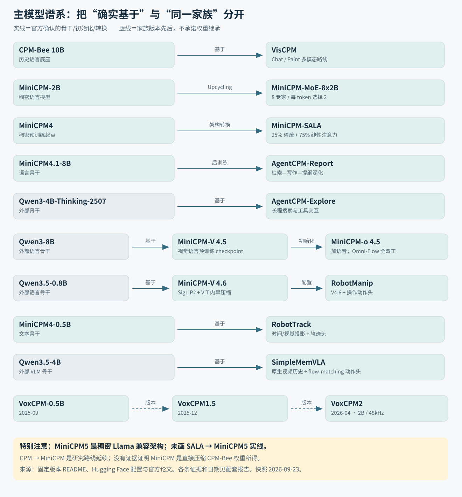

# OpenBMB：先看主模型，再看技术演进

研究快照：2026-09-23。**不必先读 88 个仓库：先看下面 4 条主模型路线和 1 条 Agent 衍生线。**“主模型”是本报告为便于阅读选定的核心家族，不是官方发布的统一等级。88 个公开仓库的完整说明放在附录，示例、工具、fork 和历史仓库均保留。

## 1. 哪些才是真正需要先理解的模型？

|优先读的家族|当前重点版本|它做什么|与普通纯文本 LLM 的关键差异|
|---|---|---|---|
|**★ MiniCPM：语言主线**|MiniCPM5-1B/2B；长上下文另看 SALA、4.1|文本对话、代码、推理及工具调用文本|多数仍是自回归 Transformer；重点在小参数训练、数据质量、稀疏/线性注意力分支和部署效率|
|**★ MiniCPM-V / o：视觉与全模态主线**|V4.6；o4.5|V 看图/视频后回答；o 同时看、听、说|增加视觉/音频编码、语音输出与时间同步；V 和 o 的版本号不是一条升级顺序|
|**★ VoxCPM：语音主线**|VoxCPM2|文本转语音、参考声音克隆、声音/风格控制|语义 LM + 声学 LM + 局部扩散 + AudioVAE，最终生成波形，不是普通文字问答|
|**★ MiniCPM-Robot：具身主线**|RobotManip；RobotTrack|机械臂操作、目标跟踪|视觉/语言表示进入动作头，输出连续控制量；需要机器人闭环和坐标协议|
|**☆ AgentCPM：任务后训练衍生线**|Explore；Report；GUI 单独仓库|搜索、报告、手机界面操作|保留 LLM/VLM 骨干，通过交互训练和工具环境学会持续行动；不是一个统一底座|

版本与用途由 [MiniCPM README](https://github.com/OpenBMB/MiniCPM/blob/316cfb1cea39f39cfa16b4f5703b77495c2340be/README.md)、[MiniCPM-V README](https://github.com/OpenBMB/MiniCPM-V/blob/6ada8e8ef5e2979670fc94406f02b87c3c7e7ee0/README.md)、[VoxCPM README](https://github.com/OpenBMB/VoxCPM/blob/f772e498a45fbb5fb8e13fbf9b9c48be9fe33e69/README.md)、[MiniCPM-Robot README](https://github.com/OpenBMB/MiniCPM-Robot/blob/f666593066641d2c0cef06bc17bfb1e954547674/README.md) 和 [AgentCPM README](https://github.com/OpenBMB/AgentCPM/blob/4a43561e790c154292798b3edd50171f71241cec/README.md) 核对。参数量、成绩及“端侧”定位属于官方口径；本次没有运行模型测评。

## 2. 技术谱系：实线才表示确认的骨干或初始化关系

**实线：官方明确说明基于该骨干或从该 checkpoint 初始化。虚线：产品/研究路线的先后，不承诺权重连续继承。**VoxCPM 版本间、MiniCPM 各代间的先后见时间线；没有证据的继承关系不画实线。图中的 Qwen、SigLIP、Whisper 等是外部骨干，不计为 OpenBMB 新仓库。

- **CPM → MiniCPM 是研究路线延续，不能直接说 MiniCPM 是把 CPM-Bee 压缩而成。**CPM-Live/Bee 体现早期大模型公开训练，MiniCPM 转向小模型训练规律与端侧成本。[CPM-Live README](https://github.com/OpenBMB/CPM-Live/blob/3b27173f67827faf329ab649ee1d0cb2a873e56b/README.md)；[官方论文 2404.06395](https://arxiv.org/html/2404.06395)
- **MiniCPM4 → SALA 有明确转换路线。**SALA 从稠密模型进行混合注意力适配，32 层配置中 8 层 `minicpm4`、24 层 `lightning-attn`。但 **MiniCPM5 又采用标准 Llama 稠密架构**；“5 比 SALA 晚”不等于它继承 SALA。[MiniCPM-SALA 配置](https://huggingface.co/openbmb/MiniCPM-SALA/resolve/9180fe1db74f71fb81bc7105efe88f6b19c959b0/config.json)；[MiniCPM5-2B 配置](https://huggingface.co/openbmb/MiniCPM5-2B/resolve/12a3808a956f869c767195e9266b59c4d21d92e2/config.json)
- **V4.5 → o4.5 有官方初始化证据；V4.6 是更轻的另一分支。**o4.5 论文第 5 节明确使用 V4.5 预训练 checkpoint；V4.6 用 Qwen3.5-0.8B + SigLIP2-400M，不是给 o4.5 减一个音频模块。[官方论文 2604.27393](https://arxiv.org/html/2604.27393)；[MiniCPM-V README](https://github.com/OpenBMB/MiniCPM-V/blob/6ada8e8ef5e2979670fc94406f02b87c3c7e7ee0/README.md)
- **AgentCPM 也没有统一的 MiniCPM 底座。**Explore 用 Qwen3-4B，Report 用 MiniCPM4.1-8B；RobotTrack 用 MiniCPM4-0.5B，RobotManip 接 V4.6。[AgentCPM-Explore 配置](https://huggingface.co/openbmb/AgentCPM-Explore/resolve/f528bbb55317bd291387ba3347551dd3414e698e/config.json)；[AgentCPM-Report 配置](https://huggingface.co/openbmb/AgentCPM-Report/resolve/c6232d64a47ccfa0c4aed240d325cbc0fb9cbc62/config.json)；[MiniCPM-RobotTrack 配置](https://huggingface.co/openbmb/MiniCPM-RobotTrack/resolve/80d32d0b091c3b340a1e4a6c78d441e8af19590e/config.json)；[MiniCPM-RobotManip 配置](https://huggingface.co/openbmb/MiniCPM-RobotManip/resolve/29cb257541e9f96f493abe21174f8892e5dffe3f/config.json)

## 3. 时间线：每次变化解决什么问题，又付出什么代价？

日期为 README 发布记录，论文发布日期与模型开放日期可能不同。下面的“解决问题/代价”是结合结构作出的分析，不是额外实测。

|时间|节点与变化|为什么需要这一步|代价或边界|
|---|---|---|---|
|2022-09 / 10|CPM-Ant / Ant+；公开训练、扩展双语|建立可观察的训练过程和双语基础|仍以较大模型和训练资源为中心|
|2023-05 / 06|CPM-Bee10B；随后 VisCPM|从语言基础扩展到看图回答、文生图|视觉编码或扩散组件增加；Chat/Paint 不是同一输出头|
|2024-02|MiniCPM-2B|用小模型实验、μP 和 WSD 提高参数/训练效率|小参数不等于低训练数据成本，也不消除知识容量限制|
|2024-04 / 07|128K、MoE-8x2B、1B、S-1B 分支|分别探索长输入、容量、小体积和 FFN 稀疏效率|MoE 总参数与激活参数不同；稀疏需要匹配内核|
|2024-09|MiniCPM3-4B|增强文本能力和低秩注意力表示，原生 32K|长文分治框架与原生窗口不能混算|
|2025-06 / 09|MiniCPM4 / 4.1|把长序列的注意力成本降下来；InfLLM-V2 稠密/稀疏切换|选块和稀疏内核有开销，短序列并非越稀疏越快|
|2026-02|MiniCPM-SALA|稀疏层保留选择性读取，线性层降低长程状态开销|需要混合架构适配与专用后端；百万上下文宣称不等于配置默认值|
|2026-05 / 09|MiniCPM5-1B / 2B|稠密小模型配高质量数据、SFT/RL/OPD，强化本地能力|不是“更大窗口优先”路线；更强训练也不替代任务实测|
|2024-04 → 2025-08|V2.0 → 2.5 → 2.6 → 4.0 / 4.5|从高分辨率/OCR走向多图、视频和更高效率|各代骨干会变；视觉压缩可能损失细节|
|2025-01 → 2026-02|o2.6 → o4.5|从多模态交互走向共享时间轴上的全双工与主动响应|常开感知、语音生成、时序缓存和网络共同决定延迟|
|2026-05|V4.6：ViT 内早压缩，1.3B|不仅减少进入 LLM 的 token，也减少视觉编码本身计算|4×/16×压缩是细节与效率之间的选择|
|2025-09 → 12 → 2026-04|VoxCPM0.5B → 1.5 → 2|连续声学建模扩展到多语言、控制和48kHz输出|模型与声学解码规模增长；扩散步数影响速度/质量|
|2026-07；08–09|RobotManip/Track；SimpleMemVLA|从“看懂”走向“执行”，处理长程历史与部分可观测性|动作坐标、控制频率和闭环错误成为关键；不同机器人不可直接共用动作|

时间来源：[CPM-Live README](https://github.com/OpenBMB/CPM-Live/blob/3b27173f67827faf329ab649ee1d0cb2a873e56b/README.md)、[CPM-Bee README](https://github.com/OpenBMB/CPM-Bee/blob/be2b6a904f596bfd0328cb5e9020a84db44f9629/README.md)、[MiniCPM README](https://github.com/OpenBMB/MiniCPM/blob/316cfb1cea39f39cfa16b4f5703b77495c2340be/README.md)、[MiniCPM-V README](https://github.com/OpenBMB/MiniCPM-V/blob/6ada8e8ef5e2979670fc94406f02b87c3c7e7ee0/README.md)、[VoxCPM README](https://github.com/OpenBMB/VoxCPM/blob/f772e498a45fbb5fb8e13fbf9b9c48be9fe33e69/README.md)、[MiniCPM-Robot README](https://github.com/OpenBMB/MiniCPM-Robot/blob/f666593066641d2c0cef06bc17bfb1e954547674/README.md)、[SimpleMemVLA README](https://github.com/OpenBMB/SimpleMemVLA/blob/404215d752704fd8d8157fa6b7ccdfafdb2bd44e/README.md)。

## 4. 其余仓库挂在哪一环？

|环节|重点仓库|与主模型的关系|
|---|---|---|
|数据与对齐|UltraX、DecorateLM、UltraFeedback、UltraLink、CPO、RLPR|改变训练材料、偏好或奖励；不是统一的一条默认训练流水线|
|训练与压缩|BMTrain、ModelCenter、BMCook、Meshy、ForgeTrain|从分布式训练、压缩到 RL 系统与 Agent 生成训练软件|
|推理执行|BMInf、cpm_kernels、CPM.cu、ArcLight、sglang、infllmv2_cuda_impl、sparse_kernel、Locret|分别处理量化/搬运、GPU/CPU执行、稀疏注意力与缓存淘汰|
|外部知识|UltraRAG、VisRAG、DEBATER、MoRE、PAGER、RAG-DDR、SHIFT、ParamMute、MetaMem|覆盖检索、证据组织、训练对齐和忠实性；解决的问题不同|
|Agent 产品|ChatDev、XAgent、EdgeClaw、ClawXMemory/Router、PilotDeck、StaffDeck、AppCopilot|给模型接工具、持久状态、工作流与设备；不能与模型参数量混为一谈|
|评测与客户端|UltraEval、InfiniteBench、OlympiadBench、Omni 系评测、V-Apps、o-Demo、Desk-Pet|分别负责测量和把模型能力呈现给用户|

这个环节表是阅读地图，不宣称表中每个工具都已直接接入每个主模型。完整依赖与限制见逐仓库附录。

**建议阅读顺序：本总览 → 深度报告中你关心的路线 → 用附录检索具体仓库。**如果只关心“跟普通大模型有什么区别”，先抓住三个变化：输入从文字扩展到视觉/音频/状态，输出从文字扩展到语音/动作，模型外增加检索、工具与执行反馈。另有一组项目专门降低训练与推理成本，它们本身不增加新的智能任务。

## 5. 从模型理解走到昇腾开发

深度分析新增两个专题：[模型来源与团队贡献](01-深度分析.md#provenance)，分清语言权重、视觉/音频组件和团队新增工作；[华为昇腾 Ascend NPU 工程分析](01-深度分析.md#ascend)，把早压缩、稀疏/线性注意力、低精度、全双工和机器人闭环对应到算子、子图融合、分块及搬运。HTML 顶部提供直接入口。

这些内容是从模型机制推导开发需求，并列出已有适配证据与验证方法；没有指定或实测某代昇腾芯片，不把 CUDA 加速比当作昇腾结论。
