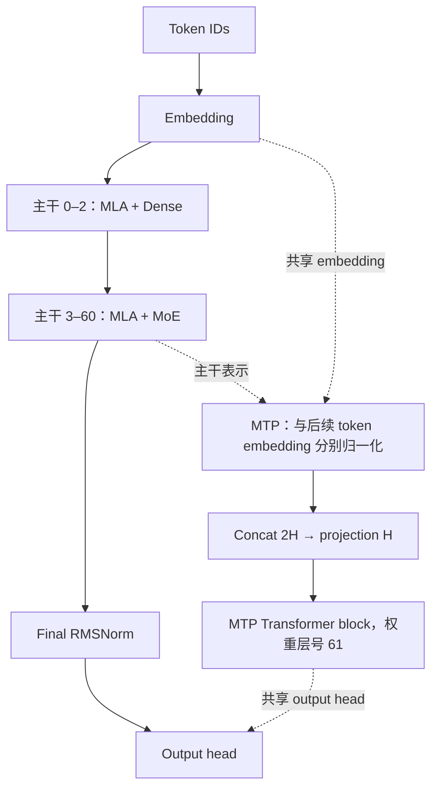

# DeepSeek 首轮研究：版本关系与 V3 代表层

研究日期：2026-10-01。研究对象为 `deepseek-ai/DeepSeek-V3@e815299b0bcbac849fa540c768ef21845365c9eb`，官方推理源码固定到 `9b4e9788e4a3a731f7567338ed15d3ec549ce03b`。本轮完成配置、参考源码与索引名称的静态研究；主干逻辑参数推导为 **671,026,419,200**，不含 MTP 和量化 scale。两类代表层分别为源码第 0 层 Dense（展示第 1 层）与源码第 3 层 MoE（展示第 4 层）。

事实源为 [v3-round1.json](../../../data/families/deepseek/research/v3-round1.json)，版本关系为 [versions.json](../../../data/families/deepseek/versions.json)，输入哈希与访问范围见 [sources.json](../../../data/families/deepseek/sources.json)。[参数表 CSV](v3-parameters.csv) 和 [代表层算子 CSV](v3-representative-operators.csv) 从相同 JSON 导出；[验证记录](validation.json) 说明实际检查范围。

## 1 版本关系与范围

| 代表条目 | 关系与核验边界 | 来源 |
| --- | --- | --- |
| V2 | MLA/DeepSeekMoE 的设计演进入口；不是 V3 权重底座关系 | [gh-deepseek-v2-readme-md](https://github.com/deepseek-ai/DeepSeek-V2/blob/ec98ee3cbffc32104cd55dba8af884b3d772602a/README.md) |
| V3-Base / V3 | 基础模型与后训练模型分列；本轮深读原始 V3 | [gh-deepseek-v3-readme-md](https://github.com/deepseek-ai/DeepSeek-V3/blob/9b4e9788e4a3a731f7567338ed15d3ec549ce03b/README.md) |
| R1-Zero / R1 | 官方说明基于 V3-Base 训练；配置相同性仍待逐字段核验 | [gh-deepseek-r1-readme-md](https://github.com/deepseek-ai/DeepSeek-R1/blob/0cf78561f1d51c84a21b2190626b21116d5c68bb/README.md) |
| R1-Distill 六版 | Qwen2.5-Math 1.5B/7B、Qwen2.5 14B/32B、Llama-3.1 8B、Llama-3.3 70B Instruct；官方提示 config/tokenizer 调整 | [gh-deepseek-r1-readme-md](https://github.com/deepseek-ai/DeepSeek-R1/blob/0cf78561f1d51c84a21b2190626b21116d5c68bb/README.md) |
| V3.2-Exp / V3.2 | Exp 从 V3.1-Terminus 引入 DSA；V3.2 模型卡声明与 Exp 同结构，具体配置/实现留到 P3 | [hf-deepseek-v3.2-exp-readme](https://huggingface.co/deepseek-ai/DeepSeek-V3.2-Exp/blob/194c67e12b1b0d6df0ef373ddcf215bc84027409/README.md)；[hf-deepseek-v3.2-readme](https://huggingface.co/deepseek-ai/DeepSeek-V3.2/blob/a7e62ac04ecb2c0a54d736dc46601c5606cf10a6/README.md) |
| V4-Flash / Pro 及 Base | 模型卡披露 CSA/HCA、mHC；Base 与后训练版精度分列；Max 为推理模式 | [hf-deepseek-v4-pro-readme](https://huggingface.co/deepseek-ai/DeepSeek-V4-Pro/blob/b5968e9190ef611bbf34a7229255be88a0e937c1/README.md) |

本轮固定 17 个代表 checkpoint 的 revision。作者目录还出现 V4.1、其他 V3 更新与 R1-0528 等条目，已列在 deferred；本轮未深读这些条目，也不把此表作为完整版本目录。目录采集范围为前 100 个条目。来源：[hf-directory](https://huggingface.co/api/models?author=deepseek-ai&limit=100&full=true)。

## 2 配置与参数口径

HF 配置对应字段与 demo 配置逐项相等；未覆盖字段单列。主干层型为 **3 层 Dense + 58 层 MoE**。MTP 的源码/权重层号 61 不计入 61 个主干层。配置来源：[hf-v3-config-json](https://huggingface.co/deepseek-ai/DeepSeek-V3/blob/e815299b0bcbac849fa540c768ef21845365c9eb/config.json)；demo 配置来源：[gh-deepseek-v3-inference-configs-config_671b-json](https://github.com/deepseek-ai/DeepSeek-V3/blob/9b4e9788e4a3a731f7567338ed15d3ec549ce03b/inference/configs/config_671B.json)。

| 配置字段 | 值 | demo 对应字段 |
| --- | --- | --- |
| attention_bias | false | 无直接映射；另记差异 |
| bos_token_id | 0 | 无直接映射；另记差异 |
| eos_token_id | 1 | 无直接映射；另记差异 |
| ep_size | 1 | 无直接映射；另记差异 |
| first_k_dense_replace | 3 | n_dense_layers |
| hidden_act | "silu" | 无直接映射；另记差异 |
| hidden_size | 7168 | dim |
| intermediate_size | 18432 | inter_dim |
| kv_lora_rank | 512 | kv_lora_rank |
| max_position_embeddings | 163840 | 无直接映射；另记差异 |
| model_type | "deepseek_v3" | 无直接映射；另记差异 |
| moe_intermediate_size | 2048 | moe_inter_dim |
| moe_layer_freq | 1 | 无直接映射；另记差异 |
| n_group | 8 | n_expert_groups |
| n_routed_experts | 256 | n_routed_experts |
| n_shared_experts | 1 | n_shared_experts |
| norm_topk_prob | true | 无直接映射；另记差异 |
| num_attention_heads | 128 | n_heads |
| num_experts_per_tok | 8 | n_activated_experts |
| num_hidden_layers | 61 | n_layers |
| num_key_value_heads | 128 | 无直接映射；另记差异 |
| num_nextn_predict_layers | 1 | 无直接映射；另记差异 |
| q_lora_rank | 1536 | q_lora_rank |
| qk_nope_head_dim | 128 | qk_nope_head_dim |
| qk_rope_head_dim | 64 | qk_rope_head_dim |
| quantization_config | {"activation_scheme": "dynamic", "fmt": "e4m3", "quant_method": "fp8", "weight_block_size": [128, 128]} | 无直接映射；另记差异 |
| rms_norm_eps | 1e-06 | 无直接映射；另记差异 |
| rope_scaling | {"beta_fast": 32, "beta_slow": 1, "factor": 40, "mscale": 1.0, "mscale_all_dim": 1.0, "original_max_position_embeddings": 4096, "type": "yarn"} | 无直接映射；另记差异 |
| rope_theta | 10000 | 无直接映射；另记差异 |
| routed_scaling_factor | 2.5 | route_scale |
| scoring_func | "sigmoid" | score_func |
| tie_word_embeddings | false | 无直接映射；另记差异 |
| topk_group | 4 | n_limited_groups |
| topk_method | "noaux_tc" | 无直接映射；另记差异 |
| torch_dtype | "bfloat16" | 无直接映射；另记差异 |
| use_cache | true | 无直接映射；另记差异 |
| v_head_dim | 128 | v_head_dim |
| vocab_size | 129280 | vocab_size |

| 参数项 | 逻辑参数 | 范围 |
| --- | --- | --- |
| Attention（含 Q/KV 低秩 norm） | 187,107,328 | 每个主干层 |
| 两次 block RMSNorm | 14,336 | 每个主干层 |
| Dense FFN | 396,361,728 | 每个 Dense 层 |
| 一个路由专家 | 44,040,192 | gate/up/down 三矩阵 |
| 全部路由专家 | 11,274,289,152 | 256 份；不等于每 token 激活 |
| 选中路由专家权重代理 | 352,321,536 | 8 份专家权重；不是完整 FLOPs 或性能 |
| 共享专家 | 44,040,192 | 1 份 |
| Router | 1,835,264 | 256×7168 权重 + 256 校正参数 |
| Dense 主干层 | 583,483,392 | Attention + norm + Dense FFN |
| MoE 主干层 | 11,507,286,272 | Attention + norm + router + 全部 routed/shared |
| 全局组件 | 1,853,365,248 | 独立 embedding、output head 与 final norm |
| 主干合计 | 671,026,419,200 | 3×Dense 层 + 58×MoE 层 + 全局 |

矩阵均按 `[输出,输入]` 给出逻辑 shape，向量 norm 单列。主干 input embedding 与 output head 的 `tie_word_embeddings=false`，两份独立计数；MTP 的共享副本不加入主干合计。scale 的预期 block 表形状由 `ceil(out/128)×ceil(in/128)` 推导，实际 shape/dtype/payload 保持未知。参数声明依据固定 HF 参考类的 `__init__`，索引只用于核对名称。

## 3 整体数据流与代表层

主干 block 为 `x + MLA(RMSNorm(x))`，随后 `x + FFN(RMSNorm(x))`。MoE 内部按 sigmoid、校正分数、组内 top-2 求和、选 4 组、选 8 专家、取原始分数归一化并乘 2.5、按专家 gather、专家计算、加权 scatter、共享专家相加组织。示意步骤对应数学与参考源码，生产框架可以采用其他重排、通信与融合方式。

MTP 的 `[H,2H]` 投影由论文公式 21 与 checkpoint 的 H 推导，逻辑参数为 102,760,448。图中的 MTP 是论文/权重说明的数据流；当前 demo 的转换脚本显式跳过 layer 61，Transformer 只创建主干，未验证 MTP 加载或 speculative decoding。来源：[v3-paper-v2](https://arxiv.org/html/2412.19437v2)（§2.2、Eq.21），[gh-deepseek-v3-readme_weights-md](https://github.com/deepseek-ai/DeepSeek-V3/blob/9b4e9788e4a3a731f7567338ed15d3ec549ce03b/README_WEIGHTS.md)，[gh-deepseek-v3-inference-convert-py](https://github.com/deepseek-ai/DeepSeek-V3/blob/9b4e9788e4a3a731f7567338ed15d3ec549ce03b/inference/convert.py)。

## 4 Prefill/decode 与两种 MLA 路径

本轮以 padded、MP=1 的参考路径说明 shape：prefill 为 B=2、L_q=L_kv=4、start_pos=0；decode 为 B=2、L_q=1、L_kv=8、start_pos=7。N_tok=B×L_q；常规 decode 之外的 verify/ragged batching 未核验。naive 与 absorb 都可用于这两个阶段，它们是 attention 实现分支，不是阶段名称。

| 步骤 | 输入/中间 shape | 输出或 cache |
| --- | --- | --- |
| Q 低秩分解 | [B,L_q,H] → [B,L_q,R_q] | [B,L_q,128,128+64] |
| KV 下投影 | [B,L_q,H] | 潜变量 [B,L_q,512] + 共享位置 Key [B,L_q,64] |
| naive KV 展开 | 潜变量 → 每头 K_nope/V | K cache [B,L_kv,128,192]；V cache [B,L_kv,128,128] |
| absorb Query 变换 | Q_nope [B,L_q,128,128] × W_K [128,128,512] | Q_abs [B,L_q,128,512] |
| absorb cache | 归一化潜变量与旋转后共享位置 Key | C [B,L_kv,512]；PE [B,L_kv,64] |
| 两路 attention | naive 展开 QK；absorb 潜变量分数 + 位置分数 | scores [B,L_q,128,L_kv] |
| Value 聚合 | naive 聚合 V；absorb 先聚合 C 再乘 W_V | [B,L_q,128,128] → [B,L_q,7168] |
| MoE 专家输入 | 按实际路由 gather | [N_e,7168] → [N_e,2048] → [N_e,7168] |

MP=1 时，naive 每 token/层为 **40,960** 个 cache 元素，absorb 为 **576** 个（512+64）。BF16 假设下分别为 81,920 和 1,152 字节/token/层；这是数学口径，不是实测显存。demo 按最大 batch/sequence 预分配；使用窗口 B×L_kv 的元素数与实际预分配容量分别记录。排除 attention scores、RoPE 表、权重、工作区与框架管理。来源：[gh-deepseek-v3-inference-model-py](https://github.com/deepseek-ai/DeepSeek-V3/blob/9b4e9788e4a3a731f7567338ed15d3ec549ce03b/inference/model.py) 的 MLA.__init__/forward。

## 5 参考实现、精度与证据边界

FP8 权重在 `linear` 中有条件分支：非 FP8 用 F.linear；gemm_impl="bf16" 时先解量化再 F.linear；另一条分支为 act_quant→fp8_gemm。absorb 直接读取并按需解量化 W_kv_b，再做 einsum，不能把所有步骤强行对应为相同 GEMM wrapper。RMSNorm 的 demo 入口为 F.rms_norm；HF 参考 norm 显式转 FP32。算子表将精度说明与实际存储字段分开。

demo 的 world_size 同时约束 attention heads、Dense/shared FFN 切分、词表切分与专家归属，不能将其直接改写为任意独立 TP/EP 布局。本轮使用 MP=1；列出的 all_reduce/all-to-all 仅是固定参考源码观察，未映射到生产框架或 Ascend kernel。

完整权重索引包含 91,991 个张量名称与 163 个分片。研究只核对名称与 scale 伴随项，未读取文件头。实际 storedShape、storedDtype、payloadBytes、kernel 与 duration 为未知；没有 checkpoint 加载、GPU/NPU 数值测试或性能实验。来源：[hf-v3-model-safetensors-index-json](https://huggingface.co/deepseek-ai/DeepSeek-V3/blob/e815299b0bcbac849fa540c768ef21845365c9eb/model.safetensors.index.json)。

## 6 冲突与缺口

| 项 | 观察 | 处理 |
| --- | --- | --- |
| context | HF max_position_embeddings=163840；官方 V3 README 披露 128K；demo 配置未覆盖 ModelArgs.max_seq_len=16384 | 分别保留配置、披露和 demo 默认值；不能用其中任一数值替代已验证的服务上下文 |
| mtp-count | README 披露主干 671B、含 MTP 的发布规模 685B/额外 14B；README_WEIGHTS 单列 MTP unique 11.5B（排除共享 embedding/head） | 主干推导总数单列；MTP exact unique 参数与共享 norm 的真实别名仍未知，不把披露的近似值强行配平 |
| router-dtype | HF MoEGate.forward 显式 FP32 linear；demo Gate.forward 无相同显式转换，correction bias 构造为 FP32 | 按实现分别记录 dtype，不把 HF 的精度语义直接转写成 demo 的执行路径 |
| index-size | 索引 metadata.total_size=1369062772000，索引只给张量名与分片 | 保留原值；实际 storage dtype、shape、payloadBytes 均未知，不能据索引 total_size 推断 FP8 实际载荷 |

| 下一阶段 | 待核验问题 | 状态 |
| --- | --- | --- |
| 可选权重审计 | 实际逐张量 dtype、shape、scale 与 payload，以及 MTP 共享参数存储别名 | unknown |
| P2 | 目标框架的 MTP/speculative decoding 加载与执行路径；当前 demo 转换跳过 layer 61 | unknown |
| P2 | 目标 Ascend 型号、卡数/拓扑、CANN、torch_npu、框架及权重转换格式 | unknown |
| P2 | 生产 attention、MoE、通信、量化 kernel 的条件映射与融合边界 | unknown |
| P2 | 带历史的 chunked prefill/verify mask 路径；demo 当前方形 mask 不能直接证明这些场景 | not_verified |
| P3/P4 | 其他 checkpoint 的实际配置、精度与结构一致性；首轮只核对名称、revision、官方关系 | not_verified |
| P5a | DeepSeek 网站数据适配、独立验证分派；新 cache 结构扩展在 P3/P5b 处理 | not_started |
| P6 | 权重加载、设备数值正确性、profiling、性能与质量实验 | not_run |

## 7 复算与继续工作

执行 `python3 scripts/validate_deepseek.py --research-root <源码快照目录>` 检查输入/函数体哈希、配置映射、层型、参数汇总、线性收缩、einsum、reshape/split、路由与 cache 公式；CSV 生成后检查与 JSON 的行列和值一致。验证器另做固定随机种子的 FP64 合成小矩阵 MLA 代数复算，不使用模型权重，也不导入执行上游代码。这项检查验证公式恒等关系，不能代替 checkpoint 数值验证。

下一步为 P5a：将已审核的 V3 事实适配到 family/architecture/compute 契约，增加 DeepSeek 构建验证分派，接入来源与下载。P2 的设备实现研究在目标 Ascend 栈明确后开始；P3/P4 继续各自配置与结构核验。

## 8 固定来源索引

| source_id | revision | 已读取范围 | 来源 |
| --- | --- | --- | --- |
| hf-directory | 访问日快照 | 配置或目录元数据核对 | [hf-directory](https://huggingface.co/api/models?author=deepseek-ai&limit=100&full=true) |
| gh-deepseek-v2-readme-md | ec98ee3cbffc32104cd55dba8af884b3d772602a | 版本/底座、架构概述、参数与权重说明或许可入口；未复验评测 | [gh-deepseek-v2-readme-md](https://github.com/deepseek-ai/DeepSeek-V2/blob/ec98ee3cbffc32104cd55dba8af884b3d772602a/README.md) |
| gh-deepseek-v3-readme-md | 9b4e9788e4a3a731f7567338ed15d3ec549ce03b | 版本/底座、架构概述、参数与权重说明或许可入口；未复验评测 | [gh-deepseek-v3-readme-md](https://github.com/deepseek-ai/DeepSeek-V3/blob/9b4e9788e4a3a731f7567338ed15d3ec549ce03b/README.md) |
| gh-deepseek-v3-readme_weights-md | 9b4e9788e4a3a731f7567338ed15d3ec549ce03b | 版本/底座、架构概述、参数与权重说明或许可入口；未复验评测 | [gh-deepseek-v3-readme_weights-md](https://github.com/deepseek-ai/DeepSeek-V3/blob/9b4e9788e4a3a731f7567338ed15d3ec549ce03b/README_WEIGHTS.md) |
| gh-deepseek-v3-license-code | 9b4e9788e4a3a731f7567338ed15d3ec549ce03b | 确认 V3 代码 MIT 与独立模型许可入口；不扩展为法律结论 | [gh-deepseek-v3-license-code](https://github.com/deepseek-ai/DeepSeek-V3/blob/9b4e9788e4a3a731f7567338ed15d3ec549ce03b/LICENSE-CODE) |
| gh-deepseek-v3-license-model | 9b4e9788e4a3a731f7567338ed15d3ec549ce03b | 确认 V3 代码 MIT 与独立模型许可入口；不扩展为法律结论 | [gh-deepseek-v3-license-model](https://github.com/deepseek-ai/DeepSeek-V3/blob/9b4e9788e4a3a731f7567338ed15d3ec549ce03b/LICENSE-MODEL) |
| gh-deepseek-v3-inference-model-py | 9b4e9788e4a3a731f7567338ed15d3ec549ce03b | 已读符号：Block.forward, MLA.forward, MLP.forward, MoE.forward, Gate.forward, Expert.forward, linear, Linear.__init__, RMSNorm.forward, ColumnParallelLinear.__init__, RowParallelLinear.forward, ParallelEmbedding.forward, Transformer.__init__, Transformer.forward, Gate.__init__, MoE.__init__, apply_rotary_emb | [gh-deepseek-v3-inference-model-py](https://github.com/deepseek-ai/DeepSeek-V3/blob/9b4e9788e4a3a731f7567338ed15d3ec549ce03b/inference/model.py) |
| gh-deepseek-v3-inference-kernel-py | 9b4e9788e4a3a731f7567338ed15d3ec549ce03b | 已读符号：act_quant, weight_dequant, fp8_gemm | [gh-deepseek-v3-inference-kernel-py](https://github.com/deepseek-ai/DeepSeek-V3/blob/9b4e9788e4a3a731f7567338ed15d3ec549ce03b/inference/kernel.py) |
| gh-deepseek-v3-inference-convert-py | 9b4e9788e4a3a731f7567338ed15d3ec549ce03b | 已读符号：main | [gh-deepseek-v3-inference-convert-py](https://github.com/deepseek-ai/DeepSeek-V3/blob/9b4e9788e4a3a731f7567338ed15d3ec549ce03b/inference/convert.py) |
| gh-deepseek-v3-inference-fp8_cast_bf16-py | 9b4e9788e4a3a731f7567338ed15d3ec549ce03b | 只采集；未深读 | [gh-deepseek-v3-inference-fp8_cast_bf16-py](https://github.com/deepseek-ai/DeepSeek-V3/blob/9b4e9788e4a3a731f7567338ed15d3ec549ce03b/inference/fp8_cast_bf16.py) |
| gh-deepseek-v3-inference-configs-config_671b-json | 9b4e9788e4a3a731f7567338ed15d3ec549ce03b | 配置或目录元数据核对 | [gh-deepseek-v3-inference-configs-config_671b-json](https://github.com/deepseek-ai/DeepSeek-V3/blob/9b4e9788e4a3a731f7567338ed15d3ec549ce03b/inference/configs/config_671B.json) |
| gh-deepseek-r1-readme-md | 0cf78561f1d51c84a21b2190626b21116d5c68bb | 版本/底座、架构概述、参数与权重说明或许可入口；未复验评测 | [gh-deepseek-r1-readme-md](https://github.com/deepseek-ai/DeepSeek-R1/blob/0cf78561f1d51c84a21b2190626b21116d5c68bb/README.md) |
| gh-deepseek-v3.2-exp-readme-md | 87e509a2e5a100d221c97df52c6e8be7835f0057 | 版本/底座、架构概述、参数与权重说明或许可入口；未复验评测 | [gh-deepseek-v3.2-exp-readme-md](https://github.com/deepseek-ai/DeepSeek-V3.2-Exp/blob/87e509a2e5a100d221c97df52c6e8be7835f0057/README.md) |
| hf-v3-config-json | e815299b0bcbac849fa540c768ef21845365c9eb | 全部配置字段；与 demo 对应字段逐项核对 | [hf-v3-config-json](https://huggingface.co/deepseek-ai/DeepSeek-V3/blob/e815299b0bcbac849fa540c768ef21845365c9eb/config.json) |
| hf-v3-model-safetensors-index-json | e815299b0bcbac849fa540c768ef21845365c9eb | 索引全部名称、分片和 metadata；核对主干模板名称与 scale 伴随名称；未读取文件头 | [hf-v3-model-safetensors-index-json](https://huggingface.co/deepseek-ai/DeepSeek-V3/blob/e815299b0bcbac849fa540c768ef21845365c9eb/model.safetensors.index.json) |
| hf-v3-modeling_deepseek-py | e815299b0bcbac849fa540c768ef21845365c9eb | 已读符号：DeepseekV3Attention.__init__, DeepseekV3DecoderLayer.__init__, DeepseekV3MLP.__init__, MoEGate.__init__, DeepseekV3Model.__init__, DeepseekV3ForCausalLM.__init__, MoEGate.forward, DeepseekV3MoE.moe_infer, DeepseekV3Attention.forward, DeepseekV3MLP.forward, DeepseekV3RMSNorm.forward | [hf-v3-modeling_deepseek-py](https://huggingface.co/deepseek-ai/DeepSeek-V3/blob/e815299b0bcbac849fa540c768ef21845365c9eb/modeling_deepseek.py) |
| hf-v3-configuration_deepseek-py | e815299b0bcbac849fa540c768ef21845365c9eb | 只采集；未深读 | [hf-v3-configuration_deepseek-py](https://huggingface.co/deepseek-ai/DeepSeek-V3/blob/e815299b0bcbac849fa540c768ef21845365c9eb/configuration_deepseek.py) |
| hf-deepseek-v3.2-exp-readme | 194c67e12b1b0d6df0ef373ddcf215bc84027409 | 版本/底座、架构概述、参数与权重说明或许可入口；未复验评测 | [hf-deepseek-v3.2-exp-readme](https://huggingface.co/deepseek-ai/DeepSeek-V3.2-Exp/blob/194c67e12b1b0d6df0ef373ddcf215bc84027409/README.md) |
| hf-deepseek-v3.2-readme | a7e62ac04ecb2c0a54d736dc46601c5606cf10a6 | 版本/底座、架构概述、参数与权重说明或许可入口；未复验评测 | [hf-deepseek-v3.2-readme](https://huggingface.co/deepseek-ai/DeepSeek-V3.2/blob/a7e62ac04ecb2c0a54d736dc46601c5606cf10a6/README.md) |
| hf-deepseek-v4-flash-readme | 60d8d70770c6776ff598c94bb586a859a38244f1 | 版本/底座、架构概述、参数与权重说明或许可入口；未复验评测 | [hf-deepseek-v4-flash-readme](https://huggingface.co/deepseek-ai/DeepSeek-V4-Flash/blob/60d8d70770c6776ff598c94bb586a859a38244f1/README.md) |
| hf-deepseek-v4-pro-readme | b5968e9190ef611bbf34a7229255be88a0e937c1 | 版本/底座、架构概述、参数与权重说明或许可入口；未复验评测 | [hf-deepseek-v4-pro-readme](https://huggingface.co/deepseek-ai/DeepSeek-V4-Pro/blob/b5968e9190ef611bbf34a7229255be88a0e937c1/README.md) |
| v3-paper-v2 | 2412.19437v2 | 第 2.2 节 MTP 和公式 21；未复验论文实验 | [v3-paper-v2](https://arxiv.org/html/2412.19437v2) |
| hf-deepseek-v2-metadata | 4461458f186c35188585855f28f77af5661ad489 | 固定 revision 的文件目录、论文标签与许可入口；未据此读取或验证其他 checkpoint 配置值 | [hf-deepseek-v2-metadata](https://huggingface.co/api/models/deepseek-ai/DeepSeek-V2/revision/4461458f186c35188585855f28f77af5661ad489) |
| hf-deepseek-v3-base-metadata | afb92e1fa402c2be2a9eb085312bb02e0384d6c7 | 固定 revision 的文件目录、论文标签与许可入口；未据此读取或验证其他 checkpoint 配置值 | [hf-deepseek-v3-base-metadata](https://huggingface.co/api/models/deepseek-ai/DeepSeek-V3-Base/revision/afb92e1fa402c2be2a9eb085312bb02e0384d6c7) |
| hf-deepseek-v3-metadata | e815299b0bcbac849fa540c768ef21845365c9eb | 固定 revision 的文件目录、论文标签与许可入口；未据此读取或验证其他 checkpoint 配置值 | [hf-deepseek-v3-metadata](https://huggingface.co/api/models/deepseek-ai/DeepSeek-V3/revision/e815299b0bcbac849fa540c768ef21845365c9eb) |
| hf-deepseek-r1-zero-metadata | 72234287cbc67dbf474d911359ae32b61a2fdc7e | 固定 revision 的文件目录、论文标签与许可入口；未据此读取或验证其他 checkpoint 配置值 | [hf-deepseek-r1-zero-metadata](https://huggingface.co/api/models/deepseek-ai/DeepSeek-R1-Zero/revision/72234287cbc67dbf474d911359ae32b61a2fdc7e) |
| hf-deepseek-r1-metadata | 56d4cbbb4d29f4355bab4b9a39ccb717a14ad5ad | 固定 revision 的文件目录、论文标签与许可入口；未据此读取或验证其他 checkpoint 配置值 | [hf-deepseek-r1-metadata](https://huggingface.co/api/models/deepseek-ai/DeepSeek-R1/revision/56d4cbbb4d29f4355bab4b9a39ccb717a14ad5ad) |
| hf-deepseek-r1-distill-qwen-1.5b-metadata | ad9f0ae0864d7fbcd1cd905e3c6c5b069cc8b562 | 固定 revision 的文件目录、论文标签与许可入口；未据此读取或验证其他 checkpoint 配置值 | [hf-deepseek-r1-distill-qwen-1.5b-metadata](https://huggingface.co/api/models/deepseek-ai/DeepSeek-R1-Distill-Qwen-1.5B/revision/ad9f0ae0864d7fbcd1cd905e3c6c5b069cc8b562) |
| hf-deepseek-r1-distill-qwen-7b-metadata | 916b56a44061fd5cd7d6a8fb632557ed4f724f60 | 固定 revision 的文件目录、论文标签与许可入口；未据此读取或验证其他 checkpoint 配置值 | [hf-deepseek-r1-distill-qwen-7b-metadata](https://huggingface.co/api/models/deepseek-ai/DeepSeek-R1-Distill-Qwen-7B/revision/916b56a44061fd5cd7d6a8fb632557ed4f724f60) |
| hf-deepseek-r1-distill-qwen-14b-metadata | 1df8507178afcc1bef68cd8c393f61a886323761 | 固定 revision 的文件目录、论文标签与许可入口；未据此读取或验证其他 checkpoint 配置值 | [hf-deepseek-r1-distill-qwen-14b-metadata](https://huggingface.co/api/models/deepseek-ai/DeepSeek-R1-Distill-Qwen-14B/revision/1df8507178afcc1bef68cd8c393f61a886323761) |
| hf-deepseek-r1-distill-qwen-32b-metadata | 711ad2ea6aa40cfca18895e8aca02ab92df1a746 | 固定 revision 的文件目录、论文标签与许可入口；未据此读取或验证其他 checkpoint 配置值 | [hf-deepseek-r1-distill-qwen-32b-metadata](https://huggingface.co/api/models/deepseek-ai/DeepSeek-R1-Distill-Qwen-32B/revision/711ad2ea6aa40cfca18895e8aca02ab92df1a746) |
| hf-deepseek-r1-distill-llama-8b-metadata | 6a6f4aa4197940add57724a7707d069478df56b1 | 固定 revision 的文件目录、论文标签与许可入口；未据此读取或验证其他 checkpoint 配置值 | [hf-deepseek-r1-distill-llama-8b-metadata](https://huggingface.co/api/models/deepseek-ai/DeepSeek-R1-Distill-Llama-8B/revision/6a6f4aa4197940add57724a7707d069478df56b1) |
| hf-deepseek-r1-distill-llama-70b-metadata | b1c0b44b4369b597ad119a196caf79a9c40e141e | 固定 revision 的文件目录、论文标签与许可入口；未据此读取或验证其他 checkpoint 配置值 | [hf-deepseek-r1-distill-llama-70b-metadata](https://huggingface.co/api/models/deepseek-ai/DeepSeek-R1-Distill-Llama-70B/revision/b1c0b44b4369b597ad119a196caf79a9c40e141e) |
| hf-deepseek-v3.2-exp-metadata | 194c67e12b1b0d6df0ef373ddcf215bc84027409 | 固定 revision 的文件目录、论文标签与许可入口；未据此读取或验证其他 checkpoint 配置值 | [hf-deepseek-v3.2-exp-metadata](https://huggingface.co/api/models/deepseek-ai/DeepSeek-V3.2-Exp/revision/194c67e12b1b0d6df0ef373ddcf215bc84027409) |
| hf-deepseek-v3.2-metadata | a7e62ac04ecb2c0a54d736dc46601c5606cf10a6 | 固定 revision 的文件目录、论文标签与许可入口；未据此读取或验证其他 checkpoint 配置值 | [hf-deepseek-v3.2-metadata](https://huggingface.co/api/models/deepseek-ai/DeepSeek-V3.2/revision/a7e62ac04ecb2c0a54d736dc46601c5606cf10a6) |
| hf-deepseek-v4-flash-base-metadata | 8855555deef230a27a21a8d6f294b7b7497759b6 | 固定 revision 的文件目录、论文标签与许可入口；未据此读取或验证其他 checkpoint 配置值 | [hf-deepseek-v4-flash-base-metadata](https://huggingface.co/api/models/deepseek-ai/DeepSeek-V4-Flash-Base/revision/8855555deef230a27a21a8d6f294b7b7497759b6) |
| hf-deepseek-v4-flash-metadata | 60d8d70770c6776ff598c94bb586a859a38244f1 | 固定 revision 的文件目录、论文标签与许可入口；未据此读取或验证其他 checkpoint 配置值 | [hf-deepseek-v4-flash-metadata](https://huggingface.co/api/models/deepseek-ai/DeepSeek-V4-Flash/revision/60d8d70770c6776ff598c94bb586a859a38244f1) |
| hf-deepseek-v4-pro-base-metadata | 98730c030fbdbaca4950788280a35c4642b208a9 | 固定 revision 的文件目录、论文标签与许可入口；未据此读取或验证其他 checkpoint 配置值 | [hf-deepseek-v4-pro-base-metadata](https://huggingface.co/api/models/deepseek-ai/DeepSeek-V4-Pro-Base/revision/98730c030fbdbaca4950788280a35c4642b208a9) |
| hf-deepseek-v4-pro-metadata | b5968e9190ef611bbf34a7229255be88a0e937c1 | 固定 revision 的文件目录、论文标签与许可入口；未据此读取或验证其他 checkpoint 配置值 | [hf-deepseek-v4-pro-metadata](https://huggingface.co/api/models/deepseek-ai/DeepSeek-V4-Pro/revision/b5968e9190ef611bbf34a7229255be88a0e937c1) |
